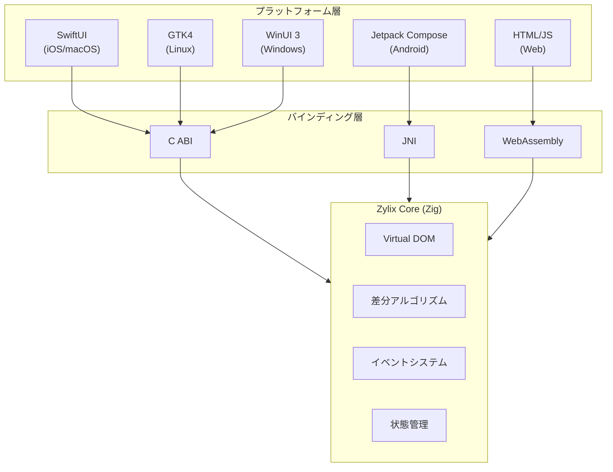

Zylix 公式ドキュメントへようこそ。Zig で構築された高性能クロスプラットフォーム UI フレームワークの完全なリファレンスです。

## Zylix とは？

Zylix は**Zig で構築された高性能クロスプラットフォーム UI フレームワーク**です。単一のコアロジックから6つのプラットフォームでネイティブアプリケーションを構築できます。

### 主な特徴

| 特徴 | 説明 |
|------|------|
| **Virtual DOM** | 効率的な差分アルゴリズムによる最小限の UI 更新 |
| **6 プラットフォーム** | Web/WASM、iOS、Android、macOS、Linux、Windows |
| **C ABI** | ネイティブフレームワークとのシームレスな統合 |
| **型安全** | Zig のコンパイル時型チェックによる信頼性 |
| **GC フリー** | アリーナアロケーションによる予測可能なパフォーマンス |
| **軽量** | コアライブラリは50-150KB |

## アーキテクチャ概要



## クイックスタート

```bash
# リポジトリをクローン
git clone https://github.com/kotsutsumi/zylix.git
cd zylix

# コアライブラリをビルド
cd core
zig build

# Web デモを実行
zig build wasm -Doptimize=ReleaseSmall
cd ../platforms/web
python3 -m http.server 8080
# ブラウザで http://localhost:8080 を開く
```

## ドキュメント構成

### 入門

- **[はじめる](getting-started)**: インストールと最初のアプリ
  - **[アーキテクチャ](architecture)**: Zylix の設計思想

### コア概念

- **[Virtual DOM](core-concepts/virtual-dom)**: 仮想 DOM エンジン
  - **[状態管理](core-concepts/state-management)**: 集中型ストア
  - **[コンポーネント](core-concepts/components)**: 再利用可能な UI 部品
  - **[イベントシステム](core-concepts/events)**: 型安全なイベント処理

### プラットフォームガイド

- **[プラットフォームガイド](platforms)**: 全6プラットフォームの統合ガイド

### ロードマップ

- **[ロードマップ](roadmap)**: 今後の計画：コンポーネント、ルーティング、非同期処理、Hot Reload

## 対応プラットフォーム

| プラットフォーム | UI フレームワーク | バインディング | 最小バージョン | ステータス |
|-----------------|------------------|---------------|---------------|-----------|
| **Web/WASM** | HTML/JavaScript | WebAssembly | モダンブラウザ | 🔵 ベータ |
| **iOS** | SwiftUI | C ABI | iOS 15+ | 🟡 アルファ |
| **Android** | Jetpack Compose | JNI | API 26+ | 🟡 アルファ |
| **macOS** | SwiftUI | C ABI | macOS 12+ | 🟡 アルファ |
| **Linux** | GTK4 | C ABI | GTK 4.0+ | 🟡 アルファ |
| **Windows** | WinUI 3 | P/Invoke | Windows 10+ | 🟡 アルファ |

## 設計原則

### 1. ネイティブファースト

各プラットフォームのネイティブ UI フレームワークを活用し、真のネイティブルック＆フィールを実現します。

### 2. 型安全

Zig のコンパイル時型チェックにより、ランタイムエラーを最小化します。

### 3. ゼロアロケーション

ホットパスではヒープアロケーションを行わず、予測可能なパフォーマンスを提供します。

### 4. シンプルさ

API はシンプルで理解しやすく、学習曲線を緩やかにします。

## コミュニティ

- [GitHub リポジトリ](https://github.com/kotsutsumi/zylix)
- [イシュートラッカー](https://github.com/kotsutsumi/zylix/issues)
- [ディスカッション](https://github.com/kotsutsumi/zylix/discussions)

## ライセンス

Zylix は MIT ライセンスの下で公開されています。
