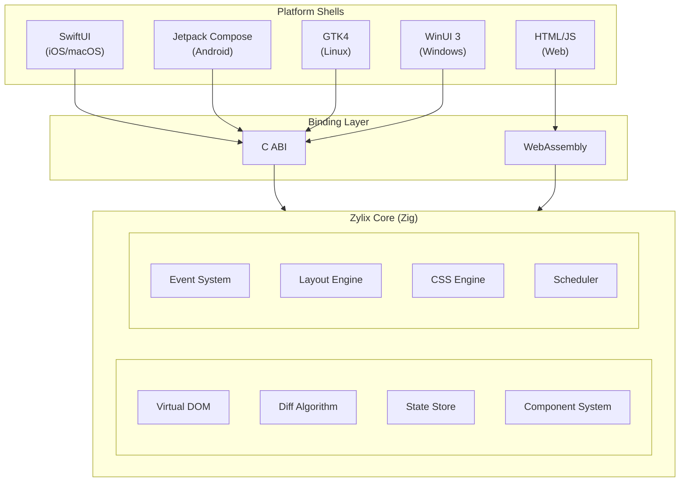

Welcome to the official Zylix documentation. Zylix is a high-performance, cross-platform UI framework powered by [Zig](https://ziglang.org/), designed to build native applications that run on Web, iOS, watchOS, Android, macOS, Linux, and Windows from a single codebase.

## Why Zylix?

Modern cross-platform frameworks often sacrifice performance for developer convenience, or require complex toolchains that slow down iteration. Zylix takes a different approach:

- **Zero-Cost Abstractions**: Written in Zig, Zylix provides predictable, garbage-collection-free performance with compile-time safety guarantees
- **True Native Performance**: No JavaScript bridge, no virtual machine overhead. Your UI code compiles directly to native machine code
- **Unified Architecture**: A single Virtual DOM implementation powers all platforms, ensuring consistent behavior everywhere
- **Minimal Bundle Size**: Core library under 50KB. WASM builds are incredibly small and load instantly
- **Platform-Native Look & Feel**: Each platform uses its native UI toolkit (SwiftUI, Jetpack Compose, GTK4, WinUI 3) for authentic user experiences

## Architecture Overview

## Quick Links

- **Start Here (Shortest Path)**: [Getting Started](getting-started) → [Tutorials](/tutorials) → [Core Concepts](core-concepts)
- **[Getting Started](getting-started)**: Install Zylix and build your first app in minutes
- **[Core Concepts](core-concepts)**: Understand Virtual DOM, State, Components, and Events
- **[Architecture](architecture)**: Deep dive into Zylix internals
- **[Platform Guides](platforms)**: Platform-specific setup and best practices
- **[Tutorials](/tutorials)**: Step-by-step platform walkthroughs
- **[API Reference](api-reference)**: Complete API documentation for all modules
- **[Roadmap](roadmap)**: Development progress and future plans

## Supported Platforms

| Platform | UI Framework | Binding | Min Version | Status |
|----------|-------------|---------|-------------|--------|
| **Web/WASM** | HTML/JavaScript | WebAssembly | Modern browsers | Production Ready |
| **iOS** | SwiftUI | C ABI | iOS 15+ | Production Ready |
| **watchOS** | SwiftUI | C ABI | watchOS 10+ | In Development |
| **macOS** | SwiftUI | C ABI | macOS 12+ | Production Ready |
| **Android** | Jetpack Compose | JNI | API 26+ | In Development |
| **Linux** | GTK4 | C ABI | GTK 4.0+ | In Development |
| **Windows** | WinUI 3 | P/Invoke | Windows 10+ | In Development |

> See [Compatibility Reference](https://github.com/kotsutsumi/zylix/blob/main/docs/COMPATIBILITY.md) for detailed platform maturity definitions.

## Core Features

### Virtual DOM Engine
Efficient UI updates through intelligent diffing. Zylix computes minimal patches between UI states, ensuring only necessary DOM operations are performed.

### Type-Safe State Management
Centralized state with compile-time type checking. State changes are tracked with version numbers, enabling efficient change detection and time-travel debugging.

### Component System
Composable, reusable UI components with props, state, and event handlers. Components are lightweight structures with zero runtime overhead.

### Cross-Language Bindings
Seamless integration with platform languages through C ABI (Swift, Kotlin, C#) and WASM (JavaScript). All core logic stays in Zig while platforms handle rendering.

## Community & Support

- **GitHub**: [github.com/kotsutsumi/zylix](https://github.com/kotsutsumi/zylix)
- **Issues**: [Report bugs and request features](https://github.com/kotsutsumi/zylix/issues)
- **Discussions**: [Ask questions and share ideas](https://github.com/kotsutsumi/zylix/discussions)
- **License**: Apache License 2.0

## Version

This documentation covers **Zylix v0.20.0**. See the [Compatibility Reference](https://github.com/kotsutsumi/zylix/blob/main/docs/COMPATIBILITY.md) and [Roadmap](roadmap) for current status.
