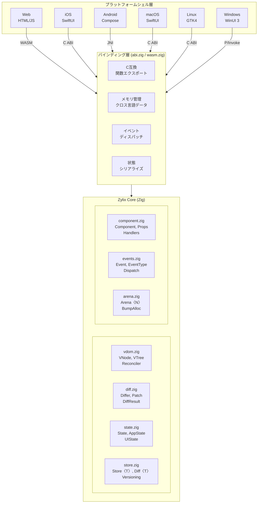
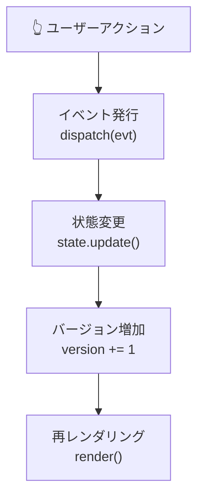
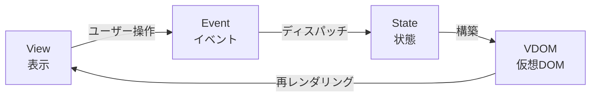

Zylix は、関心事の分離とプラットフォーム間でのコード再利用を最大化するレイヤードアーキテクチャを採用しています。

## システム概要



## コアモジュール

### Virtual DOM (`vdom.zig`)

Virtual DOM は UI ツリーの軽量な表現です。

```zig
/// VNode - 仮想 DOM ノード
pub const VNode = struct {
    /// ノードタイプ
    tag: Tag,

    /// 差分検出用のユニークキー
    key: ?[]const u8 = null,

    /// ノードプロパティ
    props: Props = .{},

    /// 子ノード配列
    children: []const VNode = &.{},

    /// テキストコンテンツ
    text: ?[]const u8 = null,

    /// 要素ノードを作成
    pub fn element(tag: Tag) VNode {
        return .{ .tag = tag };
    }

    /// テキストノードを作成
    pub fn textNode(text: []const u8) VNode {
        return .{ .tag = .text, .text = text };
    }
};

/// タグ定義
pub const Tag = enum(u8) {
    text = 0,
    div = 1,
    span = 2,
    button = 3,
    input = 4,
    ul = 5,
    li = 6,
    h1 = 7,
    p = 8,
};
```

**設計原則:**

| 原則 | 説明 |
|------|------|
| **不変性** | VNode は作成後変更されない |
| **アリーナアロケーション** | ツリー全体が単一アリーナで管理 |
| **キー最適化** | キー付きノードは O(1) ルックアップ |

### 差分アルゴリズム (`diff.zig`)

効率的な差分検出により、最小限の UI 更新を実現します。

```zig
/// パッチ操作
pub const Patch = union(enum) {
    /// ノードを置換
    replace: VNode,

    /// プロパティを更新
    update_props: Props,

    /// テキストを更新
    update_text: []const u8,

    /// 子を挿入
    insert_child: struct { index: usize, node: VNode },

    /// 子を削除
    remove_child: usize,

    /// 子を移動
    move_child: struct { from: usize, to: usize },
};

/// 差分計算
pub fn diff(old: VNode, new: VNode) []Patch {
    // 1. タグが異なる場合は完全置換
    if (old.tag != new.tag) {
        return &[_]Patch{.{ .replace = new }};
    }

    // 2. テキストノードの場合
    if (old.tag == .text) {
        if (!std.mem.eql(u8, old.text.?, new.text.?)) {
            return &[_]Patch{.{ .update_text = new.text.? }};
        }
        return &.{};
    }

    // 3. プロパティ差分
    // 4. 子ノード差分（キー最適化付き）
    // ...
}
```

**パフォーマンス特性:**

| 操作 | 計算量 | 説明 |
|------|--------|------|
| ツリー比較 | O(n) | 線形時間差分 |
| キー付きリスト | O(n) | キーマップによる最適化 |
| パッチ生成 | O(m) | m = 変更数 |
| メモリ使用 | O(n) | n = ノード数 |

### 状態管理 (`state.zig`)

集中型ストアによるバージョン追跡付き状態管理。

```zig
/// アプリケーション状態
pub const AppState = struct {
    /// カウンター値
    counter: i64 = 0,

    /// Todo アイテム
    todos: [MAX_TODOS]Todo = undefined,
    todo_count: usize = 0,

    /// 入力テキスト
    input_text: [256]u8 = [_]u8{0} ** 256,
    input_len: usize = 0,
};

/// ジェネリックストア
pub fn Store(comptime T: type) type {
    return struct {
        const Self = @This();

        current: T,
        previous: T,
        version: u64 = 0,
        dirty: bool = false,

        /// 現在の状態を取得（読み取り専用）
        pub fn getState(self: *const Self) *const T {
            return &self.current;
        }

        /// 変更をコミット
        pub fn commit(self: *Self) void {
            if (self.dirty) {
                self.previous = self.current;
                self.version += 1;
                self.dirty = false;
            }
        }
    };
}
```

**状態フロー:**



### イベントシステム (`events.zig`)

型安全な判別共用体によるイベント処理。

```zig
/// イベント定義
pub const Event = union(enum) {
    // カウンターイベント
    counter_increment,
    counter_decrement,
    counter_reset,

    // Todo イベント
    todo_add: []const u8,
    todo_toggle: u32,
    todo_remove: u32,
    todo_clear_completed,
    todo_set_filter: Filter,
};

/// イベントハンドラ
pub fn handleEvent(event: Event) void {
    switch (event) {
        .counter_increment => {
            const s = state.getStore().getStateMut();
            s.counter += 1;
            state.getStore().commit();
        },
        .todo_add => |text| {
            todo.addTodo(text);
        },
        // ...
    }
}
```

## データフロー

### 単方向データフロー



### 詳細フロー

1. **ユーザー操作**: ボタンクリック、テキスト入力など
2. **プラットフォームイベント**: ネイティブイベントを Zylix イベントに変換
3. **ディスパッチ**: `zylix_dispatch()` でコアに送信
4. **状態更新**: イミュータブルな状態遷移
5. **VDOM 再構築**: 新しい仮想ツリーを生成
6. **差分検出**: 旧ツリーと比較してパッチを生成
7. **プラットフォーム適用**: ネイティブ UI に変更を適用

## メモリ管理

### アリーナアロケーション

```zig
/// 固定サイズアリーナ
pub fn Arena(comptime size: usize) type {
    return struct {
        buffer: [size]u8 = undefined,
        offset: usize = 0,

        /// メモリを割り当て
        pub fn alloc(self: *@This(), comptime T: type, n: usize) ?[]T {
            const bytes_needed = @sizeOf(T) * n;
            const aligned_offset = std.mem.alignForward(usize, self.offset, @alignOf(T));

            if (aligned_offset + bytes_needed > size) {
                return null;
            }

            const result = @as([*]T, @ptrCast(@alignCast(&self.buffer[aligned_offset])));
            self.offset = aligned_offset + bytes_needed;
            return result[0..n];
        }

        /// アリーナをリセット
        pub fn reset(self: *@This()) void {
            self.offset = 0;
        }
    };
}
```

**メリット:**

| 特性 | 説明 |
|------|------|
| **GC フリー** | ガベージコレクション停止なし |
| **高速割り当て** | O(1) バンプアロケーション |
| **キャッシュ効率** | 連続メモリレイアウト |
| **予測可能** | 決定論的なメモリ解放 |

## ABI 設計

### C ABI エクスポート

```zig
/// 初期化
export fn zylix_init() c_int {
    state.init();
    return SUCCESS;
}

/// イベントディスパッチ
export fn zylix_dispatch(
    event_type: u32,
    payload: ?*anyopaque,
    len: usize
) c_int {
    // イベント検証
    // ハンドラ呼び出し
    // 状態更新
    return SUCCESS;
}

/// 状態取得
export fn zylix_get_state() ?*const ABIState {
    if (!state.isInitialized()) return null;
    return &cached_abi_state;
}
```

### ABI 互換状態

```zig
/// C 互換の状態構造体
pub const ABIState = extern struct {
    version: u64,
    screen: u32,
    loading: bool,
    error_message: ?[*:0]const u8,
    view_data: ?*const anyopaque,
    view_data_size: usize,
};
```

## プラットフォームバインディング

### バインディング比較

| プラットフォーム | バインディング | 特徴 |
|-----------------|---------------|------|
| Web | WASM | 直接コンパイル、JS グルーコード |
| iOS/macOS | C ABI | `@_silgen_name` で直接呼び出し |
| Android | JNI | Java Native Interface |
| Linux | C ABI | 標準 C 呼び出し規約 |
| Windows | P/Invoke | .NET ソース生成相互運用 |

### Swift バインディング例

```swift
// C 関数をインポート
@_silgen_name("zylix_init")
func zylix_init() -> Int32

@_silgen_name("zylix_dispatch")
func zylix_dispatch(_ eventType: UInt32, _ payload: UnsafeRawPointer?, _ len: Int) -> Int32

@_silgen_name("zylix_get_state")
func zylix_get_state() -> UnsafePointer<ZylixState>?

// 使用例
class ZylixBridge {
    static func initialize() {
        zylix_init()
    }

    static func dispatch(event: UInt32) {
        zylix_dispatch(event, nil, 0)
    }

    static func getState() -> ZylixState? {
        return zylix_get_state()?.pointee
    }
}
```

## パフォーマンス最適化

### 最適化手法

| 手法 | 効果 |
|------|------|
| **バンプアロケーション** | O(1) メモリ割り当て |
| **キー最適化** | O(1) ノードルックアップ |
| **差分最小化** | 必要な変更のみ計算 |
| **コンパイル時最適化** | Zig の `comptime` 活用 |

### ベンチマーク

| 操作 | 時間 | メモリ |
|------|------|--------|
| 初期化 | < 1ms | ~4KB |
| 1000 ノード差分 | < 5ms | ~16KB |
| イベントディスパッチ | < 0.1ms | 0 |
| 状態更新 | < 0.1ms | 0 |

## 次のステップ

- **[コア概念](core-concepts)**: 詳細な技術解説
  - **[プラットフォーム](platforms)**: 各プラットフォームの統合
