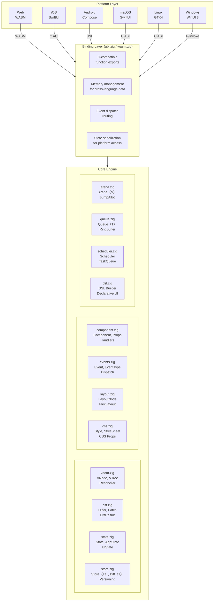

This document provides a deep dive into Zylix's internal architecture, explaining how the framework achieves cross-platform native performance with a unified codebase.

## Design Philosophy

Zylix is built on three core principles:

1. **Zig as the Single Source of Truth**: All business logic, state management, and UI computation happens in Zig. Platform shells are thin wrappers.

2. **Minimal Abstraction Overhead**: The framework introduces no runtime overhead. Virtual DOM operations compile to direct function calls.

3. **Platform-Native Rendering**: Each platform uses its native UI toolkit. Zylix computes *what* to render; platforms decide *how*.

## System Overview



## Module Deep Dive

### Virtual DOM Engine (`vdom.zig`)

The Virtual DOM is Zylix's central abstraction. It represents UI as a tree of lightweight `VNode` structures.

**Key Data Structures:**

```zig
pub const VNode = struct {
    id: u32,                          // Unique identifier
    node_type: VNodeType,             // element, text, component, fragment
    tag: ElementTag,                  // div, button, input, etc.
    key: [32]u8,                      // Reconciliation key
    text: [128]u8,                    // Text content
    props: VNodeProps,                // Properties and handlers
    children: [16]u32,                // Child node IDs
    dom_id: u32,                      // Platform DOM reference
};

pub const VTree = struct {
    nodes: [256]VNode,                // Node storage
    count: u32,                       // Active node count
    root_id: u32,                     // Root node ID
};

pub const Reconciler = struct {
    current_tree: VTree,              // Currently rendered tree
    next_tree: VTree,                 // Tree being built
    differ: Differ,                   // Diff algorithm instance
};
```

**Render Cycle:**

1. `getNextTree()` - Get empty tree for building
2. Build VNodes from application state
3. `commit()` - Diff against current tree, produce patches
4. Platform applies patches to native UI

### Diff Algorithm (`diff.zig`)

The differ compares two VNode trees and produces minimal patches.

**Algorithm:**

```
diff(old_tree, new_tree) → patches

1. If old_tree is null:
   → Create all nodes in new_tree

2. For each node pair (old, new):
   a. If types differ:
      → Remove old, create new subtree

   b. If same type:
      → Compare props → update_props patch
      → Compare text → update_text patch
      → Recursively diff children

3. For children:
   a. Match by key if present
   b. Compare by index otherwise
   c. Generate insert/remove patches
```

**Complexity:** O(n) where n = total nodes

**Patch Types:**

```zig
pub const PatchType = enum(u8) {
    create,        // Create new node
    remove,        // Remove existing node
    replace,       // Replace with different type
    update_props,  // Update properties
    update_text,   // Update text content
    insert_child,  // Insert child at index
    remove_child,  // Remove child at index
    reorder,       // Reorder children
};
```

### State Management (`state.zig`, `store.zig`)

State is managed through a generic `Store` with version tracking.

**Store Architecture:**

```zig
pub fn Store(comptime T: type) type {
    return struct {
        current: T,      // Current state
        previous: T,     // Previous state (for diff)
        version: u64,    // Monotonically increasing version
        dirty: bool,     // Has uncommitted changes
    };
}
```

**State Flow:**

```
Event → Handler → State Mutation → Version Bump → Diff Calculation → Render
```

**Diff Detection:**

```zig
pub fn Diff(comptime T: type) type {
    return struct {
        changed: bool,
        version: u64,
        fields_changed: u32,

        pub fn calculate(old: *const T, new: *const T, version: u64) Self {
            // Byte-level comparison for change detection
            if (!std.mem.eql(u8, asBytes(old), asBytes(new))) {
                return .{ .changed = true, .version = version };
            }
            return .{ .changed = false, .version = version };
        }
    };
}
```

### Component System (`component.zig`)

Components encapsulate UI structure, styling, and behavior.

**Component Anatomy:**

```zig
pub const Component = struct {
    id: u32,
    component_type: ComponentType,    // container, button, input, etc.
    props: ComponentProps,            // All configurable properties
    state: ComponentState,            // Interactive state (hover, focus)
    handlers: [8]EventHandler,        // Event callbacks
    children: [MAX_CHILDREN]u32,      // Child component IDs
};
```

**Component Lifecycle:**

1. **Creation**: Component struct initialized with props
2. **Render**: Component produces VNodes
3. **Update**: Props change → re-render → diff → patch
4. **Destruction**: Component removed from tree

### Event System (`events.zig`)

Type-safe event dispatch with discriminated unions.

**Event Definition:**

```zig
pub const Event = union(enum) {
    // No payload
    counter_increment,
    counter_reset,

    // With payload
    todo_add: []const u8,
    todo_toggle: u32,
    navigate: Screen,
};
```

**Dispatch Flow:**

```
Platform Shell
    │
    ├─ Converts native event to Zylix event type + payload
    │
    ▼
zylix_dispatch(event_type, payload, len)
    │
    ├─ Validates event type and payload
    ├─ Routes to appropriate handler
    │
    ▼
Event Handler
    │
    ├─ Updates state
    ├─ Commits changes
    │
    ▼
Render Scheduled
```

### Memory Management (`arena.zig`)

Zylix uses arena allocation for predictable, GC-free performance.

**Arena Allocator:**

```zig
pub fn Arena(comptime SIZE: usize) type {
    return struct {
        buffer: [SIZE]u8,
        offset: usize,

        pub fn alloc(self: *Self, comptime T: type) ?*T {
            const size = @sizeOf(T);
            const aligned = alignUp(self.offset, @alignOf(T));

            if (aligned + size > SIZE) return null;

            const ptr = @ptrCast(*T, self.buffer[aligned..]);
            self.offset = aligned + size;
            return ptr;
        }

        pub fn reset(self: *Self) void {
            self.offset = 0;
        }
    };
}
```

**Benefits:**

| Property | Arena | General Allocator |
|----------|-------|-------------------|
| Allocation | O(1) bump | O(log n) or worse |
| Deallocation | O(1) reset all | O(1) per item |
| Fragmentation | None | Possible |
| Cache Locality | Excellent | Variable |
| GC Pauses | None | Possible |

### Layout Engine (`layout.zig`)

Flexbox-inspired layout computation in Zig.

**Layout Computation:**

```zig
pub const LayoutNode = struct {
    // Input constraints
    width: ?f32,
    height: ?f32,
    min_width: f32,
    max_width: f32,

    // Flex properties
    flex_direction: FlexDirection,
    justify_content: JustifyContent,
    align_items: AlignItems,
    flex_grow: f32,
    flex_shrink: f32,

    // Computed output
    computed_x: f32,
    computed_y: f32,
    computed_width: f32,
    computed_height: f32,
};
```

**Layout Algorithm:**

1. Measure phase: Calculate intrinsic sizes bottom-up
2. Layout phase: Distribute space top-down
3. Position phase: Calculate absolute positions

### CSS Engine (`css.zig`)

CSS-like styling defined in Zig.

**Style Properties:**

```zig
pub const Style = struct {
    // Box model
    width: Dimension,
    height: Dimension,
    padding: Edges,
    margin: Edges,
    border: BorderStyle,

    // Visual
    background_color: Color,
    color: Color,
    opacity: f32,

    // Text
    font_size: f32,
    font_weight: FontWeight,
    text_align: TextAlign,

    // Flexbox
    display: Display,
    flex_direction: FlexDirection,
    justify_content: JustifyContent,
    align_items: AlignItems,
};
```

**Style Resolution:**

```zig
// Cascading: component → class → inline
pub fn resolveStyle(component: *Component) Style {
    var style = Style.default();

    // Apply class styles
    if (component.props.class_name_len > 0) {
        const class_style = stylesheet.get(component.props.getClassName());
        style.merge(class_style);
    }

    // Apply inline styles
    if (component.props.style_id != 0) {
        const inline_style = styles.get(component.props.style_id);
        style.merge(inline_style);
    }

    return style;
}
```

### Scheduler (`scheduler.zig`)

Task scheduling for async operations and batched updates.

**Task Queue:**

```zig
pub const Scheduler = struct {
    high_priority: Queue(Task),    // User interactions
    normal_priority: Queue(Task),  // State updates
    low_priority: Queue(Task),     // Background work
    idle_callbacks: Queue(Task),   // When idle

    pub fn scheduleUpdate(self: *Self) void {
        self.normal_priority.push(.{ .type = .render });
    }

    pub fn processQueue(self: *Self, deadline: i64) void {
        // Process high priority first
        while (self.high_priority.pop()) |task| {
            task.execute();
        }

        // Then normal, respecting deadline
        while (std.time.milliTimestamp() < deadline) {
            if (self.normal_priority.pop()) |task| {
                task.execute();
            } else break;
        }
    }
};
```

## Cross-Platform Binding

### C ABI (`abi.zig`)

All core functions export via C ABI:

```zig
// Lifecycle
export fn zylix_init() c_int;
export fn zylix_deinit() c_int;

// State
export fn zylix_get_state() ?*const State;
export fn zylix_get_version() u64;

// Events
export fn zylix_dispatch(event_type: u32, payload: ?*anyopaque, len: usize) c_int;

// Rendering
export fn zylix_render() c_int;
export fn zylix_get_patches() ?*const DiffResult;
export fn zylix_get_patch_count() u32;

// Memory
export fn zylix_alloc(len: usize) ?[*]u8;
export fn zylix_free(ptr: [*]u8, len: usize) void;
```

### WASM Bindings (`wasm.zig`)

WebAssembly-specific adaptations:

```zig
// JavaScript interop
extern fn js_log(ptr: [*]const u8, len: usize) void;
extern fn js_create_element(tag: u32, parent: u32) u32;
extern fn js_set_text(element: u32, ptr: [*]const u8, len: usize) void;
extern fn js_add_event_listener(element: u32, event: u32, callback: u32) void;

// WASM exports
export fn wasm_alloc(len: usize) ?[*]u8 {
    return allocator.alloc(u8, len) catch null;
}

export fn wasm_render() void {
    const patches = reconciler.commit();
    for (patches.patches[0..patches.count]) |patch| {
        applyPatch(patch);
    }
}
```

## Performance Characteristics

### Memory Usage

| Component | Typical Size | Maximum |
|-----------|-------------|---------|
| VNode | 256 bytes | 512 bytes |
| VTree | 64 KB | 128 KB |
| State | 4 KB | 64 KB |
| Patch | 256 bytes | 512 bytes |
| Total Runtime | ~100 KB | ~500 KB |

### Time Complexity

| Operation | Complexity | Typical Time |
|-----------|------------|--------------|
| Create VNode | O(1) | <1 μs |
| Tree Diff | O(n) | <100 μs for 100 nodes |
| Apply Patch | O(1) | <10 μs |
| Full Render | O(n) | <1 ms |

### Comparison

| Metric | Zylix | React Native | Flutter |
|--------|-------|--------------|---------|
| Bundle Size | ~50 KB | ~2 MB | ~5 MB |
| Startup Time | <10 ms | ~500 ms | ~200 ms |
| Memory Base | ~100 KB | ~50 MB | ~30 MB |
| GC Pauses | None | Possible | None |

## Security Considerations

### Memory Safety

- All allocations bounds-checked
- No null pointer dereferences (Zig's optionals)
- No buffer overflows (slice bounds checking)
- No use-after-free (arena allocation patterns)

### Input Validation

- Event types validated against enum range
- Payload sizes checked before access
- String lengths validated before copy
- Cross-language data validated at boundary

### Platform Isolation

- Core logic isolated from platform code
- State is read-only to platform shells
- All mutations go through dispatch
- No direct memory access across boundary

## Future Architecture

### Planned Enhancements

1. **Incremental Diffing**: Partial tree comparison for large apps
2. **Concurrent Rendering**: Background tree building
3. **Server-Side Rendering**: Pre-render for faster initial load
4. **Hot Reload**: Development-time code swapping
5. **DevTools Integration**: Debugging and profiling support

## Next Steps

- [Platform Guides](platforms) - Platform-specific implementation details
- [Core Concepts](core-concepts) - Virtual DOM, State, Components, and Events
