Understanding Zylix's core concepts is essential for building efficient cross-platform applications. This section covers the fundamental building blocks that power every Zylix app.

## The Zylix Philosophy

Zylix is built on several key principles:

1. **Zig Owns the Logic**: All application state and business logic lives in Zig. Platform shells are thin wrappers that handle rendering and user input.

2. **Unidirectional Data Flow**: State changes flow in one direction: Event → State → Virtual DOM → Patches → UI.

3. **Immutable State Transitions**: State is never mutated directly. Instead, events trigger state transitions that create new state versions.

4. **Minimal Patches**: The diffing algorithm ensures only necessary changes are applied to the UI.

## Core Components

- **[Virtual DOM](virtual-dom)**: Lightweight UI representation for efficient updates
  - **[State Management](state-management)**: Centralized, version-tracked application state
  - **[Components](components)**: Composable, reusable UI building blocks
  - **[Event System](events)**: Type-safe event handling and dispatch

## Data Flow Diagram

```mermaid
flowchart TB
    User["👆 User Interaction<br/>(tap, click, type, scroll)"]

    subgraph Shell1["Platform Shell (Swift, Kotlin, JS, C#, C)"]
        Convert["Converts native events to Zylix events"]
        Call["Calls: zylix_dispatch(event_type, payload)"]
    end

    subgraph Dispatcher["Event Dispatcher"]
        Route["Routes event to appropriate handler"]
        Validate["Validates event payload"]
    end

    subgraph Store["State Store"]
        Transition["Applies state transition"]
        Version["Increments version number"]
        Trigger["Triggers re-render"]
    end

    subgraph Builder["Virtual DOM Builder"]
        Construct["Constructs new VNode tree from state"]
        Render["Uses component render functions"]
    end

    subgraph Differ["Diff Algorithm"]
        Compare["Compares old tree vs new tree"]
        Generate["Generates minimal patch set"]
    end

    subgraph Shell2["Platform Shell"]
        Receive["Receives patches via zylix_get_patches()"]
        Apply["Applies patches to native UI elements"]
    end

    Updated["✨ UI Updated<br/>User sees changes"]

    User --> Shell1
    Shell1 --> Dispatcher
    Dispatcher --> Store
    Store --> Builder
    Builder --> Differ
    Differ --> Shell2
    Shell2 --> Updated
```



## Quick Reference

| Concept | File | Purpose |
|---------|------|---------|
| Virtual DOM | `vdom.zig` | Lightweight tree representation of UI |
| Diff Algorithm | `diff.zig` | Computes minimal changes between trees |
| State Store | `store.zig` | Generic state container with versioning |
| State | `state.zig` | Application-specific state definitions |
| Components | `component.zig` | UI building blocks with props and events |
| Events | `events.zig` | Type-safe event definitions |
| Arena | `arena.zig` | Efficient memory allocation |
| ABI | `abi.zig` | C-compatible function exports |
| WASM | `wasm.zig` | WebAssembly-specific bindings |

## Memory Model

Zylix uses arena allocation for predictable, GC-free performance:

```zig
// Arena allocates from a contiguous buffer
var arena = Arena(4096).init();

// Allocations are O(1) bump pointer operations
const node = arena.alloc(VNode);

// Reset frees all allocations at once
arena.reset();
```

Benefits:
- **No GC pauses**: Deterministic deallocation
- **Cache-friendly**: Contiguous memory layout
- **Fast allocation**: O(1) bump allocation
- **Bulk deallocation**: Reset entire arena instantly

## Type Safety

Zylix leverages Zig's compile-time features for safety:

```zig
// Discriminated unions prevent invalid states
pub const Event = union(enum) {
    todo_add: []const u8,
    todo_toggle: u32,
    todo_remove: u32,
};

// Exhaustive switch ensures all cases handled
switch (event) {
    .todo_add => |text| addTodo(text),
    .todo_toggle => |id| toggleTodo(id),
    .todo_remove => |id| removeTodo(id),
}
```

## Platform Bindings

Zylix exposes a C ABI for cross-language compatibility:

```zig
// Exported functions (abi.zig)
export fn zylix_init() c_int;
export fn zylix_deinit() c_int;
export fn zylix_dispatch(event_type: u32, payload: ?*anyopaque, len: usize) c_int;
export fn zylix_get_state() ?*const State;
export fn zylix_render() c_int;
export fn zylix_get_patches() ?*const DiffResult;
```

Platform shells call these functions to:
1. Initialize/deinitialize the framework
2. Dispatch user events
3. Query current state
4. Trigger rendering
5. Retrieve patches to apply
