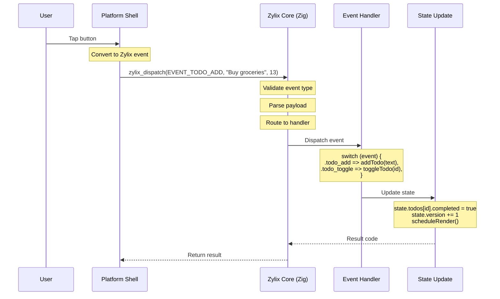

Zylix uses a type-safe event system to handle user interactions. Events flow from platform shells through the core, triggering state changes and UI updates.

## Terms

- **Event**: A typed action sent from platform UI to the Zig core.
- **Dispatch**: The ABI call that routes events to handlers.
- **Payload**: Optional data attached to an event.

## Concept

## Event Architecture



## Implementation

### Event Types

### Built-in Events

Zylix provides common event types for UI interactions:

```zig
pub const EventType = enum(u8) {
    none = 0,
    click = 1,
    double_click = 2,
    mouse_enter = 3,
    mouse_leave = 4,
    mouse_down = 5,
    mouse_up = 6,
    focus = 7,
    blur = 8,
    input = 9,
    change = 10,
    submit = 11,
    key_down = 12,
    key_up = 13,
    key_press = 14,
};
```

### Application Events

Define your own events using discriminated unions:

```zig
// events.zig
pub const Event = union(enum) {
    // Counter events
    counter_increment,
    counter_decrement,
    counter_reset,

    // Todo events
    todo_add: []const u8,        // Payload: todo text
    todo_toggle: u32,            // Payload: todo ID
    todo_remove: u32,            // Payload: todo ID
    todo_clear_completed,
    todo_set_filter: Filter,     // Payload: filter type

    // Navigation events
    navigate: Screen,            // Payload: target screen
};
```

### Event Dispatch

### ABI Export

Events are dispatched through the C ABI:

```zig
// abi.zig
export fn zylix_dispatch(
    event_type: u32,
    payload: ?*anyopaque,
    len: usize
) c_int {
    // Validate event type
    if (event_type > MAX_EVENT_TYPE) {
        return ERROR_INVALID_EVENT;
    }

    // Route to handler
    const result = handleEvent(event_type, payload, len);

    // Trigger render if state changed
    if (result == SUCCESS and state.isDirty()) {
        scheduleRender();
    }

    return result;
}
```

### Platform Dispatch

Each platform calls dispatch differently:

```swift
// iOS/macOS
@_silgen_name("zylix_dispatch")
func zylix_dispatch(
    _ eventType: UInt32,
    _ payload: UnsafeRawPointer?,
    _ len: Int
) -> Int32

// Usage
let text = "Buy groceries"
text.withCString { ptr in
    zylix_dispatch(EVENT_TODO_ADD, ptr, text.count)
}
```

```kotlin
// Android
external fun dispatch(eventType: Int, payload: ByteArray?, len: Int): Int

// Usage
val text = "Buy groceries".toByteArray()
ZylixLib.dispatch(EVENT_TODO_ADD, text, text.size)
```

```javascript
// Web/WASM
function dispatch(eventType, payload) {
    const encoder = new TextEncoder();
    const bytes = encoder.encode(payload);
    const ptr = zylix.alloc(bytes.length);
    zylix.memory.set(bytes, ptr);
    const result = zylix.dispatch(eventType, ptr, bytes.length);
    zylix.free(ptr, bytes.length);
    return result;
}

// Usage
dispatch(EVENT_TODO_ADD, "Buy groceries");
```

```csharp
// Windows
[LibraryImport("zylix", EntryPoint = "zylix_dispatch")]
public static partial int Dispatch(
    uint eventType,
    IntPtr payload,
    nuint len
);

// Usage
var text = "Buy groceries"u8.ToArray();
fixed (byte* ptr = text) {
    ZylixInterop.Dispatch(EVENT_TODO_ADD, (IntPtr)ptr, (nuint)text.Length);
}
```

```c
// Linux (GTK)
extern int zylix_dispatch(
    uint32_t event_type,
    void* payload,
    size_t len
);

// Usage
const char* text = "Buy groceries";
zylix_dispatch(EVENT_TODO_ADD, (void*)text, strlen(text));
```

## Event Handlers

### Handler Registration

```zig
// Callback ID constants
pub const CALLBACK_INCREMENT = 1;
pub const CALLBACK_DECREMENT = 2;
pub const CALLBACK_RESET = 3;
pub const CALLBACK_ADD_TODO = 10;
pub const CALLBACK_TOGGLE_TODO = 11;
pub const CALLBACK_REMOVE_TODO = 12;

// Handler dispatch
pub fn handleCallback(id: u32, data: ?*anyopaque) void {
    switch (id) {
        CALLBACK_INCREMENT => state.handleIncrement(),
        CALLBACK_DECREMENT => state.handleDecrement(),
        CALLBACK_RESET => state.handleReset(),
        CALLBACK_ADD_TODO => {
            if (data) |ptr| {
                const text = @as([*:0]const u8, @ptrCast(ptr));
                todo.addTodo(std.mem.sliceTo(text, 0));
            }
        },
        CALLBACK_TOGGLE_TODO => {
            if (data) |ptr| {
                const id = @as(*const u32, @ptrCast(@alignCast(ptr))).*;
                todo.toggleTodo(id);
            }
        },
        else => {},
    }
}
```

### Event Handler Structure

```zig
pub const EventHandler = struct {
    event_type: EventType = .none,
    callback_id: u32 = 0,
    prevent_default: bool = false,
    stop_propagation: bool = false,
};
```

## Handling Specific Events

### Click Events

```zig
fn handleClick(callback_id: u32) void {
    switch (callback_id) {
        CALLBACK_INCREMENT => {
            const app = state.getStore().getStateMut();
            app.counter += 1;
            state.getStore().commit();
        },
        CALLBACK_SUBMIT => {
            submitForm();
        },
        else => {},
    }
}
```

### Input Events

```zig
fn handleInput(callback_id: u32, text: []const u8) void {
    switch (callback_id) {
        CALLBACK_TEXT_INPUT => {
            const app = state.getStore().getStateMut();
            const len = @min(text.len, app.input_text.len - 1);
            @memcpy(app.input_text[0..len], text[0..len]);
            app.input_len = len;
            state.getStore().commit();
        },
        CALLBACK_SEARCH => {
            performSearch(text);
        },
        else => {},
    }
}
```

### Keyboard Events

```zig
pub const KeyEvent = struct {
    key_code: u16,
    modifiers: KeyModifiers,
};

pub const KeyModifiers = packed struct {
    shift: bool = false,
    ctrl: bool = false,
    alt: bool = false,
    meta: bool = false,
};

fn handleKeyDown(event: KeyEvent) void {
    // Enter key
    if (event.key_code == 13) {
        if (state.getInput().len > 0) {
            todo.addTodo(state.getInput());
            state.clearInput();
        }
    }

    // Escape key
    if (event.key_code == 27) {
        state.clearInput();
    }

    // Ctrl+Z - Undo
    if (event.key_code == 90 and event.modifiers.ctrl) {
        state.undo();
    }
}
```

## Event Validation

### Type Validation

```zig
fn validateEvent(event_type: u32) !EventType {
    if (event_type > @intFromEnum(EventType.key_press)) {
        return error.InvalidEventType;
    }
    return @enumFromInt(event_type);
}
```

### Payload Validation

```zig
fn validatePayload(
    event_type: EventType,
    payload: ?*anyopaque,
    len: usize
) !void {
    switch (event_type) {
        .todo_add => {
            if (payload == null or len == 0) {
                return error.MissingPayload;
            }
            if (len > MAX_TODO_TEXT_LEN) {
                return error.PayloadTooLarge;
            }
        },
        .todo_toggle, .todo_remove => {
            if (len != @sizeOf(u32)) {
                return error.InvalidPayloadSize;
            }
        },
        else => {},
    }
}
```

## Event Queue

For batching multiple events:

```zig
pub const EventQueue = struct {
    events: [MAX_QUEUED_EVENTS]QueuedEvent = undefined,
    count: usize = 0,

    pub fn push(self: *EventQueue, event: QueuedEvent) !void {
        if (self.count >= MAX_QUEUED_EVENTS) {
            return error.QueueFull;
        }
        self.events[self.count] = event;
        self.count += 1;
    }

    pub fn processAll(self: *EventQueue) void {
        for (self.events[0..self.count]) |event| {
            processEvent(event);
        }
        self.count = 0;
    }
};
```

## Error Handling

### Result Codes

```zig
pub const EventResult = enum(c_int) {
    success = 0,
    error_invalid_event = -1,
    error_invalid_payload = -2,
    error_handler_failed = -3,
    error_state_locked = -4,
};
```

### Error Recovery

```zig
fn dispatchWithRecovery(
    event_type: u32,
    payload: ?*anyopaque,
    len: usize
) EventResult {
    // Validate first
    const event = validateEvent(event_type) catch {
        return .error_invalid_event;
    };

    validatePayload(event, payload, len) catch {
        return .error_invalid_payload;
    };

    // Try to handle
    handleEvent(event, payload, len) catch |err| {
        // Log error
        std.log.err("Event handler failed: {}", .{err});

        // Attempt recovery
        state.rollback();

        return .error_handler_failed;
    };

    return .success;
}
```

## Best Practices

### 1. Keep Events Granular

```zig
// Good: Specific events
pub const Event = union(enum) {
    todo_add: []const u8,
    todo_toggle: u32,
    todo_remove: u32,
    todo_edit: struct { id: u32, text: []const u8 },
};

// Avoid: Generic events
pub const Event = union(enum) {
    todo_action: struct {
        action_type: u8,
        id: ?u32,
        text: ?[]const u8,
    },
};
```

### 2. Use Constants for Callback IDs

```zig
// Good: Named constants
pub const CALLBACK_INCREMENT = 1;
pub const CALLBACK_DECREMENT = 2;

node.props.on_click = CALLBACK_INCREMENT;

// Avoid: Magic numbers
node.props.on_click = 1;
```

### 3. Validate Before Processing

```zig
// Good: Validate first
fn handleTodoAdd(text: []const u8) !void {
    if (text.len == 0) return error.EmptyText;
    if (text.len > MAX_TEXT_LEN) return error.TextTooLong;
    if (todo_count >= MAX_TODOS) return error.TooManyTodos;

    // Safe to add
    addTodo(text);
}
```

### 4. Batch Related Events

```zig
// Good: Batch when possible
fn handleBulkComplete(ids: []const u32) void {
    for (ids) |id| {
        completeTodo(id);
    }
    // Single commit after all changes
    state.commit();
    scheduleRender();
}
```

## Debugging Events

### Logging

```zig
fn logEvent(event_type: EventType, payload: ?*anyopaque) void {
    std.log.debug(
        "Event: {s}, payload: {}",
        .{ @tagName(event_type), payload != null }
    );
}
```

### Event History

```zig
var event_history: [256]EventRecord = undefined;
var history_index: usize = 0;

fn recordEvent(event: Event) void {
    event_history[history_index] = .{
        .event = event,
        .timestamp = std.time.milliTimestamp(),
    };
    history_index = (history_index + 1) % 256;
}
```

## Pitfalls

- Dispatching before initialization returns an error code.
- Payload length mismatches lead to invalid reads.
- Reusing payload buffers after dispatch can corrupt data.

## Implementation Links

- [core/src/events.zig](https://github.com/kotsutsumi/zylix/blob/main/core/src/events.zig)
- [core/src/abi.zig](https://github.com/kotsutsumi/zylix/blob/main/core/src/abi.zig)

## Samples

- [platforms/ios/Zylix](https://github.com/kotsutsumi/zylix/tree/main/platforms/ios/Zylix)
- [platforms/android/app](https://github.com/kotsutsumi/zylix/tree/main/platforms/android/app)

## Next Steps

- [State Management](../state-management) - How events trigger state changes
- [Components](../components) - Attach event handlers to components
- [Virtual DOM](../virtual-dom) - How events trigger re-renders
