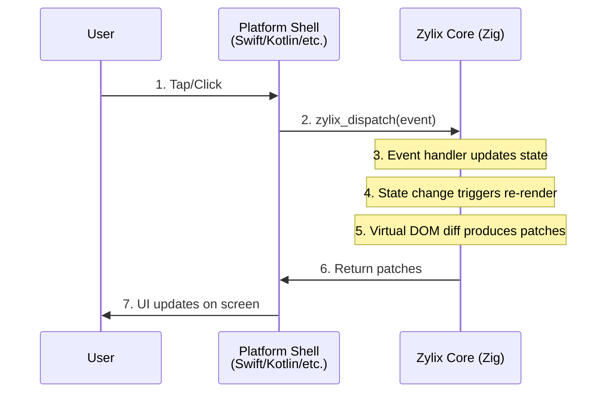

This guide walks you through setting up Zylix and building your first cross-platform application. By the end, you'll have a working Todo app running on your chosen platform.

**Recommended shortest path:** Start with the [Web/WASM tutorial](/tutorials/web) to get a quick success, then follow your platform tutorial from [/tutorials](/tutorials).

## Prerequisites

Before you begin, ensure you have the following installed:

### Required

- **[Zig](https://ziglang.org/download/)** 0.15.0 or later (see [Compatibility Reference](https://github.com/kotsutsumi/zylix/blob/main/docs/COMPATIBILITY.md))
  ```bash
  # Verify installation
  zig version
  # Expected: 0.15.0 or higher
  ```

- **Git** for cloning the repository
  ```bash
  git --version
  ```

### Platform-Specific Requirements

For step-by-step walkthroughs, see the [Tutorials](/tutorials) page.

**Web/WASM** requires:
- A modern web browser (Chrome, Firefox, Safari, Edge)
- A local HTTP server (Python, Node.js, or any static file server)

```bash
# Quick server options
python3 -m http.server 8080
# or
npx serve .
```

**iOS** requires:
- macOS 12 (Monterey) or later
- Xcode 14 or later
- [XcodeGen](https://github.com/yonaskolb/XcodeGen) for project generation

```bash
# Install XcodeGen via Homebrew
brew install xcodegen
```

**Android** requires:
- [Android Studio](https://developer.android.com/studio) Arctic Fox or later
- Android SDK with API level 26+
- Android NDK 25 or later (for native compilation)

```bash
# Set environment variables
export ANDROID_HOME=$HOME/Library/Android/sdk
export ANDROID_NDK_HOME=$ANDROID_HOME/ndk/25.2.9519653
```

**macOS** requires:
- macOS 12 (Monterey) or later
- Xcode 14 or later
- [XcodeGen](https://github.com/yonaskolb/XcodeGen) for project generation

```bash
# Install XcodeGen via Homebrew
brew install xcodegen
```

**Linux** requires:
- GTK4 development libraries
- pkg-config

```bash
# Ubuntu/Debian
sudo apt install libgtk-4-dev pkg-config

# Fedora
sudo dnf install gtk4-devel pkg-config

# Arch Linux
sudo pacman -S gtk4 pkgconf
```

**Windows** requires:
- Windows 10 version 1809 or later
- [.NET 8 SDK](https://dotnet.microsoft.com/download)
- Windows App SDK 1.4 or later

```powershell
# Verify .NET installation
dotnet --version
```

## Installation

### Step 1: Clone the Repository

```bash
git clone https://github.com/kotsutsumi/zylix.git
cd zylix
```

### Step 2: Build the Core Library

The core library contains all shared logic: Virtual DOM, state management, diffing algorithm, and component system.

```bash
cd core
zig build
```

This produces `libzylix.a` (static library) for your current platform.

### Step 3: Verify the Build

Run the test suite to ensure everything is working:

```bash
zig build test
```

You should see all tests passing.

## Project Structure

Understanding the project layout helps navigate the codebase:

```
zylix/
├── core/                      # Zig core library (shared across all platforms)
│   ├── src/
│   │   ├── vdom.zig          # Virtual DOM engine
│   │   ├── diff.zig          # Diffing algorithm
│   │   ├── component.zig     # Component system
│   │   ├── state.zig         # State management
│   │   ├── store.zig         # Generic state store
│   │   ├── events.zig        # Event system
│   │   ├── arena.zig         # Memory arena allocator
│   │   ├── layout.zig        # Layout engine
│   │   ├── css.zig           # CSS-in-Zig styling
│   │   ├── scheduler.zig     # Task scheduler
│   │   ├── abi.zig           # C ABI exports
│   │   ├── wasm.zig          # WASM bindings
│   │   ├── dsl.zig           # Declarative UI DSL
│   │   └── todo.zig          # Todo app implementation
│   └── build.zig             # Build configuration
│
├── platforms/
│   ├── web/                  # Web/WASM platform
│   │   ├── index.html        # HTML shell
│   │   ├── zylix.js          # JavaScript bindings
│   │   └── styles.css        # Platform styles
│   │
│   ├── ios/                  # iOS platform
│   │   ├── Zylix/            # Swift/SwiftUI app
│   │   ├── project.yml       # XcodeGen configuration
│   │   └── ZylixBridge.swift # C ABI bridge
│   │
│   ├── android/              # Android platform
│   │   └── zylix-android/    # Kotlin/Compose app
│   │       ├── app/          # Application module
│   │       └── zylix/        # Native library module
│   │
│   ├── macos/                # macOS platform
│   │   ├── Zylix/            # Swift/SwiftUI app
│   │   └── project.yml       # XcodeGen configuration
│   │
│   ├── linux/                # Linux platform
│   │   └── zylix-gtk/        # GTK4/C app
│   │       ├── src/          # C source files
│   │       └── Makefile      # Build configuration
│   │
│   └── windows/              # Windows platform
│       └── Zylix/            # C#/WinUI 3 app
│           ├── Zylix/        # Application project
│           └── Zylix.sln     # Solution file
│
└── site/                     # This documentation website
```

## Building for Platforms

### Web/WASM

Build the WASM module and serve locally:

```bash
# Build WASM (from core directory)
cd core
zig build wasm -Doptimize=ReleaseSmall

# The output is at: zig-out/lib/zylix.wasm

# Copy to web platform
cp zig-out/lib/zylix.wasm ../platforms/web/

# Serve the web app
cd ../platforms/web
python3 -m http.server 8080
```

Open http://localhost:8080 in your browser.

### iOS

```bash
# Build for iOS (from core directory)
cd core
zig build ios -Doptimize=ReleaseFast

# Generate Xcode project
cd ../platforms/ios
xcodegen generate

# Open in Xcode
open Zylix.xcodeproj
```

Select a simulator or device and press Run (⌘R).

### Android

```bash
# Build for Android (from core directory)
cd core
zig build android -Doptimize=ReleaseFast

# Build with Gradle
cd ../platforms/android/zylix-android
./gradlew assembleDebug

# Install on device/emulator
./gradlew installDebug
```

### macOS

```bash
# Build for macOS (from core directory)
cd core
zig build -Doptimize=ReleaseFast

# Generate Xcode project
cd ../platforms/macos
xcodegen generate

# Open in Xcode
open Zylix.xcodeproj
```

### Linux

```bash
# Build for Linux (from core directory)
cd core
zig build linux -Doptimize=ReleaseFast

# Build GTK app
cd ../platforms/linux/zylix-gtk
make

# Run the app
./build/zylix-todo
```

### Windows

```bash
# Build for Windows (from core directory)
cd core
zig build windows-x64 -Doptimize=ReleaseFast

# Build with .NET
cd ../platforms/windows/Zylix
dotnet build -c Release

# Run the app
dotnet run
```

## Your First App: Hello Zylix

Let's create a simple counter app to understand the basics.

### Understanding the Data Flow



### Core Logic (Zig)

Here's how a counter works in Zylix:

```zig
// state.zig - Define your state
pub const AppState = struct {
    counter: i64 = 0,
};

// events.zig - Define events
pub const Event = union(enum) {
    counter_increment,
    counter_decrement,
    counter_reset,
};

// Handle events
pub fn dispatch(event: Event) void {
    switch (event) {
        .counter_increment => state.counter += 1,
        .counter_decrement => state.counter -= 1,
        .counter_reset => state.counter = 0,
    }
    // Trigger re-render
    reconciler.scheduleRender();
}
```

### Platform Shell (Swift Example)

```swift
import SwiftUI

struct CounterView: View {
    @State private var counter: Int64 = 0

    var body: some View {
        VStack(spacing: 20) {
            Text("Count: \(counter)")
                .font(.largeTitle)

            HStack(spacing: 16) {
                Button("-") {
                    ZylixBridge.dispatch(.counterDecrement)
                    updateState()
                }

                Button("Reset") {
                    ZylixBridge.dispatch(.counterReset)
                    updateState()
                }

                Button("+") {
                    ZylixBridge.dispatch(.counterIncrement)
                    updateState()
                }
            }
        }
    }

    func updateState() {
        counter = ZylixBridge.getState().counter
    }
}
```

## Next Steps

Now that you have Zylix running, explore these topics:

- **[Core Concepts](../core-concepts)**: Deep dive into Virtual DOM, State, and Components
  - **[Architecture](../architecture)**: Understand how Zylix works internally
  - **[Platform Guides](../platforms)**: Platform-specific best practices

## Troubleshooting

### Common Issues

**Zig version mismatch**
```bash
# Check your version
zig version

# Zylix requires 0.15.0+
# Download from https://ziglang.org/download/
```

**WASM not loading in browser**
- Ensure you're serving via HTTP (not file://)
- Check browser console for CORS errors
- Verify the WASM file path is correct

**iOS build fails**
- Run `xcodegen generate` after any changes to project.yml
- Ensure XcodeGen is up to date: `brew upgrade xcodegen`

**Android NDK not found**
- Set `ANDROID_NDK_HOME` environment variable
- Verify NDK is installed via Android Studio SDK Manager

**GTK4 not found on Linux**
- Install development packages: `libgtk-4-dev` (Ubuntu) or `gtk4-devel` (Fedora)
- Run `pkg-config --cflags gtk4` to verify

**Windows build fails**
- Ensure .NET 8 SDK is installed
- Install Windows App SDK via NuGet or Visual Studio
