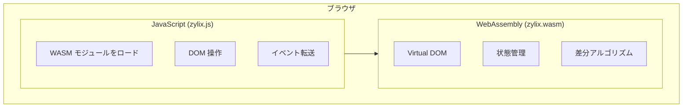
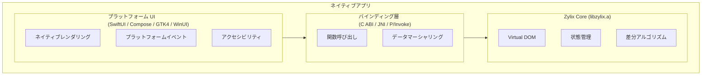

Zylix は組み込みシステムを含む 8 つのプラットフォームで動作し、それぞれネイティブ UI フレームワークを使用して本物のユーザー体験を提供します。このセクションでは、プラットフォーム固有のセットアップ、統合パターン、およびベストプラクティスを説明します。

対応状況の定義は [互換性リファレンス](https://github.com/kotsutsumi/zylix/blob/main/docs/COMPATIBILITY.md) を参照してください。

## 対応プラットフォーム

| プラットフォーム | UI フレームワーク | 言語 | バインディング | ビルドコマンド |
|-----------------|------------------|------|---------------|---------------|
| **Web/WASM** | HTML/JavaScript | JavaScript | WebAssembly | `zig build wasm` |
| **iOS** | SwiftUI | Swift | C ABI | `zig build ios` |
| **watchOS** | SwiftUI | Swift | C ABI | `zig build watchos` |
| **Android** | Jetpack Compose | Kotlin | JNI | `zig build android` |
| **macOS** | SwiftUI | Swift | C ABI | `zig build` |
| **Linux** | GTK4 | C | C ABI | `zig build linux` |
| **Windows** | WinUI 3 | C# | P/Invoke | `zig build windows-x64` |
| **M5Stack** | カスタム Zig UI | Zig | 直接 | `zig build -Dtarget=xtensa-esp32s3` |

## プラットフォーム比較

| 機能 | Web | iOS | watchOS | Android | macOS | Linux | Windows | M5Stack |
|---------|-----|-----|---------|---------|-------|-------|---------|---------|
| **UI フレームワーク** | HTML/JS | SwiftUI | SwiftUI | Compose | SwiftUI | GTK4 | WinUI 3 | Zig UI |
| **言語** | JavaScript | Swift | Swift | Kotlin | Swift | C | C# | Zig |
| **バインディング** | WASM | C ABI | C ABI | JNI | C ABI | C ABI | P/Invoke | 直接 |
| **最小バージョン** | モダンブラウザ | iOS 15+ | watchOS 10+ | API 26+ | macOS 12+ | GTK 4.0+ | Win 10+ | ESP-IDF 5.0+ |
| **バンドルサイズ** | ~50 KB | ~100 KB | ~80 KB | ~150 KB | ~100 KB | ~80 KB | ~120 KB | ~200 KB |
| **ホットリロード** | ✅ | ✅ | ❌ | ✅ | ✅ | ❌ | ❌ | ❌ |

## プラットフォーム別アーキテクチャ

### Web/WASM アーキテクチャ



### ネイティブプラットフォームアーキテクチャ



### 組み込みシステムアーキテクチャ (M5Stack)

```mermaid
flowchart TB
    subgraph Device["M5Stack CoreS3"]
        subgraph Hardware["ハードウェア層"]
            SPI["SPI バス"]
            I2C["I2C バス"]
            GPIO["GPIO"]
        end

        subgraph HAL["ハードウェア抽象化層"]
            Display["ILI9342C ディスプレイドライバ"]
            Touch["FT6336U タッチコントローラ"]
            Power["AXP2101 PMIC"]
            Expander["AW9523B GPIO エキスパンダ"]
        end

        subgraph Core["Zylix Core"]
            VDOM3["Virtual DOM"]
            State3["状態管理"]
            Renderer["RGB565 レンダラー"]
            Gestures["ジェスチャー認識"]
        end

        subgraph UI3["UI コンポーネント"]
            Widgets["ウィジェット"]
            Layout["レイアウトシステム"]
            Styles["スタイリング"]
        end

        Hardware --> HAL
        HAL --> Core
        Core --> UI3
    end
```



## バインディング戦略

### WebAssembly (Web)

JavaScript グルーコードを使用した WASM への直接コンパイル：

```javascript
// WASM モジュールをロード
const wasmModule = await WebAssembly.instantiate(wasmBuffer, {
    env: {
        js_log: (ptr, len) => console.log(readString(ptr, len)),
        js_create_element: (tag, parent) => createElement(tag, parent),
        js_set_text: (el, ptr, len) => setTextContent(el, ptr, len),
    }
});

// 初期化
wasmModule.exports.zylix_init();

// イベントをディスパッチ
function onClick(callbackId) {
    wasmModule.exports.zylix_dispatch(callbackId, 0, 0);
    render();
}
```

### C ABI (iOS, macOS, Linux)

直接関数呼び出しによる静的ライブラリリンク：

```swift
// Swift バインディング
@_silgen_name("zylix_init")
func zylix_init() -> Int32

@_silgen_name("zylix_dispatch")
func zylix_dispatch(_ eventType: UInt32, _ payload: UnsafeRawPointer?, _ len: Int) -> Int32

@_silgen_name("zylix_get_state")
func zylix_get_state() -> UnsafePointer<ZylixState>?

// 使用例
zylix_init()
zylix_dispatch(EVENT_INCREMENT, nil, 0)
let state = zylix_get_state()?.pointee
```

### JNI (Android)

Kotlin/Java 相互運用のための Java Native Interface：

```kotlin
// Kotlin バインディング
object ZylixLib {
    init {
        System.loadLibrary("zylix")
    }

    external fun init(): Int
    external fun deinit(): Int
    external fun dispatch(eventType: Int, payload: ByteArray?, len: Int): Int
    external fun getState(): ZylixState
}

// 使用例
ZylixLib.init()
ZylixLib.dispatch(EVENT_INCREMENT, null, 0)
val state = ZylixLib.getState()
```

### P/Invoke (Windows)

.NET ソース生成相互運用：

```csharp
// C# バインディング
public static partial class ZylixInterop
{
    [LibraryImport("zylix", EntryPoint = "zylix_init")]
    public static partial int Init();

    [LibraryImport("zylix", EntryPoint = "zylix_dispatch")]
    public static partial int Dispatch(uint eventType, IntPtr payload, nuint len);

    [LibraryImport("zylix", EntryPoint = "zylix_get_state")]
    public static partial IntPtr GetState();
}

// 使用例
ZylixInterop.Init();
ZylixInterop.Dispatch(EVENT_INCREMENT, IntPtr.Zero, 0);
var statePtr = ZylixInterop.GetState();
```

## 共通パターン

### 状態監視

各プラットフォームは状態監視を異なる方法で実装します：

```swift
// SwiftUI with ObservableObject
class ZylixStore: ObservableObject {
    @Published var state: ZylixState

    init() {
        zylix_init()
        state = zylix_get_state()!.pointee
    }

    func dispatch(_ event: UInt32) {
        zylix_dispatch(event, nil, 0)
        state = zylix_get_state()!.pointee
    }
}
```

```kotlin
// Compose with MutableState
class ZylixStore {
    var state by mutableStateOf(ZylixLib.getState())
        private set

    fun dispatch(event: Int) {
        ZylixLib.dispatch(event, null, 0)
        state = ZylixLib.getState()
    }
}
```

```javascript
// リアクティブ状態ラッパー
class ZylixStore {
    constructor() {
        this.listeners = [];
        this.state = zylix.getState();
    }

    dispatch(event) {
        zylix.dispatch(event, null, 0);
        this.state = zylix.getState();
        this.listeners.forEach(fn => fn(this.state));
    }

    subscribe(listener) {
        this.listeners.push(listener);
        return () => this.listeners = this.listeners.filter(l => l !== listener);
    }
}
```

```csharp
// MVVM with INotifyPropertyChanged
public class ZylixStore : INotifyPropertyChanged
{
    private ZylixState _state;

    public ZylixState State
    {
        get => _state;
        private set { _state = value; OnPropertyChanged(); }
    }

    public void Dispatch(uint eventType)
    {
        ZylixInterop.Dispatch(eventType, IntPtr.Zero, 0);
        State = Marshal.PtrToStructure<ZylixState>(ZylixInterop.GetState());
    }
}
```

### イベント処理

ネイティブイベントを Zylix イベントに変換：

```swift
Button("インクリメント") {
    store.dispatch(EVENT_INCREMENT)
}
.buttonStyle(.borderedProminent)

TextField("テキストを入力", text: $inputText)
    .onChange(of: inputText) { newValue in
        newValue.withCString { ptr in
            zylix_dispatch(EVENT_TEXT_INPUT, ptr, newValue.count)
        }
    }
```

```kotlin
Button(onClick = { store.dispatch(EVENT_INCREMENT) }) {
    Text("インクリメント")
}

TextField(
    value = inputText,
    onValueChange = { text ->
        ZylixLib.dispatch(EVENT_TEXT_INPUT, text.toByteArray(), text.length)
        inputText = text
    }
)
```

```javascript
button.addEventListener('click', () => {
    store.dispatch(EVENT_INCREMENT);
});

input.addEventListener('input', (e) => {
    const text = e.target.value;
    const bytes = new TextEncoder().encode(text);
    const ptr = zylix.alloc(bytes.length);
    zylix.memory.set(bytes, ptr);
    zylix.dispatch(EVENT_TEXT_INPUT, ptr, bytes.length);
    zylix.free(ptr, bytes.length);
});
```

```csharp
private void OnIncrementClick(object sender, RoutedEventArgs e)
{
    Store.Dispatch(EVENT_INCREMENT);
}

private void OnTextChanged(object sender, TextChangedEventArgs e)
{
    var text = ((TextBox)sender).Text;
    var bytes = Encoding.UTF8.GetBytes(text);
    fixed (byte* ptr = bytes)
    {
        ZylixInterop.Dispatch(EVENT_TEXT_INPUT, (IntPtr)ptr, (nuint)bytes.Length);
    }
}
```

## ビルド設定

### クロスプラットフォームビルドスクリプト

```bash
#!/bin/bash
# build-all.sh

# すべてのプラットフォーム向けにコアをビルド
cd core

# Web/WASM
zig build wasm -Doptimize=ReleaseSmall
cp zig-out/lib/zylix.wasm ../platforms/web/

# iOS (arm64)
zig build -Dtarget=aarch64-ios -Doptimize=ReleaseFast
cp zig-out/lib/libzylix.a ../platforms/ios/

# Android (複数 ABI)
for abi in aarch64-linux-android armv7a-linux-androideabi x86_64-linux-android; do
    zig build -Dtarget=$abi -Doptimize=ReleaseFast
    cp zig-out/lib/libzylix.a ../platforms/android/app/src/main/jniLibs/${abi}/
done

# macOS (ユニバーサルバイナリ)
zig build -Dtarget=aarch64-macos -Doptimize=ReleaseFast
zig build -Dtarget=x86_64-macos -Doptimize=ReleaseFast
lipo -create zig-out/lib/libzylix-arm64.a zig-out/lib/libzylix-x64.a -output ../platforms/macos/libzylix.a

# Linux (x64)
zig build -Dtarget=x86_64-linux-gnu -Doptimize=ReleaseFast
cp zig-out/lib/libzylix.a ../platforms/linux/

# Windows (x64)
zig build -Dtarget=x86_64-windows -Doptimize=ReleaseFast
cp zig-out/lib/zylix.dll ../platforms/windows/
```

## パフォーマンスのヒント

### 全プラットフォーム共通

1. **状態変更を最小化**: 関連する更新をバッチ処理
2. **リストにキーを使用**: 効率的な差分検出を有効化
3. **遅延読み込み**: オンデマンドでデータをロード
4. **メモ化**: 高コストな計算をキャッシュ

### プラットフォーム固有

| プラットフォーム | ヒント |
|----------|--------|
| **Web** | WASM ストリーミングコンパイルを有効化 |
| **iOS** | ローカル状態には `@ObservedObject` より `@State` を優先 |
| **Android** | 高コストな計算には `remember` を使用 |
| **macOS** | カスタム描画よりネイティブコントロールを優先 |
| **Linux** | インラインスタイルより CSS クラスを使用 |
| **Windows** | パフォーマンス向けにコンパイル済みバインディングを有効化 |
| **M5Stack** | ダーティ矩形レンダリングを使用し、全画面再描画を最小化 |

## デバッグ

### 全プラットフォーム共通

```zig
// Zig でデバッグログを有効化
pub const log_level: std.log.Level = .debug;

// 状態変更をログ
pub fn logStateChange(event: Event) void {
    std.log.debug("イベント: {s}, バージョン: {d}", .{
        @tagName(event),
        state.getVersion()
    });
}
```

### プラットフォーム固有ツール

| プラットフォーム | ツール |
|----------|--------|
| **Web** | ブラウザ DevTools、WASM デバッグ |
| **iOS** | Xcode Instruments、View Debugger |
| **Android** | Android Studio Profiler、Layout Inspector |
| **macOS** | Xcode Instruments |
| **Linux** | GTK Inspector、Valgrind |
| **Windows** | Visual Studio Profiler、WinDbg |
| **M5Stack** | ESP-IDF モニター、JTAG デバッグ、シリアル出力 |

## 次のステップ

- [はじめる](../getting-started) - インストールと最初のアプリチュートリアル
- [アーキテクチャ](../architecture) - Zylix の内部構造の詳細
- [コア概念](../core-concepts) - Virtual DOM、状態、コンポーネント、イベント
