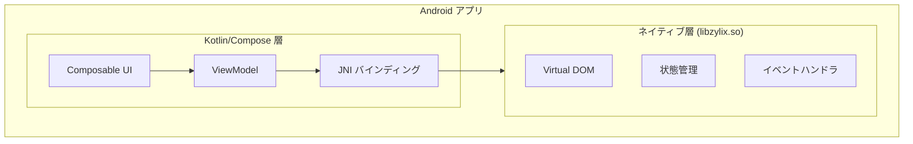

Jetpack Compose を使用して Zylix でネイティブ Android アプリケーションを構築します。このガイドでは、Android Studio のセットアップ、JNI 統合、Google Play デプロイについて説明します。

## 前提条件

始める前に、以下がインストールされていることを確認してください：

- **Android Studio** Hedgehog (2023.1.1) 以降
- **Android NDK** r25 以降
- **Zig** 0.11.0 以降
- **JDK** 17 以降
- Kotlin と Jetpack Compose の基本知識

```bash
# Zig インストールの確認
zig version

# Java インストールの確認
java -version
```

## アーキテクチャ概要



## プロジェクトセットアップ

### ステップ 1: Android プロジェクトの作成

1. Android Studio を開く → New Project
2. **Empty Activity** (Compose) を選択
3. 設定：
   - Name: `ZylixApp`
   - Package: `com.example.zylixapp`
   - Minimum SDK: **API 26** (Android 8.0)

### ステップ 2: Zylix 共有ライブラリのビルド

Android 用に `libzylix.so` をビルド：

```bash
cd core

# arm64-v8a 用にビルド（最も一般的）
zig build -Dtarget=aarch64-linux-android -Doptimize=ReleaseFast

# armeabi-v7a 用にビルド（古いデバイス）
zig build -Dtarget=arm-linux-androideabi -Doptimize=ReleaseFast

# x86_64 用にビルド（エミュレータ）
zig build -Dtarget=x86_64-linux-android -Doptimize=ReleaseFast
```

ライブラリを Android プロジェクトにコピー：
```bash
mkdir -p app/src/main/jniLibs/{arm64-v8a,armeabi-v7a,x86_64}
cp zig-out/lib/libzylix-arm64.so app/src/main/jniLibs/arm64-v8a/libzylix.so
cp zig-out/lib/libzylix-arm.so app/src/main/jniLibs/armeabi-v7a/libzylix.so
cp zig-out/lib/libzylix-x64.so app/src/main/jniLibs/x86_64/libzylix.so
```

## Kotlin 統合

### データクラス

`ZylixState.kt` を作成：

```kotlin
package com.example.zylixapp

data class ZylixState(
    val counter: Int,
    val todoCount: Int,
    val version: Int
)

// イベントタイプ定数
object ZylixEvents {
    const val INCREMENT = 1
    const val DECREMENT = 2
    const val RESET = 3
    const val TODO_ADD = 10
}
```

### JNI ライブラリクラス

`ZylixLib.kt` を作成：

```kotlin
package com.example.zylixapp

object ZylixLib {
    init {
        System.loadLibrary("zylixjni")
    }

    external fun init(): Int
    external fun deinit(): Int
    external fun dispatch(eventType: Int, payload: ByteArray?, len: Int): Int
    external fun getState(): ZylixState?

    // 便利メソッド
    fun dispatch(eventType: Int) = dispatch(eventType, null, 0)

    fun dispatch(eventType: Int, payload: String) {
        val bytes = payload.toByteArray(Charsets.UTF_8)
        dispatch(eventType, bytes, bytes.size)
    }
}
```

### ViewModel

`ZylixViewModel.kt` を作成：

```kotlin
package com.example.zylixapp

import androidx.lifecycle.ViewModel
import kotlinx.coroutines.flow.MutableStateFlow
import kotlinx.coroutines.flow.StateFlow
import kotlinx.coroutines.flow.asStateFlow

class ZylixViewModel : ViewModel() {
    private val _state = MutableStateFlow(ZylixState(0, 0, 0))
    val state: StateFlow<ZylixState> = _state.asStateFlow()

    init {
        val result = ZylixLib.init()
        if (result != 0) {
            throw RuntimeException("Zylix の初期化に失敗: $result")
        }
        refreshState()
    }

    override fun onCleared() {
        super.onCleared()
        ZylixLib.deinit()
    }

    private fun refreshState() {
        ZylixLib.getState()?.let { newState ->
            _state.value = newState
        }
    }

    fun increment() {
        ZylixLib.dispatch(ZylixEvents.INCREMENT)
        refreshState()
    }

    fun decrement() {
        ZylixLib.dispatch(ZylixEvents.DECREMENT)
        refreshState()
    }

    fun reset() {
        ZylixLib.dispatch(ZylixEvents.RESET)
        refreshState()
    }

    fun addTodo(text: String) {
        if (text.isNotBlank()) {
            ZylixLib.dispatch(ZylixEvents.TODO_ADD, text)
            refreshState()
        }
    }
}
```

### Composable UI

`MainActivity.kt` を作成：

```kotlin
package com.example.zylixapp

import android.os.Bundle
import androidx.activity.ComponentActivity
import androidx.activity.compose.setContent
import androidx.activity.viewModels
import androidx.compose.foundation.layout.*
import androidx.compose.material3.*
import androidx.compose.runtime.*
import androidx.compose.ui.Alignment
import androidx.compose.ui.Modifier
import androidx.compose.ui.unit.dp
import androidx.compose.ui.unit.sp

class MainActivity : ComponentActivity() {
    private val viewModel: ZylixViewModel by viewModels()

    override fun onCreate(savedInstanceState: Bundle?) {
        super.onCreate(savedInstanceState)
        setContent {
            MaterialTheme {
                Surface(
                    modifier = Modifier.fillMaxSize(),
                    color = MaterialTheme.colorScheme.background
                ) {
                    ZylixApp(viewModel)
                }
            }
        }
    }
}

@Composable
fun ZylixApp(viewModel: ZylixViewModel) {
    val state by viewModel.state.collectAsState()

    Column(
        modifier = Modifier
            .fillMaxSize()
            .padding(16.dp),
        horizontalAlignment = Alignment.CenterHorizontally
    ) {
        // カウンターセクション
        CounterSection(
            count = state.counter,
            onIncrement = viewModel::increment,
            onDecrement = viewModel::decrement,
            onReset = viewModel::reset
        )
    }
}

@Composable
fun CounterSection(
    count: Int,
    onIncrement: () -> Unit,
    onDecrement: () -> Unit,
    onReset: () -> Unit
) {
    Column(horizontalAlignment = Alignment.CenterHorizontally) {
        Text(
            text = "カウンター",
            style = MaterialTheme.typography.headlineMedium
        )

        Spacer(modifier = Modifier.height(16.dp))

        Text(
            text = "$count",
            fontSize = 64.sp,
            style = MaterialTheme.typography.displayLarge
        )

        Spacer(modifier = Modifier.height(16.dp))

        Row(horizontalArrangement = Arrangement.spacedBy(16.dp)) {
            Button(onClick = onDecrement) {
                Text("-")
            }

            OutlinedButton(onClick = onReset) {
                Text("リセット")
            }

            Button(onClick = onIncrement) {
                Text("+")
            }
        }
    }
}
```

## デバッグ

### よくある問題

| 問題 | 解決策 |
|------|--------|
| UnsatisfiedLinkError | ライブラリが正しい jniLibs フォルダにあるか確認 |
| init でクラッシュ | Logcat でネイティブエラーメッセージを確認 |
| 状態が更新されない | JNI メソッドシグネチャが一致しているか確認 |

## Play Store デプロイ

### 署名付き APK/Bundle の生成

1. Build → Generate Signed Bundle/APK
2. **Android App Bundle** を選択
3. キーストアを作成または使用
4. リリースバージョンをビルド

## 次のステップ

- **[macOS](../macos)**: SwiftUI でネイティブ macOS アプリを構築
  - **[Linux](../linux)**: GTK4 でネイティブ Linux アプリを構築
