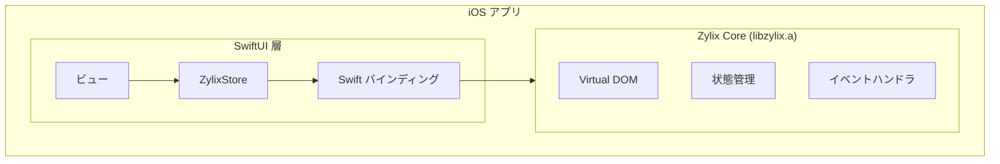


**ステータス: 🚧 開発中** — このプラットフォームは現在SwiftUIデモアプリのみです。C FFI経由のZigコア統合は計画中ですが、まだ実装されていません。以下のコードは目標アーキテクチャを示しています。


SwiftUI を使用して Zylix でネイティブ iOS アプリケーションを構築します。このガイドでは、Xcode プロジェクトのセットアップ、C ABI 統合、App Store デプロイについて説明します。

## 前提条件

始める前に、以下がインストールされていることを確認してください：

- **macOS** 13.0 以降
- **Xcode** 15.0 以降
- **Zig** 0.11.0 以降
- Apple Developer アカウント（デバイステストとデプロイ用）
- Swift と SwiftUI の基本知識

```bash
# インストールの確認
zig version
xcodebuild -version
```

## アーキテクチャ概要



## プロジェクトセットアップ

### ステップ 1: Xcode プロジェクトの作成

1. Xcode を開く → ファイル → 新規 → プロジェクト
2. **iOS** → **App** を選択
3. 設定：
   - Product Name: `ZylixApp`
   - Interface: **SwiftUI**
   - Language: **Swift**

### ステップ 2: Zylix 静的ライブラリのビルド

iOS 用に `libzylix.a` をビルド：

```bash
# Zylix core ディレクトリに移動
cd core

# iOS arm64（デバイス）用にビルド
zig build -Dtarget=aarch64-ios -Doptimize=ReleaseFast

# iOS シミュレータ（arm64 Mac）用にビルド
zig build -Dtarget=aarch64-ios-simulator -Doptimize=ReleaseFast
```

### ステップ 3: Xcode にライブラリを追加

1. `libzylix.a` を Xcode プロジェクトナビゲータにドラッグ
2. ターゲット → **Build Settings**：
   - **Library Search Paths** に追加: `$(PROJECT_DIR)/libs`
   - **Header Search Paths** に追加: `$(PROJECT_DIR)/include`
3. ターゲット → **Build Phases** → **Link Binary With Libraries**：
   - `libzylix.a` がリストされていることを確認

### ステップ 4: ブリッジングヘッダーの作成

`ZylixApp-Bridging-Header.h` を作成：

```c
#ifndef ZylixApp_Bridging_Header_h
#define ZylixApp_Bridging_Header_h

#include <stdint.h>
#include <stddef.h>

// 状態構造体
typedef struct {
    int32_t counter;
    uint32_t todo_count;
    uint32_t version;
} ZylixState;

// 初期化
int32_t zylix_init(void);
int32_t zylix_deinit(void);

// イベントディスパッチ
int32_t zylix_dispatch(uint32_t event_type, const void* payload, size_t len);

// 状態アクセス
const ZylixState* zylix_get_state(void);

// イベントタイプ定数
#define EVENT_INCREMENT 1
#define EVENT_DECREMENT 2
#define EVENT_RESET 3
#define EVENT_TODO_ADD 10

#endif
```

## Swift 統合

### ZylixStore クラス

状態管理用の `ZylixStore.swift` を作成：

```swift
import Foundation
import SwiftUI

@MainActor
class ZylixStore: ObservableObject {
    @Published private(set) var state: ZylixState

    static let shared = ZylixStore()

    private init() {
        let result = zylix_init()
        guard result == 0 else {
            fatalError("Zylix の初期化に失敗: \(result)")
        }

        guard let statePtr = zylix_get_state() else {
            fatalError("初期状態の取得に失敗")
        }
        self.state = statePtr.pointee
    }

    func dispatch(_ eventType: UInt32) {
        zylix_dispatch(eventType, nil, 0)
        refreshState()
    }

    func dispatch(_ eventType: UInt32, payload: String) {
        payload.withCString { ptr in
            zylix_dispatch(eventType, ptr, payload.utf8.count)
        }
        refreshState()
    }

    private func refreshState() {
        guard let statePtr = zylix_get_state() else { return }
        self.state = statePtr.pointee
    }

    // 便利メソッド
    func increment() { dispatch(UInt32(EVENT_INCREMENT)) }
    func decrement() { dispatch(UInt32(EVENT_DECREMENT)) }
    func reset() { dispatch(UInt32(EVENT_RESET)) }

    func addTodo(_ text: String) {
        dispatch(UInt32(EVENT_TODO_ADD), payload: text)
    }
}
```

### SwiftUI ビュー

SwiftUI ビューを作成：

```swift
import SwiftUI

struct ContentView: View {
    @StateObject private var store = ZylixStore.shared

    var body: some View {
        NavigationStack {
            VStack(spacing: 20) {
                // カウンターセクション
                CounterView(
                    count: store.state.counter,
                    onIncrement: store.increment,
                    onDecrement: store.decrement,
                    onReset: store.reset
                )
            }
            .navigationTitle("Zylix デモ")
        }
    }
}

struct CounterView: View {
    let count: Int32
    let onIncrement: () -> Void
    let onDecrement: () -> Void
    let onReset: () -> Void

    var body: some View {
        VStack(spacing: 16) {
            Text("カウンター")
                .font(.headline)

            Text("\(count)")
                .font(.system(size: 48, weight: .bold, design: .rounded))

            HStack(spacing: 20) {
                Button(action: onDecrement) {
                    Image(systemName: "minus.circle.fill")
                        .font(.title)
                }

                Button(action: onReset) {
                    Image(systemName: "arrow.counterclockwise.circle.fill")
                        .font(.title)
                }

                Button(action: onIncrement) {
                    Image(systemName: "plus.circle.fill")
                        .font(.title)
                }
            }
            .buttonStyle(.bordered)
        }
        .padding()
    }
}
```

## デバッグ

### よくある問題

| 問題 | 解決策 |
|------|--------|
| リンカエラー: シンボルが見つからない | `libzylix.a` が Link Binary With Libraries にあるか確認 |
| init でクラッシュ | Zylix 初期化の戻りコードを確認 |
| 状態が更新されない | dispatch 後に `refreshState()` が呼ばれているか確認 |

## App Store デプロイ

### リリース用ビルド

1. **Product** → **Archive** を選択
2. **Distribute App** を選択
3. **App Store Connect** を選択

## 次のステップ

- **[Android](../android)**: Jetpack Compose でネイティブ Android アプリを構築
  - **[macOS](../macos)**: SwiftUI でネイティブ macOS アプリを構築
