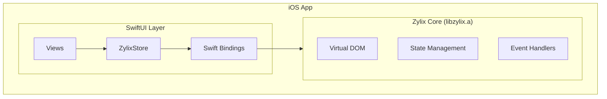

Build native iOS applications with Zylix using SwiftUI. This guide covers Xcode project setup, C ABI integration, and App Store deployment.

## Prerequisites

Before you begin, ensure you have:

- **macOS** 13.0 or later
- **Xcode** 15.0 or later
- **Zig** 0.11.0 or later
- Apple Developer account (for device testing and deployment)
- Basic knowledge of Swift and SwiftUI

```bash
# Verify installations
zig version
xcodebuild -version
```

## Architecture Overview



## Project Setup

### Step 1: Create Xcode Project

1. Open Xcode → File → New → Project
2. Select **iOS** → **App**
3. Configure:
   - Product Name: `ZylixApp`
   - Interface: **SwiftUI**
   - Language: **Swift**

### Step 2: Build Zylix Static Library

Build `libzylix.a` for iOS:

```bash
# Navigate to Zylix core directory
cd core

# Build for iOS arm64 (device)
zig build -Dtarget=aarch64-ios -Doptimize=ReleaseFast

# Build for iOS simulator (arm64 Mac)
zig build -Dtarget=aarch64-ios-simulator -Doptimize=ReleaseFast

# Create universal library (optional)
lipo -create \
    zig-out/lib/libzylix-ios.a \
    zig-out/lib/libzylix-ios-sim.a \
    -output libzylix-universal.a
```

### Step 3: Add Library to Xcode

1. Drag `libzylix.a` into Xcode project navigator
2. Go to target → **Build Settings**:
   - Add to **Library Search Paths**: `$(PROJECT_DIR)/libs`
   - Add to **Header Search Paths**: `$(PROJECT_DIR)/include`
3. Go to target → **Build Phases** → **Link Binary With Libraries**:
   - Ensure `libzylix.a` is listed

### Step 4: Create Bridging Header

Create `ZylixApp-Bridging-Header.h`:

```c
#ifndef ZylixApp_Bridging_Header_h
#define ZylixApp_Bridging_Header_h

#include <stdint.h>
#include <stddef.h>

// State structure
typedef struct {
    int32_t counter;
    uint32_t todo_count;
    uint32_t version;
} ZylixState;

// Initialization
int32_t zylix_init(void);
int32_t zylix_deinit(void);

// Event dispatch
int32_t zylix_dispatch(uint32_t event_type, const void* payload, size_t len);

// State access
const ZylixState* zylix_get_state(void);

// Event type constants
#define EVENT_INCREMENT 1
#define EVENT_DECREMENT 2
#define EVENT_RESET 3
#define EVENT_TODO_ADD 10
#define EVENT_TODO_TOGGLE 11
#define EVENT_TODO_REMOVE 12

#endif
```

Configure in **Build Settings** → **Objective-C Bridging Header**:
```
$(PROJECT_DIR)/ZylixApp-Bridging-Header.h
```

## Swift Integration

### ZylixStore Class

Create `ZylixStore.swift` for state management:

```swift
import Foundation
import SwiftUI

@MainActor
class ZylixStore: ObservableObject {
    @Published private(set) var state: ZylixState

    static let shared = ZylixStore()

    private init() {
        // Initialize Zylix core
        let result = zylix_init()
        guard result == 0 else {
            fatalError("Failed to initialize Zylix: \(result)")
        }

        // Get initial state
        guard let statePtr = zylix_get_state() else {
            fatalError("Failed to get initial state")
        }
        self.state = statePtr.pointee
    }

    deinit {
        zylix_deinit()
    }

    // MARK: - Event Dispatch

    func dispatch(_ eventType: UInt32) {
        zylix_dispatch(eventType, nil, 0)
        refreshState()
    }

    func dispatch(_ eventType: UInt32, payload: String) {
        payload.withCString { ptr in
            zylix_dispatch(eventType, ptr, payload.utf8.count)
        }
        refreshState()
    }

    func dispatch(_ eventType: UInt32, payload: UInt32) {
        withUnsafePointer(to: payload) { ptr in
            zylix_dispatch(eventType, ptr, MemoryLayout<UInt32>.size)
        }
        refreshState()
    }

    private func refreshState() {
        guard let statePtr = zylix_get_state() else { return }
        self.state = statePtr.pointee
    }

    // MARK: - Convenience Methods

    func increment() {
        dispatch(UInt32(EVENT_INCREMENT))
    }

    func decrement() {
        dispatch(UInt32(EVENT_DECREMENT))
    }

    func reset() {
        dispatch(UInt32(EVENT_RESET))
    }

    func addTodo(_ text: String) {
        dispatch(UInt32(EVENT_TODO_ADD), payload: text)
    }

    func toggleTodo(id: UInt32) {
        dispatch(UInt32(EVENT_TODO_TOGGLE), payload: id)
    }

    func removeTodo(id: UInt32) {
        dispatch(UInt32(EVENT_TODO_REMOVE), payload: id)
    }
}
```

### SwiftUI Views

Create your SwiftUI views:

```swift
// ContentView.swift
import SwiftUI

struct ContentView: View {
    @StateObject private var store = ZylixStore.shared

    var body: some View {
        NavigationStack {
            VStack(spacing: 20) {
                // Counter section
                CounterView(
                    count: store.state.counter,
                    onIncrement: store.increment,
                    onDecrement: store.decrement,
                    onReset: store.reset
                )

                Divider()

                // Todo section
                TodoListView(store: store)
            }
            .navigationTitle("Zylix Demo")
        }
    }
}

struct CounterView: View {
    let count: Int32
    let onIncrement: () -> Void
    let onDecrement: () -> Void
    let onReset: () -> Void

    var body: some View {
        VStack(spacing: 16) {
            Text("Counter")
                .font(.headline)

            Text("\(count)")
                .font(.system(size: 48, weight: .bold, design: .rounded))

            HStack(spacing: 20) {
                Button(action: onDecrement) {
                    Image(systemName: "minus.circle.fill")
                        .font(.title)
                }

                Button(action: onReset) {
                    Image(systemName: "arrow.counterclockwise.circle.fill")
                        .font(.title)
                }

                Button(action: onIncrement) {
                    Image(systemName: "plus.circle.fill")
                        .font(.title)
                }
            }
            .buttonStyle(.bordered)
        }
        .padding()
    }
}

struct TodoListView: View {
    @ObservedObject var store: ZylixStore
    @State private var newTodoText = ""

    var body: some View {
        VStack(spacing: 16) {
            Text("Todos (\(store.state.todo_count))")
                .font(.headline)

            HStack {
                TextField("New todo", text: $newTodoText)
                    .textFieldStyle(.roundedBorder)

                Button("Add") {
                    guard !newTodoText.isEmpty else { return }
                    store.addTodo(newTodoText)
                    newTodoText = ""
                }
                .buttonStyle(.borderedProminent)
            }
            .padding(.horizontal)

            // Todo list would go here
            // (Requires additional state structure for todo items)
        }
    }
}
```

### App Entry Point

```swift
// ZylixApp.swift
import SwiftUI

@main
struct ZylixApp: App {
    var body: some Scene {
        WindowGroup {
            ContentView()
        }
    }
}
```

## Advanced Topics

### Async Operations

Handle async operations from Zylix:

```swift
extension ZylixStore {
    func fetchData() async throws {
        // Dispatch async event
        await MainActor.run {
            dispatch(UInt32(EVENT_FETCH_START))
        }

        // Perform async work
        let data = try await URLSession.shared.data(from: apiURL)

        // Update state with result
        await MainActor.run {
            dispatch(UInt32(EVENT_FETCH_SUCCESS), payload: data)
        }
    }
}
```

### Custom Data Types

Pass complex data structures:

```swift
struct TodoItem: Codable {
    let id: UInt32
    let text: String
    let completed: Bool
}

extension ZylixStore {
    func getTodos() -> [TodoItem] {
        // Read from Zylix memory
        guard let todosPtr = zylix_get_todos() else { return [] }
        let count = Int(zylix_get_todo_count())

        var todos: [TodoItem] = []
        for i in 0..<count {
            let todo = todosPtr[i]
            todos.append(TodoItem(
                id: todo.id,
                text: String(cString: &todo.text.0),
                completed: todo.completed
            ))
        }
        return todos
    }
}
```

### Memory Management

Proper cleanup for allocated resources:

```swift
class ZylixResource {
    private var ptr: UnsafeMutableRawPointer?

    init(size: Int) {
        ptr = zylix_alloc(size)
    }

    deinit {
        if let ptr = ptr {
            zylix_free(ptr)
        }
    }
}
```

## Testing

### Unit Tests

```swift
// ZylixStoreTests.swift
import XCTest
@testable import ZylixApp

final class ZylixStoreTests: XCTestCase {
    var store: ZylixStore!

    override func setUp() {
        store = ZylixStore.shared
        store.reset()
    }

    func testIncrement() {
        let initial = store.state.counter
        store.increment()
        XCTAssertEqual(store.state.counter, initial + 1)
    }

    func testDecrement() {
        store.increment()
        let current = store.state.counter
        store.decrement()
        XCTAssertEqual(store.state.counter, current - 1)
    }

    func testReset() {
        store.increment()
        store.increment()
        store.reset()
        XCTAssertEqual(store.state.counter, 0)
    }
}
```

### UI Tests

```swift
// ZylixAppUITests.swift
import XCTest

final class ZylixAppUITests: XCTestCase {
    func testCounterIncrement() throws {
        let app = XCUIApplication()
        app.launch()

        let incrementButton = app.buttons["plus.circle.fill"]
        let counterText = app.staticTexts.matching(identifier: "counterValue").firstMatch

        incrementButton.tap()

        XCTAssertEqual(counterText.label, "1")
    }
}
```

## Debugging

### Xcode Debugger

1. Set breakpoints in Swift code
2. Use **Debug Memory Graph** for memory leaks
3. Use **Instruments** for performance profiling

### Zylix Debug Logging

Enable verbose logging:

```zig
// In Zig code
pub const log_level: std.log.Level = .debug;

// Logs will appear in Xcode console
```

### Common Issues

| Issue | Solution |
|-------|----------|
| Linker error: symbol not found | Ensure `libzylix.a` is in Link Binary With Libraries |
| Crash on init | Check Zylix initialization return code |
| State not updating | Verify `refreshState()` is called after dispatch |
| Memory leak | Use Instruments to find unreleased allocations |

## App Store Deployment

### Build for Release

1. Select **Product** → **Archive**
2. Choose **Distribute App**
3. Select **App Store Connect**

### Required Configurations

In `Info.plist`:
```xml
<key>CFBundleDisplayName</key>
<string>Zylix App</string>
<key>CFBundleIdentifier</key>
<string>com.yourcompany.zylixapp</string>
<key>CFBundleVersion</key>
<string>1</string>
<key>CFBundleShortVersionString</key>
<string>1.0.0</string>
```

### Privacy Declarations

If your app uses network:
```xml
<key>NSAppTransportSecurity</key>
<dict>
    <key>NSAllowsArbitraryLoads</key>
    <false/>
</dict>
```

## Next Steps

- **[Android](../android)**: Build native Android apps with Jetpack Compose
  - **[macOS](../macos)**: Build native macOS apps with SwiftUI
