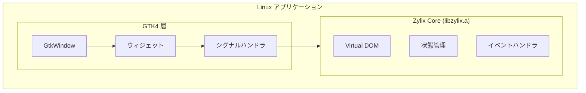

GTK4 を使用して Zylix でネイティブ Linux アプリケーションを構築します。このガイドでは、開発環境のセットアップ、C ABI 統合、配布パッケージングについて説明します。

## 前提条件

始める前に、以下がインストールされていることを確認してください：

- **Linux** ディストリビューション（Ubuntu 22.04+、Fedora 38+ など）
- **Zig** 0.15.0 以降
- **GTK4** 開発ライブラリ
- **pkg-config** とビルドツール
- C と GTK の基本知識

### 依存関係のインストール

```bash
# パッケージリストを更新
sudo apt update

# ビルドツールをインストール
sudo apt install build-essential pkg-config

# GTK4 開発ライブラリをインストール
sudo apt install libgtk-4-dev

# インストールを確認
pkg-config --modversion gtk4
```

```bash
# ビルドツールをインストール
sudo dnf groupinstall "Development Tools"

# GTK4 開発ライブラリをインストール
sudo dnf install gtk4-devel

# インストールを確認
pkg-config --modversion gtk4
```

```bash
# ビルドツールをインストール
sudo pacman -S base-devel

# GTK4 開発ライブラリをインストール
sudo pacman -S gtk4

# インストールを確認
pkg-config --modversion gtk4
```

## アーキテクチャ概要



## プロジェクトセットアップ

### ステップ 1: プロジェクト構造

```
zylix-linux-app/
├── core/                    # Zylix core (Zig)
│   ├── src/
│   │   └── main.zig
│   └── build.zig
├── src/                     # GTK アプリケーション (C)
│   ├── main.c
│   ├── zylix_bindings.h
│   └── app_window.c
├── Makefile
└── meson.build
```

### ステップ 2: Zylix 静的ライブラリのビルド

```bash
cd core

# Linux x86_64 用にビルド
zig build -Dtarget=x86_64-linux-gnu -Doptimize=ReleaseFast

# 出力: zig-out/lib/libzylix.a
cp zig-out/lib/libzylix.a ../lib/
```

## GTK4 統合

### メインアプリケーション

`src/main.c` を作成：

```c
#include <gtk/gtk.h>
#include "zylix_bindings.h"

// グローバル状態参照
static const ZylixState* state = NULL;
static GtkLabel* counter_label = NULL;

static void on_increment_clicked(GtkButton* button, gpointer user_data);
static void on_decrement_clicked(GtkButton* button, gpointer user_data);
static void on_reset_clicked(GtkButton* button, gpointer user_data);
static void update_ui(void);

static void activate(GtkApplication* app, gpointer user_data) {
    // Zylix を初期化
    if (zylix_init() != 0) {
        g_error("Zylix の初期化に失敗");
        return;
    }

    state = zylix_get_state();

    // メインウィンドウを作成
    GtkWidget* window = gtk_application_window_new(app);
    gtk_window_set_title(GTK_WINDOW(window), "Zylix Linux デモ");
    gtk_window_set_default_size(GTK_WINDOW(window), 400, 300);

    // メインボックスを作成
    GtkWidget* main_box = gtk_box_new(GTK_ORIENTATION_VERTICAL, 20);
    gtk_widget_set_margin_top(main_box, 40);
    gtk_widget_set_margin_bottom(main_box, 40);
    gtk_widget_set_margin_start(main_box, 40);
    gtk_widget_set_margin_end(main_box, 40);
    gtk_window_set_child(GTK_WINDOW(window), main_box);

    // タイトル
    GtkWidget* title = gtk_label_new("カウンター");
    gtk_widget_add_css_class(title, "title-1");
    gtk_box_append(GTK_BOX(main_box), title);

    // カウンター値ラベル
    counter_label = GTK_LABEL(gtk_label_new("0"));
    gtk_box_append(GTK_BOX(main_box), GTK_WIDGET(counter_label));

    // ボタンボックス
    GtkWidget* button_box = gtk_box_new(GTK_ORIENTATION_HORIZONTAL, 10);
    gtk_widget_set_halign(button_box, GTK_ALIGN_CENTER);
    gtk_box_append(GTK_BOX(main_box), button_box);

    // デクリメントボタン
    GtkWidget* dec_btn = gtk_button_new_with_label("-");
    g_signal_connect(dec_btn, "clicked", G_CALLBACK(on_decrement_clicked), NULL);
    gtk_box_append(GTK_BOX(button_box), dec_btn);

    // リセットボタン
    GtkWidget* reset_btn = gtk_button_new_with_label("リセット");
    g_signal_connect(reset_btn, "clicked", G_CALLBACK(on_reset_clicked), NULL);
    gtk_box_append(GTK_BOX(button_box), reset_btn);

    // インクリメントボタン
    GtkWidget* inc_btn = gtk_button_new_with_label("+");
    g_signal_connect(inc_btn, "clicked", G_CALLBACK(on_increment_clicked), NULL);
    gtk_box_append(GTK_BOX(button_box), inc_btn);

    update_ui();
    gtk_window_present(GTK_WINDOW(window));
}

static void on_increment_clicked(GtkButton* button, gpointer user_data) {
    zylix_dispatch(EVENT_INCREMENT, NULL, 0);
    update_ui();
}

static void on_decrement_clicked(GtkButton* button, gpointer user_data) {
    zylix_dispatch(EVENT_DECREMENT, NULL, 0);
    update_ui();
}

static void on_reset_clicked(GtkButton* button, gpointer user_data) {
    zylix_dispatch(EVENT_RESET, NULL, 0);
    update_ui();
}

static void update_ui(void) {
    if (state == NULL || counter_label == NULL) return;
    char buffer[32];
    snprintf(buffer, sizeof(buffer), "%d", state->counter);
    gtk_label_set_text(counter_label, buffer);
}

int main(int argc, char* argv[]) {
    GtkApplication* app = gtk_application_new(
        "com.example.zylixlinux",
        G_APPLICATION_DEFAULT_FLAGS);

    g_signal_connect(app, "activate", G_CALLBACK(activate), NULL);
    int status = g_application_run(G_APPLICATION(app), argc, argv);
    g_object_unref(app);

    return status;
}
```

## ビルドシステム

### Makefile

`Makefile` を作成：

```makefile
CC = gcc
CFLAGS = $(shell pkg-config --cflags gtk4) -Wall -Wextra -O2
LDFLAGS = $(shell pkg-config --libs gtk4) -L./lib -lzylix -lm

TARGET = zylix-linux-app
SOURCES = src/main.c
OBJECTS = $(SOURCES:.c=.o)

all: $(TARGET)

$(TARGET): $(OBJECTS)
	$(CC) -o $@ $^ $(LDFLAGS)

%.o: %.c
	$(CC) $(CFLAGS) -c -o $@ $<

clean:
	rm -f $(OBJECTS) $(TARGET)

run: $(TARGET)
	./$(TARGET)

.PHONY: all clean run
```

## デバッグ

### よくある問題

| 問題 | 解決策 |
|------|--------|
| ライブラリが見つからない | `LD_LIBRARY_PATH` を確認するか `-rpath` を使用 |
| GTK 警告 | デバッグ用に `G_DEBUG=fatal-warnings` を有効化 |
| init でセグフォルト | Zylix ライブラリが正しいターゲット用にビルドされているか確認 |

## 配布

### AppImage

AppImage をビルド：
```bash
# AppDir 構造を作成
mkdir -p AppDir/usr/{bin,lib,share/applications,share/icons}
cp zylix-linux-app AppDir/usr/bin/
cp lib/libzylix.a AppDir/usr/lib/

# AppImage をビルド
ARCH=x86_64 appimagetool AppDir
```

### Flatpak

`com.example.ZylixLinux.yml` を作成：

```yaml
app-id: com.example.ZylixLinux
runtime: org.gnome.Platform
runtime-version: '45'
sdk: org.gnome.Sdk
command: zylix-linux-app

finish-args:
  - --share=ipc
  - --socket=fallback-x11
  - --socket=wayland

modules:
  - name: zylix-linux-app
    buildsystem: simple
    build-commands:
      - make
      - install -D zylix-linux-app /app/bin/zylix-linux-app
    sources:
      - type: dir
        path: .
```

## 次のステップ

- **[Windows](../windows)**: WinUI 3 でネイティブ Windows アプリを構築
  - **[Web/WASM](../web)**: WebAssembly で Web アプリを構築
