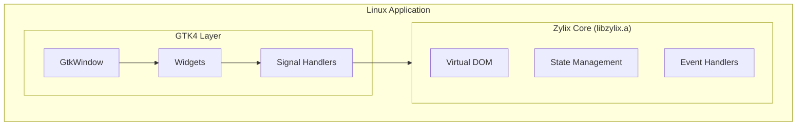

Build native Linux applications with Zylix using GTK4. This guide covers development environment setup, C ABI integration, and distribution packaging.

## Prerequisites

Before you begin, ensure you have:

- **Linux** distribution (Ubuntu 22.04+, Fedora 38+, or similar)
- **Zig** 0.15.0 or later
- **GTK4** development libraries
- **pkg-config** and build tools
- Basic knowledge of C and GTK

### Install Dependencies

```bash
# Update package list
sudo apt update

# Install build tools
sudo apt install build-essential pkg-config

# Install GTK4 development libraries
sudo apt install libgtk-4-dev

# Verify installation
pkg-config --modversion gtk4
```

```bash
# Install build tools
sudo dnf groupinstall "Development Tools"

# Install GTK4 development libraries
sudo dnf install gtk4-devel

# Verify installation
pkg-config --modversion gtk4
```

```bash
# Install build tools
sudo pacman -S base-devel

# Install GTK4 development libraries
sudo pacman -S gtk4

# Verify installation
pkg-config --modversion gtk4
```

## Architecture Overview



## Project Setup

### Step 1: Project Structure

```
zylix-linux-app/
├── core/                    # Zylix core (Zig)
│   ├── src/
│   │   └── main.zig
│   └── build.zig
├── src/                     # GTK application (C)
│   ├── main.c
│   ├── zylix_bindings.h
│   └── app_window.c
├── resources/
│   ├── app.gresource.xml
│   └── window.ui
├── Makefile
└── meson.build              # Alternative build system
```

### Step 2: Build Zylix Static Library

```bash
cd core

# Build for Linux x86_64
zig build -Dtarget=x86_64-linux-gnu -Doptimize=ReleaseFast

# Output: zig-out/lib/libzylix.a
cp zig-out/lib/libzylix.a ../lib/
```

### Step 3: Create C Bindings Header

Create `src/zylix_bindings.h`:

```c
#ifndef ZYLIX_BINDINGS_H
#define ZYLIX_BINDINGS_H

#include <stdint.h>
#include <stddef.h>

// State structure
typedef struct {
    int32_t counter;
    uint32_t todo_count;
    uint32_t version;
} ZylixState;

// Lifecycle functions
int32_t zylix_init(void);
int32_t zylix_deinit(void);

// Event dispatch
int32_t zylix_dispatch(uint32_t event_type, const void* payload, size_t len);

// State access
const ZylixState* zylix_get_state(void);

// Event constants
#define EVENT_INCREMENT 1
#define EVENT_DECREMENT 2
#define EVENT_RESET 3
#define EVENT_TODO_ADD 10
#define EVENT_TODO_TOGGLE 11
#define EVENT_TODO_REMOVE 12

#endif // ZYLIX_BINDINGS_H
```

## GTK4 Integration

### Main Application

Create `src/main.c`:

```c
#include <gtk/gtk.h>
#include "zylix_bindings.h"

// Global state reference
static const ZylixState* state = NULL;
static GtkLabel* counter_label = NULL;

// Forward declarations
static void on_increment_clicked(GtkButton* button, gpointer user_data);
static void on_decrement_clicked(GtkButton* button, gpointer user_data);
static void on_reset_clicked(GtkButton* button, gpointer user_data);
static void update_ui(void);

static void activate(GtkApplication* app, gpointer user_data) {
    // Initialize Zylix
    if (zylix_init() != 0) {
        g_error("Failed to initialize Zylix");
        return;
    }

    state = zylix_get_state();
    if (state == NULL) {
        g_error("Failed to get Zylix state");
        return;
    }

    // Create main window
    GtkWidget* window = gtk_application_window_new(app);
    gtk_window_set_title(GTK_WINDOW(window), "Zylix Linux Demo");
    gtk_window_set_default_size(GTK_WINDOW(window), 400, 300);

    // Create main box
    GtkWidget* main_box = gtk_box_new(GTK_ORIENTATION_VERTICAL, 20);
    gtk_widget_set_margin_top(main_box, 40);
    gtk_widget_set_margin_bottom(main_box, 40);
    gtk_widget_set_margin_start(main_box, 40);
    gtk_widget_set_margin_end(main_box, 40);
    gtk_window_set_child(GTK_WINDOW(window), main_box);

    // Title
    GtkWidget* title = gtk_label_new("Counter");
    gtk_widget_add_css_class(title, "title-1");
    gtk_box_append(GTK_BOX(main_box), title);

    // Counter value label
    counter_label = GTK_LABEL(gtk_label_new("0"));
    gtk_widget_add_css_class(GTK_WIDGET(counter_label), "title-1");
    PangoAttrList* attrs = pango_attr_list_new();
    pango_attr_list_insert(attrs, pango_attr_size_new(72 * PANGO_SCALE));
    pango_attr_list_insert(attrs, pango_attr_weight_new(PANGO_WEIGHT_BOLD));
    gtk_label_set_attributes(counter_label, attrs);
    pango_attr_list_unref(attrs);
    gtk_box_append(GTK_BOX(main_box), GTK_WIDGET(counter_label));

    // Button box
    GtkWidget* button_box = gtk_box_new(GTK_ORIENTATION_HORIZONTAL, 10);
    gtk_widget_set_halign(button_box, GTK_ALIGN_CENTER);
    gtk_box_append(GTK_BOX(main_box), button_box);

    // Decrement button
    GtkWidget* dec_btn = gtk_button_new_with_label("-");
    gtk_widget_add_css_class(dec_btn, "circular");
    gtk_widget_add_css_class(dec_btn, "large");
    g_signal_connect(dec_btn, "clicked", G_CALLBACK(on_decrement_clicked), NULL);
    gtk_box_append(GTK_BOX(button_box), dec_btn);

    // Reset button
    GtkWidget* reset_btn = gtk_button_new_with_label("Reset");
    g_signal_connect(reset_btn, "clicked", G_CALLBACK(on_reset_clicked), NULL);
    gtk_box_append(GTK_BOX(button_box), reset_btn);

    // Increment button
    GtkWidget* inc_btn = gtk_button_new_with_label("+");
    gtk_widget_add_css_class(inc_btn, "circular");
    gtk_widget_add_css_class(inc_btn, "suggested-action");
    gtk_widget_add_css_class(inc_btn, "large");
    g_signal_connect(inc_btn, "clicked", G_CALLBACK(on_increment_clicked), NULL);
    gtk_box_append(GTK_BOX(button_box), inc_btn);

    // Version label
    GtkWidget* version_label = gtk_label_new("State version: 0");
    gtk_widget_add_css_class(version_label, "dim-label");
    gtk_box_append(GTK_BOX(main_box), version_label);

    // Load CSS
    GtkCssProvider* provider = gtk_css_provider_new();
    gtk_css_provider_load_from_string(provider,
        ".large { min-width: 48px; min-height: 48px; font-size: 24px; }");
    gtk_style_context_add_provider_for_display(
        gdk_display_get_default(),
        GTK_STYLE_PROVIDER(provider),
        GTK_STYLE_PROVIDER_PRIORITY_APPLICATION);

    // Update UI with initial state
    update_ui();

    gtk_window_present(GTK_WINDOW(window));
}

static void on_increment_clicked(GtkButton* button, gpointer user_data) {
    (void)button;
    (void)user_data;
    zylix_dispatch(EVENT_INCREMENT, NULL, 0);
    update_ui();
}

static void on_decrement_clicked(GtkButton* button, gpointer user_data) {
    (void)button;
    (void)user_data;
    zylix_dispatch(EVENT_DECREMENT, NULL, 0);
    update_ui();
}

static void on_reset_clicked(GtkButton* button, gpointer user_data) {
    (void)button;
    (void)user_data;
    zylix_dispatch(EVENT_RESET, NULL, 0);
    update_ui();
}

static void update_ui(void) {
    if (state == NULL || counter_label == NULL) return;

    char buffer[32];
    snprintf(buffer, sizeof(buffer), "%d", state->counter);
    gtk_label_set_text(counter_label, buffer);
}

static void shutdown(GtkApplication* app, gpointer user_data) {
    (void)app;
    (void)user_data;
    zylix_deinit();
}

int main(int argc, char* argv[]) {
    GtkApplication* app = gtk_application_new(
        "com.example.zylixlinux",
        G_APPLICATION_DEFAULT_FLAGS);

    g_signal_connect(app, "activate", G_CALLBACK(activate), NULL);
    g_signal_connect(app, "shutdown", G_CALLBACK(shutdown), NULL);

    int status = g_application_run(G_APPLICATION(app), argc, argv);
    g_object_unref(app);

    return status;
}
```

## Build System

### Makefile

Create `Makefile`:

```makefile
CC = gcc
CFLAGS = $(shell pkg-config --cflags gtk4) -Wall -Wextra -O2
LDFLAGS = $(shell pkg-config --libs gtk4) -L./lib -lzylix -lm

TARGET = zylix-linux-app
SOURCES = src/main.c
OBJECTS = $(SOURCES:.c=.o)

all: $(TARGET)

$(TARGET): $(OBJECTS)
	$(CC) -o $@ $^ $(LDFLAGS)

%.o: %.c
	$(CC) $(CFLAGS) -c -o $@ $<

clean:
	rm -f $(OBJECTS) $(TARGET)

run: $(TARGET)
	./$(TARGET)

.PHONY: all clean run
```

### Meson Build (Alternative)

Create `meson.build`:

```meson
project('zylix-linux-app', 'c',
  version: '1.0.0',
  default_options: ['warning_level=2', 'c_std=c17'])

gtk_dep = dependency('gtk4')

# Add Zylix library
zylix_lib = static_library('zylix',
  sources: [],
  link_args: ['-L' + meson.current_source_dir() + '/lib', '-lzylix'])

executable('zylix-linux-app',
  'src/main.c',
  dependencies: [gtk_dep],
  link_with: zylix_lib,
  install: true)
```

Build with Meson:
```bash
meson setup build
meson compile -C build
./build/zylix-linux-app
```

## Advanced Features

### GResource for UI Files

Create `resources/app.gresource.xml`:

```xml
<?xml version="1.0" encoding="UTF-8"?>
<gresources>
  <gresource prefix="/com/example/zylixlinux">
    <file>window.ui</file>
    <file>style.css</file>
  </gresource>
</gresources>
```

Create `resources/window.ui`:

```xml
<?xml version="1.0" encoding="UTF-8"?>
<interface>
  <template class="ZylixWindow" parent="GtkApplicationWindow">
    <property name="title">Zylix Linux Demo</property>
    <property name="default-width">400</property>
    <property name="default-height">300</property>
    <child>
      <object class="GtkBox">
        <property name="orientation">vertical</property>
        <property name="spacing">20</property>
        <property name="margin-top">40</property>
        <property name="margin-bottom">40</property>
        <property name="margin-start">40</property>
        <property name="margin-end">40</property>
        <child>
          <object class="GtkLabel" id="counter_label">
            <property name="label">0</property>
            <style>
              <class name="title-1"/>
            </style>
          </object>
        </child>
      </object>
    </child>
  </template>
</interface>
```

Compile resources:
```bash
glib-compile-resources --target=resources.c --generate-source resources/app.gresource.xml
```

### System Tray Integration

```c
#include <libayatana-appindicator/app-indicator.h>

static AppIndicator* indicator = NULL;

void setup_tray_icon(void) {
    indicator = app_indicator_new(
        "zylix-linux-app",
        "application-default-icon",
        APP_INDICATOR_CATEGORY_APPLICATION_STATUS);

    app_indicator_set_status(indicator, APP_INDICATOR_STATUS_ACTIVE);

    GtkWidget* menu = gtk_menu_new();

    GtkWidget* item_show = gtk_menu_item_new_with_label("Show Window");
    gtk_menu_shell_append(GTK_MENU_SHELL(menu), item_show);

    GtkWidget* item_quit = gtk_menu_item_new_with_label("Quit");
    g_signal_connect(item_quit, "activate", G_CALLBACK(gtk_main_quit), NULL);
    gtk_menu_shell_append(GTK_MENU_SHELL(menu), item_quit);

    gtk_widget_show_all(menu);
    app_indicator_set_menu(indicator, GTK_MENU(menu));
}
```

### D-Bus Integration

```c
#include <gio/gio.h>

static void on_name_acquired(GDBusConnection* connection,
                             const gchar* name,
                             gpointer user_data) {
    g_print("Acquired D-Bus name: %s\n", name);
}

void setup_dbus(void) {
    g_bus_own_name(G_BUS_TYPE_SESSION,
                   "com.example.ZylixLinux",
                   G_BUS_NAME_OWNER_FLAGS_NONE,
                   NULL,
                   on_name_acquired,
                   NULL,
                   NULL,
                   NULL);
}
```

## Debugging

### GDB Debugging

```bash
# Build with debug symbols
CFLAGS="-g -O0" make

# Run with GDB
gdb ./zylix-linux-app

# Set breakpoints
(gdb) break main.c:42
(gdb) run
```

### GTK Inspector

```bash
# Enable GTK Inspector
GTK_DEBUG=interactive ./zylix-linux-app
```

### Valgrind Memory Check

```bash
valgrind --leak-check=full ./zylix-linux-app
```

### Common Issues

| Issue | Solution |
|-------|----------|
| Library not found | Check `LD_LIBRARY_PATH` or use `-rpath` |
| GTK warnings | Enable `G_DEBUG=fatal-warnings` for debugging |
| Segfault on init | Verify Zylix library built for correct target |
| UI not updating | Ensure `update_ui()` called after dispatch |

## Distribution

### AppImage

Create `AppDir/AppRun`:

```bash
#!/bin/bash
SELF=$(readlink -f "$0")
HERE=${SELF%/*}
export LD_LIBRARY_PATH="${HERE}/usr/lib:${LD_LIBRARY_PATH}"
exec "${HERE}/usr/bin/zylix-linux-app" "$@"
```

Build AppImage:
```bash
# Create AppDir structure
mkdir -p AppDir/usr/{bin,lib,share/applications,share/icons}
cp zylix-linux-app AppDir/usr/bin/
cp lib/libzylix.a AppDir/usr/lib/

# Create desktop file
cat > AppDir/usr/share/applications/zylix.desktop << EOF
[Desktop Entry]
Name=Zylix
Exec=zylix-linux-app
Icon=zylix
Type=Application
Categories=Utility;
EOF

# Build AppImage
ARCH=x86_64 appimagetool AppDir
```

### Flatpak

Create `com.example.ZylixLinux.yml`:

```yaml
app-id: com.example.ZylixLinux
runtime: org.gnome.Platform
runtime-version: '45'
sdk: org.gnome.Sdk
command: zylix-linux-app

finish-args:
  - --share=ipc
  - --socket=fallback-x11
  - --socket=wayland
  - --device=dri

modules:
  - name: zylix-linux-app
    buildsystem: simple
    build-commands:
      - make
      - install -D zylix-linux-app /app/bin/zylix-linux-app
    sources:
      - type: dir
        path: .
```

Build Flatpak:
```bash
flatpak-builder --user --install build-dir com.example.ZylixLinux.yml
```

### Debian Package

Create `debian/control`:

```
Package: zylix-linux-app
Version: 1.0.0
Section: utils
Priority: optional
Architecture: amd64
Depends: libgtk-4-1 (>= 4.0)
Maintainer: Your Name <your@email.com>
Description: Zylix Linux Demo Application
 A demonstration of Zylix framework on Linux with GTK4.
```

Build package:
```bash
dpkg-deb --build debian zylix-linux-app_1.0.0_amd64.deb
```

## Next Steps

- **[Windows](../windows)**: Build native Windows apps with WinUI 3
  - **[Web/WASM](../web)**: Build web apps with WebAssembly
