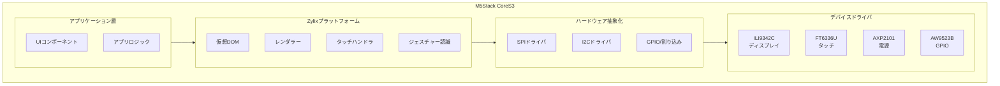

M5Stack CoreS3 SE向けにZylixでネイティブZigを使用した組み込みアプリケーションを構築します。このガイドでは、ESP32-S3のセットアップ、ハードウェアドライバの統合、IoTデプロイメントについて説明します。

プラットフォームのステータス定義は[互換性リファレンス](https://github.com/kotsutsumi/zylix/blob/main/docs/COMPATIBILITY.md)に従います。

## 前提条件

開始する前に、以下を確認してください：

- **Zig** 0.15.0以降（Xtensaサポート付き）
- **ESP-IDF** 5.1以降
- **M5Stack CoreS3 SE** デバイス
- フラッシュ用USB-Cケーブル
- 組み込みシステムの基礎知識

```bash
# インストールの確認
zig version
idf.py --version
```

## ハードウェア概要

### M5Stack CoreS3 SE 仕様

| コンポーネント | チップ | インターフェース | 仕様 |
|---------------|--------|-----------------|------|
| **MCU** | ESP32-S3 | - | デュアルコア Xtensa LX7, 240MHz |
| **ディスプレイ** | ILI9342C | SPI (40MHz) | 320x240 IPS LCD, RGB565 |
| **タッチ** | FT6336U | I2C (0x38) | 静電容量式, 2点マルチタッチ |
| **PMIC** | AXP2101 | I2C (0x34) | バッテリー管理, LDO/DC-DC |
| **GPIOエクスパンダ** | AW9523B | I2C (0x58) | 16ビットI/O, LEDドライバ |
| **メモリ** | - | - | 8MB PSRAM, 16MB Flash |

### ピン割り当て

#### ディスプレイ（SPI）
| ピン | GPIO | 機能 |
|-----|------|------|
| SCLK | GPIO36 | SPIクロック |
| MOSI | GPIO37 | SPIデータ出力 |
| CS | GPIO3 | チップセレクト |
| D/C | GPIO35 | データ/コマンド |
| RST | AW9523B P1_1 | リセット（I/Oエクスパンダ経由） |

#### タッチ & I2C
| ピン | GPIO | 機能 |
|-----|------|------|
| SDA | GPIO12 | I2Cデータ |
| SCL | GPIO11 | I2Cクロック |
| INT | GPIO21 | タッチ割り込み |
| RST | AW9523B P1_0 | タッチリセット |

## アーキテクチャ概要



## プロジェクトセットアップ

### ステップ1: ESP-IDFのインストール

```bash
# ESP-IDFをクローン
git clone --recursive https://github.com/espressif/esp-idf.git
cd esp-idf
git checkout v5.1

# ツールチェーンをインストール
./install.sh esp32s3

# 環境をセットアップ
. ./export.sh
```

### ステップ2: XtensaサポートのZigをインストール

```bash
# Xtensaバックエンド付きZigをダウンロード
# （標準Zigビルドには0.12からXtensaサポートが含まれています）
curl -LO https://ziglang.org/download/0.15.2/zig-macos-aarch64-0.15.2.tar.xz
tar xf zig-macos-aarch64-0.15.2.tar.xz
export PATH=$PWD/zig-macos-aarch64-0.15.2:$PATH
```

### ステップ3: M5Stack用Zylixをビルド

```bash
# M5Stackシェルに移動
cd shells/m5stack

# ホスト用にビルド（テスト用）
zig build

# ESP32-S3用にビルド
zig build -Dtarget=xtensa-esp32s3-none

# テストを実行
zig build test
```

### ステップ4: デバイスにフラッシュ

```bash
# ESP-IDFツールを使用
idf.py -p /dev/tty.usbserial-* flash monitor
```

## ドライバ実装

### ディスプレイドライバ（ILI9342C）

ILI9342Cドライバは完全なLCD制御を提供します：

```zig
const ili9342c = @import("drivers/ili9342c.zig");

// ディスプレイを初期化
var display = try ili9342c.Display.init(.{
    .spi_host = .spi2,
    .clock_speed = 40_000_000, // 40MHz
    .rotation = .portrait,
});

// 画面をクリア
display.clear(ili9342c.Color.black);

// 矩形を描画
display.fillRect(10, 10, 100, 50, ili9342c.Color.blue);

// ディスプレイを更新
display.flush();
```

**機能:**
- DMAによるハードウェアアクセラレーションSPI転送
- RGB565カラーフォーマット（65K色）
- 4つの回転モード（0°, 90°, 180°, 270°）
- 省電力のための部分更新サポート
- 設定可能なフレームレート（30-120 Hz）

### タッチコントローラ（FT6336U）

ジェスチャー認識付き静電容量式タッチ：

```zig
const ft6336u = @import("drivers/ft6336u.zig");

// タッチコントローラを初期化
var touch = try ft6336u.Touch.init(.{
    .i2c_port = .i2c0,
    .interrupt_pin = 21,
    .threshold = 128,
});

// タッチイベントをポーリング
if (touch.read()) |event| {
    switch (event.phase) {
        .began => log.info("タッチ開始: ({}, {})", .{event.x, event.y}),
        .moved => log.info("タッチ移動: ({}, {})", .{event.x, event.y}),
        .ended => log.info("タッチ終了", .{}),
    }
}
```

**機能:**
- 2点マルチタッチサポート
- タッチフェーズ: began, moved, stationary, ended, cancelled
- 圧力/重量検出
- 設定可能な感度（0-255）
- 割り込み駆動またはポーリングモード

### 電源管理（AXP2101）

完全なバッテリーと電源制御：

```zig
const axp2101 = @import("drivers/axp2101.zig");

// PMICを初期化
var pmic = try axp2101.Pmic.init(.{
    .i2c_port = .i2c0,
});

// バッテリー状態を読み取り
const battery = pmic.getBatteryStatus();
log.info("バッテリー: {}% ({}mV)", .{battery.percentage, battery.voltage_mv});

// バックライトを制御
pmic.setBacklight(80); // 80%の明るさ

// 充電を有効化
pmic.setChargingCurrent(500); // 500mA
```

**機能:**
- バッテリー電圧とパーセンテージ監視
- 充電制御（プリチャージ、CC、CVモード）
- 複数のLDO/DC-DCレギュレータ
- 温度監視
- 低電力スリープモード

### GPIOエクスパンダ（AW9523B）

LED制御付き拡張GPIO：

```zig
const aw9523b = @import("drivers/aw9523b.zig");

// GPIOエクスパンダを初期化
var gpio = try aw9523b.GpioExpander.init(.{
    .i2c_port = .i2c0,
});

// ピンを出力として設定
gpio.setDirection(.p0_0, .output);

// ピンをHIGHに設定
gpio.write(.p0_0, true);

// 調光付きLEDモードを有効化
gpio.setLedMode(.p1_4, true);
gpio.setLedBrightness(.p1_4, 128); // 50%の明るさ
```

## グラフィックスシステム

### フレームバッファ

ダブルバッファリング付きRGB565フレームバッファ：

```zig
const framebuffer = @import("graphics/framebuffer.zig");

// フレームバッファを作成
var fb = try framebuffer.Framebuffer.init(allocator, .{
    .width = 320,
    .height = 240,
    .double_buffer = true,
});
defer fb.deinit();

// バックバッファに描画
fb.clear(Color.white);
fb.drawRect(10, 10, 100, 100, Color.red);

// バッファをスワップ
fb.swap();
```

### グラフィックスプリミティブ

```zig
const graphics = @import("graphics/graphics.zig");

var ctx = graphics.Context.init(&fb);

// 線
ctx.drawLine(0, 0, 100, 100, Color.black);
ctx.drawHLine(0, 50, 200, Color.gray);
ctx.drawVLine(100, 0, 240, Color.gray);

// 図形
ctx.drawRect(10, 10, 80, 60, Color.blue);
ctx.fillRect(100, 10, 80, 60, Color.green);
ctx.drawRoundedRect(10, 100, 80, 60, 8, Color.purple);

// 円
ctx.drawCircle(200, 120, 40, Color.red);
ctx.fillCircle(280, 120, 30, Color.orange);

// テキスト
ctx.drawText(10, 200, "Hello, M5Stack!", Color.black, .{
    .font_size = 16,
    .align = .center,
});
```

### カラーユーティリティ

```zig
const Color = framebuffer.Color;

// 定義済みの色
const bg = Color.black;
const fg = Color.white;
const accent = Color.blue;

// カスタムRGB565
const custom = Color.fromRgb(128, 64, 255);

// RGB888から変換
const from888 = Color.fromRgb888(0xFF, 0x80, 0x00);

// 色の補間
const lerped = Color.lerp(Color.red, Color.blue, 0.5);
```

## タッチ & ジェスチャー

### タッチ入力

```zig
const input = @import("touch/input.zig");

var touch_handler = input.TouchHandler.init();

// 更新ループ内で
while (touch_handler.poll()) |touch| {
    switch (touch.phase) {
        .began => onTouchStart(touch),
        .moved => onTouchMove(touch),
        .ended => onTouchEnd(touch),
        else => {},
    }
}
```

### ジェスチャー認識

```zig
const gesture = @import("touch/gesture.zig");

var recognizer = gesture.GestureRecognizer.init(.{
    .tap_timeout_ms = 300,
    .long_press_ms = 500,
    .swipe_threshold = 50,
});

// ジェスチャーを処理
if (recognizer.recognize(touches)) |g| {
    switch (g) {
        .tap => |tap| log.info("タップ: ({}, {})", .{tap.x, tap.y}),
        .double_tap => |dt| log.info("ダブルタップ!", .{}),
        .long_press => |lp| log.info("長押し: ({}, {})", .{lp.x, lp.y}),
        .swipe => |sw| log.info("スワイプ: {s}", .{@tagName(sw.direction)}),
        .pinch => |p| log.info("ピンチ スケール: {d}", .{p.scale}),
        .rotate => |r| log.info("回転 角度: {d}", .{r.angle}),
        .pan => |pan| log.info("パン デルタ: ({}, {})", .{pan.dx, pan.dy}),
    }
}
```

**サポートされるジェスチャー:**
- シングル、ダブル、トリプルタップ
- 長押し（設定可能な時間）
- スワイプ（速度付き4方向）
- ピンチ（スケールファクター付きズームイン/アウト）
- 回転（角度と速度）
- パン（デルタ追跡付きドラッグ）

## UIコンポーネント

### 組み込みコンポーネント

```zig
const ui = @import("ui/mod.zig");

// ボタン
var button = ui.Button.init(.{
    .x = 20, .y = 20,
    .width = 120, .height = 44,
    .text = "クリック",
    .style = .filled,
    .on_press = onButtonPress,
});

// ラベル
var label = ui.Label.init(.{
    .x = 20, .y = 80,
    .text = "カウンター: 0",
    .font_size = 16,
    .align = .center,
});

// プログレスバー
var progress = ui.ProgressBar.init(.{
    .x = 20, .y = 140,
    .width = 200, .height = 20,
    .value = 0.5,
    .style = .linear,
});

// リストビュー
var list = ui.ListView.init(.{
    .x = 20, .y = 180,
    .width = 280, .height = 200,
    .items = &items,
    .on_select = onItemSelect,
});
```

### テーマシステム

```zig
const theme = ui.Theme{
    .primary = Color.fromRgb(33, 150, 243),
    .primary_light = Color.fromRgb(100, 181, 246),
    .primary_dark = Color.fromRgb(25, 118, 210),
    .accent = Color.fromRgb(255, 193, 7),
    .background = Color.white,
    .surface = Color.fromRgb(250, 250, 250),
    .text_primary = Color.fromRgb(33, 33, 33),
    .text_secondary = Color.fromRgb(117, 117, 117),
};

ui.setTheme(theme);
```

## 仮想DOM

### ノードタイプ

```zig
const vdom = @import("renderer/vdom.zig");

// VDOMツリーを作成
var root = vdom.Node.container(.{
    .x = 0, .y = 0,
    .width = 320, .height = 240,
    .children = &.{
        vdom.Node.rect(.{
            .x = 10, .y = 10,
            .width = 300, .height = 50,
            .color = Color.blue,
            .radius = 8,
        }),
        vdom.Node.text(.{
            .x = 160, .y = 35,
            .text = "Hello, World!",
            .color = Color.white,
            .align = .center,
        }),
        vdom.Node.button(.{
            .x = 110, .y = 100,
            .width = 100, .height = 44,
            .text = "OK",
            .on_press = onOkPress,
        }),
    },
});
```

### 効率的な更新

```zig
const reconciler = @import("renderer/reconciler.zig");

var recon = reconciler.Reconciler.init(allocator);

// 初期レンダリング
recon.render(root, &graphics_ctx);

// 状態を更新
root.children[1].text = "更新済み!";

// 効率的な再レンダリング（変更された領域のみ）
recon.reconcile(root, &graphics_ctx);
```

## プラットフォームAPI

### アプリケーション構造

```zig
const platform = @import("platform/mod.zig");

pub fn main() !void {
    var app = try platform.Platform.init(.{
        .rotation = .portrait,
        .backlight = 80,
        .target_fps = 60,
        .double_buffer = true,
    });
    defer app.deinit();

    app.setCallbacks(.{
        .on_init = onInit,
        .on_update = onUpdate,
        .on_draw = onDraw,
        .on_touch = onTouch,
        .on_gesture = onGesture,
        .on_deinit = onDeinit,
    });

    app.run();
}

fn onInit(ctx: *platform.Context) void {
    // アプリ状態を初期化
}

fn onUpdate(ctx: *platform.Context, dt: f32) void {
    // 更新ロジック（毎フレーム呼び出し）
}

fn onDraw(ctx: *platform.Context, gfx: *graphics.Context) void {
    // UIをレンダリング
    gfx.clear(Color.white);
    gfx.drawText(160, 120, "Hello!", Color.black, .{});
}

fn onTouch(ctx: *platform.Context, touch: platform.Touch) void {
    // タッチ入力を処理
}

fn onGesture(ctx: *platform.Context, gesture: platform.Gesture) void {
    // ジェスチャーを処理
}

fn onDeinit(ctx: *platform.Context) void {
    // クリーンアップ
}
```

## サンプルアプリケーション

### Hello World

基本的なディスプレイとアニメーション：

```zig
// shells/m5stack/samples/hello-world/main.zig
const std = @import("std");
const platform = @import("platform");

var offset_y: i32 = 0;
var direction: i32 = 1;

pub fn main() !void {
    var app = try platform.Platform.init(.{});
    defer app.deinit();

    app.setCallbacks(.{
        .on_draw = draw,
        .on_update = update,
    });

    app.run();
}

fn update(ctx: *platform.Context, dt: f32) void {
    offset_y += direction * 2;
    if (offset_y > 100 or offset_y < 0) direction = -direction;
}

fn draw(ctx: *platform.Context, gfx: *graphics.Context) void {
    gfx.clear(Color.black);
    gfx.drawText(160, 120 + offset_y, "Hello, M5Stack!", Color.white, .{
        .align = .center,
        .font_size = 24,
    });
}
```

### カウンターアプリ

タッチインタラクションと状態管理：

```zig
// shells/m5stack/samples/counter/main.zig
var count: i32 = 0;

const buttons = [_]Button{
    .{ .x = 20, .y = 180, .width = 80, .text = "-", .action = .decrement },
    .{ .x = 120, .y = 180, .width = 80, .text = "リセット", .action = .reset },
    .{ .x = 220, .y = 180, .width = 80, .text = "+", .action = .increment },
};

fn onTouch(ctx: *platform.Context, touch: platform.Touch) void {
    if (touch.phase != .ended) return;

    for (buttons) |btn| {
        if (btn.hitTest(touch.x, touch.y)) {
            switch (btn.action) {
                .increment => count += 1,
                .decrement => count -= 1,
                .reset => count = 0,
            }
        }
    }
}

fn draw(ctx: *platform.Context, gfx: *graphics.Context) void {
    gfx.clear(Color.white);

    // カウントを表示
    var buf: [32]u8 = undefined;
    const text = std.fmt.bufPrint(&buf, "{}", .{count}) catch "?";
    gfx.drawText(160, 100, text, Color.black, .{
        .align = .center,
        .font_size = 48,
    });

    // ボタンを描画
    for (buttons) |btn| {
        btn.draw(gfx);
    }
}
```

### タッチデモ

ジェスチャー付きマルチタッチキャンバス：

```zig
// shells/m5stack/samples/touch-demo/main.zig
var canvas: [320 * 240]Color = undefined;
var brush_size: u8 = 8;
var brush_color: Color = Color.black;

fn onTouch(ctx: *platform.Context, touch: platform.Touch) void {
    if (touch.phase == .moved or touch.phase == .began) {
        drawBrush(touch.x, touch.y);
    }
}

fn onGesture(ctx: *platform.Context, gesture: platform.Gesture) void {
    switch (gesture) {
        .double_tap => clearCanvas(),
        .pinch => |p| brush_size = @intCast(@max(2, @min(32, @as(i32, brush_size) * p.scale))),
        else => {},
    }
}

fn drawBrush(x: i32, y: i32) void {
    const r = brush_size / 2;
    for (0..brush_size) |dy| {
        for (0..brush_size) |dx| {
            const px = x - r + @as(i32, dx);
            const py = y - r + @as(i32, dy);
            if (px >= 0 and px < 320 and py >= 0 and py < 240) {
                canvas[@intCast(py * 320 + px)] = brush_color;
            }
        }
    }
}
```

## ビルド設定

### ビルドオプション

```bash
# デバッグビルド（開発用）
zig build

# リリースビルド（最適化済み）
zig build -Doptimize=ReleaseFast

# ESP32-S3用にビルド
zig build -Dtarget=xtensa-esp32s3-none

# 特定のサンプルをビルド
zig build -Dsample=counter

# ドキュメントを生成
zig build docs
```

### プロジェクト構造

```
shells/m5stack/
├── build.zig              # ビルド設定
├── build.zig.zon          # パッケージマニフェスト
├── src/
│   ├── main.zig           # ライブラリエントリーポイント
│   ├── drivers/           # ハードウェアドライバ
│   │   ├── ili9342c.zig   # ディスプレイドライバ
│   │   ├── ft6336u.zig    # タッチドライバ
│   │   ├── axp2101.zig    # 電源管理
│   │   └── aw9523b.zig    # GPIOエクスパンダ
│   ├── hal/               # ハードウェア抽象化
│   │   ├── hal.zig        # HALインターフェース
│   │   ├── spi.zig        # SPIドライバ
│   │   ├── i2c.zig        # I2Cドライバ
│   │   └── interrupt.zig  # 割り込み処理
│   ├── graphics/          # グラフィックスシステム
│   │   ├── framebuffer.zig
│   │   ├── graphics.zig
│   │   └── display.zig
│   ├── touch/             # タッチ入力
│   │   ├── input.zig
│   │   ├── gesture.zig
│   │   └── events.zig
│   ├── ui/                # UIコンポーネント
│   │   ├── mod.zig
│   │   ├── button.zig
│   │   ├── label.zig
│   │   ├── panel.zig
│   │   ├── progress.zig
│   │   └── list.zig
│   ├── renderer/          # 仮想DOM
│   │   ├── vdom.zig
│   │   ├── diff.zig
│   │   └── reconciler.zig
│   └── platform/          # プラットフォーム統合
│       ├── mod.zig
│       └── events.zig
├── samples/               # サンプルアプリケーション
│   ├── hello-world/
│   ├── counter/
│   └── touch-demo/
└── docs/
    ├── SETUP.md           # セットアップガイド
    └── API.md             # APIリファレンス
```

## パフォーマンスのヒント

### ディスプレイ最適化

1. **ダーティレクタングルを使用**: 変更された領域のみを更新
2. **ダブルバッファリングを有効化**: ティアリングを防止
3. **描画呼び出しをバッチ処理**: SPIトランザクションを最小化
4. **DMA転送を使用**: ハードウェアアクセラレーションデータ転送

### メモリ管理

1. **固定アロケーション**: 実行時アロケーションを回避
2. **オブジェクトプーリング**: VDOMノードを再利用
3. **スタックバッファ**: 一時データにスタックを使用
4. **コンパイル時定数**: 実行時オーバーヘッドを削減

### 電力効率

1. **フレームレートを調整**: アイドル時はFPSを下げる
2. **バックライトを暗く**: ディスプレイ電力を削減
3. **スリープモード**: フレーム間でライトスリープを使用
4. **I2C操作をバッチ処理**: バストラフィックを削減

## トラブルシューティング

### よくある問題

| 問題 | 原因 | 解決策 |
|------|------|--------|
| ディスプレイが空白 | SPI設定ミス | ピン割り当てを確認、クロック速度を検証 |
| タッチが反応しない | I2Cアドレス競合 | I2Cバスをスキャン、プルアップを確認 |
| バッテリーが充電されない | PMIC設定 | AXP2101充電設定を確認 |
| レンダリングが遅い | DMAなし | SPI転送でDMAを有効化 |
| タッチドリフト | キャリブレーション | FT6336Uしきい値を調整 |

### デバッグツール

```bash
# シリアル出力を監視
idf.py monitor

# I2Cバススキャン
i2c_scan

# メモリ使用量を確認
zig build -Dlog-level=debug
```

## 次のステップ

- [はじめに](../getting-started) - インストールと最初のアプリ
- [アーキテクチャ](../architecture) - Zylixの内部構造
- [コアコンセプト](../core-concepts) - 仮想DOM、状態、イベント
- [M5Stack Shell README](https://github.com/kotsutsumi/zylix/tree/main/shells/m5stack) - 詳細な実装ドキュメント
