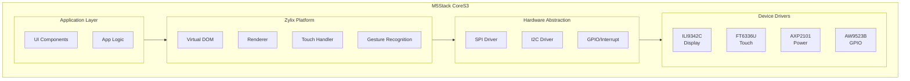

Build embedded applications with Zylix for M5Stack CoreS3 SE using native Zig. This guide covers ESP32-S3 setup, hardware driver integration, and IoT deployment.

Platform status definitions follow the [Compatibility Reference](https://github.com/kotsutsumi/zylix/blob/main/docs/COMPATIBILITY.md).

## Prerequisites

Before you begin, ensure you have:

- **Zig** 0.15.0 or later (with Xtensa support)
- **ESP-IDF** 5.1 or later
- **M5Stack CoreS3 SE** device
- USB-C cable for flashing
- Basic knowledge of embedded systems

```bash
# Verify installations
zig version
idf.py --version
```

## Hardware Overview

### M5Stack CoreS3 SE Specifications

| Component | Chip | Interface | Specifications |
|-----------|------|-----------|----------------|
| **MCU** | ESP32-S3 | - | Dual-core Xtensa LX7, 240MHz |
| **Display** | ILI9342C | SPI (40MHz) | 320x240 IPS LCD, RGB565 |
| **Touch** | FT6336U | I2C (0x38) | Capacitive, 2-point multi-touch |
| **PMIC** | AXP2101 | I2C (0x34) | Battery management, LDO/DC-DC |
| **GPIO Expander** | AW9523B | I2C (0x58) | 16-bit I/O, LED driver |
| **Memory** | - | - | 8MB PSRAM, 16MB Flash |

### Pin Assignments

#### Display (SPI)
| Pin | GPIO | Function |
|-----|------|----------|
| SCLK | GPIO36 | SPI Clock |
| MOSI | GPIO37 | SPI Data Out |
| CS | GPIO3 | Chip Select |
| D/C | GPIO35 | Data/Command |
| RST | AW9523B P1_1 | Reset (via I/O expander) |

#### Touch & I2C
| Pin | GPIO | Function |
|-----|------|----------|
| SDA | GPIO12 | I2C Data |
| SCL | GPIO11 | I2C Clock |
| INT | GPIO21 | Touch Interrupt |
| RST | AW9523B P1_0 | Touch Reset |

## Architecture Overview



## Project Setup

### Step 1: Install ESP-IDF

```bash
# Clone ESP-IDF
git clone --recursive https://github.com/espressif/esp-idf.git
cd esp-idf
git checkout v5.1

# Install toolchain
./install.sh esp32s3

# Set up environment
. ./export.sh
```

### Step 2: Install Zig with Xtensa Support

```bash
# Download Zig with Xtensa backend
# (Standard Zig builds include Xtensa support since 0.12)
curl -LO https://ziglang.org/download/0.15.2/zig-macos-aarch64-0.15.2.tar.xz
tar xf zig-macos-aarch64-0.15.2.tar.xz
export PATH=$PWD/zig-macos-aarch64-0.15.2:$PATH
```

### Step 3: Build Zylix for M5Stack

```bash
# Navigate to M5Stack shell
cd shells/m5stack

# Build for host (testing)
zig build

# Build for ESP32-S3
zig build -Dtarget=xtensa-esp32s3-none

# Run tests
zig build test
```

### Step 4: Flash to Device

```bash
# Using ESP-IDF tools
idf.py -p /dev/tty.usbserial-* flash monitor
```

## Driver Implementation

### Display Driver (ILI9342C)

The ILI9342C driver provides complete LCD control:

```zig
const ili9342c = @import("drivers/ili9342c.zig");

// Initialize display
var display = try ili9342c.Display.init(.{
    .spi_host = .spi2,
    .clock_speed = 40_000_000, // 40MHz
    .rotation = .portrait,
});

// Clear screen
display.clear(ili9342c.Color.black);

// Draw rectangle
display.fillRect(10, 10, 100, 50, ili9342c.Color.blue);

// Update display
display.flush();
```

**Features:**
- Hardware-accelerated SPI transfers with DMA
- RGB565 color format (65K colors)
- 4 rotation modes (0°, 90°, 180°, 270°)
- Partial update support for power efficiency
- Configurable frame rate (30-120 Hz)

### Touch Controller (FT6336U)

Capacitive touch with gesture recognition:

```zig
const ft6336u = @import("drivers/ft6336u.zig");

// Initialize touch controller
var touch = try ft6336u.Touch.init(.{
    .i2c_port = .i2c0,
    .interrupt_pin = 21,
    .threshold = 128,
});

// Poll touch events
if (touch.read()) |event| {
    switch (event.phase) {
        .began => log.info("Touch started at ({}, {})", .{event.x, event.y}),
        .moved => log.info("Touch moved to ({}, {})", .{event.x, event.y}),
        .ended => log.info("Touch ended", .{}),
    }
}
```

**Features:**
- 2-point multi-touch support
- Touch phases: began, moved, stationary, ended, cancelled
- Pressure/weight detection
- Configurable sensitivity (0-255)
- Interrupt-driven or polling mode

### Power Management (AXP2101)

Complete battery and power control:

```zig
const axp2101 = @import("drivers/axp2101.zig");

// Initialize PMIC
var pmic = try axp2101.Pmic.init(.{
    .i2c_port = .i2c0,
});

// Read battery status
const battery = pmic.getBatteryStatus();
log.info("Battery: {}% ({}mV)", .{battery.percentage, battery.voltage_mv});

// Control backlight
pmic.setBacklight(80); // 80% brightness

// Enable charging
pmic.setChargingCurrent(500); // 500mA
```

**Features:**
- Battery voltage and percentage monitoring
- Charging control (pre-charge, CC, CV modes)
- Multiple LDO/DC-DC regulators
- Temperature monitoring
- Low-power sleep modes

### GPIO Expander (AW9523B)

Extended GPIO with LED control:

```zig
const aw9523b = @import("drivers/aw9523b.zig");

// Initialize GPIO expander
var gpio = try aw9523b.GpioExpander.init(.{
    .i2c_port = .i2c0,
});

// Configure pin as output
gpio.setDirection(.p0_0, .output);

// Set pin high
gpio.write(.p0_0, true);

// Enable LED mode with dimming
gpio.setLedMode(.p1_4, true);
gpio.setLedBrightness(.p1_4, 128); // 50% brightness
```

## Graphics System

### Framebuffer

RGB565 framebuffer with double buffering:

```zig
const framebuffer = @import("graphics/framebuffer.zig");

// Create framebuffer
var fb = try framebuffer.Framebuffer.init(allocator, .{
    .width = 320,
    .height = 240,
    .double_buffer = true,
});
defer fb.deinit();

// Draw to back buffer
fb.clear(Color.white);
fb.drawRect(10, 10, 100, 100, Color.red);

// Swap buffers
fb.swap();
```

### Graphics Primitives

```zig
const graphics = @import("graphics/graphics.zig");

var ctx = graphics.Context.init(&fb);

// Lines
ctx.drawLine(0, 0, 100, 100, Color.black);
ctx.drawHLine(0, 50, 200, Color.gray);
ctx.drawVLine(100, 0, 240, Color.gray);

// Shapes
ctx.drawRect(10, 10, 80, 60, Color.blue);
ctx.fillRect(100, 10, 80, 60, Color.green);
ctx.drawRoundedRect(10, 100, 80, 60, 8, Color.purple);

// Circles
ctx.drawCircle(200, 120, 40, Color.red);
ctx.fillCircle(280, 120, 30, Color.orange);

// Text
ctx.drawText(10, 200, "Hello, M5Stack!", Color.black, .{
    .font_size = 16,
    .align = .center,
});
```

### Color Utilities

```zig
const Color = framebuffer.Color;

// Predefined colors
const bg = Color.black;
const fg = Color.white;
const accent = Color.blue;

// Custom RGB565
const custom = Color.fromRgb(128, 64, 255);

// From RGB888
const from888 = Color.fromRgb888(0xFF, 0x80, 0x00);

// Color interpolation
const lerped = Color.lerp(Color.red, Color.blue, 0.5);
```

## Touch & Gestures

### Touch Input

```zig
const input = @import("touch/input.zig");

var touch_handler = input.TouchHandler.init();

// In update loop
while (touch_handler.poll()) |touch| {
    switch (touch.phase) {
        .began => onTouchStart(touch),
        .moved => onTouchMove(touch),
        .ended => onTouchEnd(touch),
        else => {},
    }
}
```

### Gesture Recognition

```zig
const gesture = @import("touch/gesture.zig");

var recognizer = gesture.GestureRecognizer.init(.{
    .tap_timeout_ms = 300,
    .long_press_ms = 500,
    .swipe_threshold = 50,
});

// Process gestures
if (recognizer.recognize(touches)) |g| {
    switch (g) {
        .tap => |tap| log.info("Tap at ({}, {})", .{tap.x, tap.y}),
        .double_tap => |dt| log.info("Double tap!", .{}),
        .long_press => |lp| log.info("Long press at ({}, {})", .{lp.x, lp.y}),
        .swipe => |sw| log.info("Swipe {s}", .{@tagName(sw.direction)}),
        .pinch => |p| log.info("Pinch scale: {d}", .{p.scale}),
        .rotate => |r| log.info("Rotate angle: {d}", .{r.angle}),
        .pan => |pan| log.info("Pan delta: ({}, {})", .{pan.dx, pan.dy}),
    }
}
```

**Supported Gestures:**
- Single, double, triple tap
- Long press (configurable duration)
- Swipe (4 directions with velocity)
- Pinch (zoom in/out with scale factor)
- Rotate (angle and velocity)
- Pan (drag with delta tracking)

## UI Components

### Built-in Components

```zig
const ui = @import("ui/mod.zig");

// Button
var button = ui.Button.init(.{
    .x = 20, .y = 20,
    .width = 120, .height = 44,
    .text = "Click Me",
    .style = .filled,
    .on_press = onButtonPress,
});

// Label
var label = ui.Label.init(.{
    .x = 20, .y = 80,
    .text = "Counter: 0",
    .font_size = 16,
    .align = .center,
});

// Progress Bar
var progress = ui.ProgressBar.init(.{
    .x = 20, .y = 140,
    .width = 200, .height = 20,
    .value = 0.5,
    .style = .linear,
});

// List View
var list = ui.ListView.init(.{
    .x = 20, .y = 180,
    .width = 280, .height = 200,
    .items = &items,
    .on_select = onItemSelect,
});
```

### Theme System

```zig
const theme = ui.Theme{
    .primary = Color.fromRgb(33, 150, 243),
    .primary_light = Color.fromRgb(100, 181, 246),
    .primary_dark = Color.fromRgb(25, 118, 210),
    .accent = Color.fromRgb(255, 193, 7),
    .background = Color.white,
    .surface = Color.fromRgb(250, 250, 250),
    .text_primary = Color.fromRgb(33, 33, 33),
    .text_secondary = Color.fromRgb(117, 117, 117),
};

ui.setTheme(theme);
```

## Virtual DOM

### Node Types

```zig
const vdom = @import("renderer/vdom.zig");

// Create VDOM tree
var root = vdom.Node.container(.{
    .x = 0, .y = 0,
    .width = 320, .height = 240,
    .children = &.{
        vdom.Node.rect(.{
            .x = 10, .y = 10,
            .width = 300, .height = 50,
            .color = Color.blue,
            .radius = 8,
        }),
        vdom.Node.text(.{
            .x = 160, .y = 35,
            .text = "Hello, World!",
            .color = Color.white,
            .align = .center,
        }),
        vdom.Node.button(.{
            .x = 110, .y = 100,
            .width = 100, .height = 44,
            .text = "OK",
            .on_press = onOkPress,
        }),
    },
});
```

### Efficient Updates

```zig
const reconciler = @import("renderer/reconciler.zig");

var recon = reconciler.Reconciler.init(allocator);

// Initial render
recon.render(root, &graphics_ctx);

// Update state
root.children[1].text = "Updated!";

// Efficient re-render (only changed regions)
recon.reconcile(root, &graphics_ctx);
```

## Platform API

### Application Structure

```zig
const platform = @import("platform/mod.zig");

pub fn main() !void {
    var app = try platform.Platform.init(.{
        .rotation = .portrait,
        .backlight = 80,
        .target_fps = 60,
        .double_buffer = true,
    });
    defer app.deinit();

    app.setCallbacks(.{
        .on_init = onInit,
        .on_update = onUpdate,
        .on_draw = onDraw,
        .on_touch = onTouch,
        .on_gesture = onGesture,
        .on_deinit = onDeinit,
    });

    app.run();
}

fn onInit(ctx: *platform.Context) void {
    // Initialize app state
}

fn onUpdate(ctx: *platform.Context, dt: f32) void {
    // Update logic (called every frame)
}

fn onDraw(ctx: *platform.Context, gfx: *graphics.Context) void {
    // Render UI
    gfx.clear(Color.white);
    gfx.drawText(160, 120, "Hello!", Color.black, .{});
}

fn onTouch(ctx: *platform.Context, touch: platform.Touch) void {
    // Handle touch input
}

fn onGesture(ctx: *platform.Context, gesture: platform.Gesture) void {
    // Handle gestures
}

fn onDeinit(ctx: *platform.Context) void {
    // Cleanup
}
```

## Sample Applications

### Hello World

Basic display and animation:

```zig
// shells/m5stack/samples/hello-world/main.zig
const std = @import("std");
const platform = @import("platform");

var offset_y: i32 = 0;
var direction: i32 = 1;

pub fn main() !void {
    var app = try platform.Platform.init(.{});
    defer app.deinit();

    app.setCallbacks(.{
        .on_draw = draw,
        .on_update = update,
    });

    app.run();
}

fn update(ctx: *platform.Context, dt: f32) void {
    offset_y += direction * 2;
    if (offset_y > 100 or offset_y < 0) direction = -direction;
}

fn draw(ctx: *platform.Context, gfx: *graphics.Context) void {
    gfx.clear(Color.black);
    gfx.drawText(160, 120 + offset_y, "Hello, M5Stack!", Color.white, .{
        .align = .center,
        .font_size = 24,
    });
}
```

### Counter App

Touch interaction and state management:

```zig
// shells/m5stack/samples/counter/main.zig
var count: i32 = 0;

const buttons = [_]Button{
    .{ .x = 20, .y = 180, .width = 80, .text = "-", .action = .decrement },
    .{ .x = 120, .y = 180, .width = 80, .text = "Reset", .action = .reset },
    .{ .x = 220, .y = 180, .width = 80, .text = "+", .action = .increment },
};

fn onTouch(ctx: *platform.Context, touch: platform.Touch) void {
    if (touch.phase != .ended) return;

    for (buttons) |btn| {
        if (btn.hitTest(touch.x, touch.y)) {
            switch (btn.action) {
                .increment => count += 1,
                .decrement => count -= 1,
                .reset => count = 0,
            }
        }
    }
}

fn draw(ctx: *platform.Context, gfx: *graphics.Context) void {
    gfx.clear(Color.white);

    // Display count
    var buf: [32]u8 = undefined;
    const text = std.fmt.bufPrint(&buf, "{}", .{count}) catch "?";
    gfx.drawText(160, 100, text, Color.black, .{
        .align = .center,
        .font_size = 48,
    });

    // Draw buttons
    for (buttons) |btn| {
        btn.draw(gfx);
    }
}
```

### Touch Demo

Multi-touch canvas with gestures:

```zig
// shells/m5stack/samples/touch-demo/main.zig
var canvas: [320 * 240]Color = undefined;
var brush_size: u8 = 8;
var brush_color: Color = Color.black;

fn onTouch(ctx: *platform.Context, touch: platform.Touch) void {
    if (touch.phase == .moved or touch.phase == .began) {
        drawBrush(touch.x, touch.y);
    }
}

fn onGesture(ctx: *platform.Context, gesture: platform.Gesture) void {
    switch (gesture) {
        .double_tap => clearCanvas(),
        .pinch => |p| brush_size = @intCast(@max(2, @min(32, @as(i32, brush_size) * p.scale))),
        else => {},
    }
}

fn drawBrush(x: i32, y: i32) void {
    const r = brush_size / 2;
    for (0..brush_size) |dy| {
        for (0..brush_size) |dx| {
            const px = x - r + @as(i32, dx);
            const py = y - r + @as(i32, dy);
            if (px >= 0 and px < 320 and py >= 0 and py < 240) {
                canvas[@intCast(py * 320 + px)] = brush_color;
            }
        }
    }
}
```

## Build Configuration

### Build Options

```bash
# Debug build (for development)
zig build

# Release build (optimized)
zig build -Doptimize=ReleaseFast

# Build for ESP32-S3
zig build -Dtarget=xtensa-esp32s3-none

# Build specific sample
zig build -Dsample=counter

# Generate documentation
zig build docs
```

### Project Structure

```
shells/m5stack/
├── build.zig              # Build configuration
├── build.zig.zon          # Package manifest
├── src/
│   ├── main.zig           # Library entry point
│   ├── drivers/           # Hardware drivers
│   │   ├── ili9342c.zig   # Display driver
│   │   ├── ft6336u.zig    # Touch driver
│   │   ├── axp2101.zig    # Power management
│   │   └── aw9523b.zig    # GPIO expander
│   ├── hal/               # Hardware abstraction
│   │   ├── hal.zig        # HAL interface
│   │   ├── spi.zig        # SPI driver
│   │   ├── i2c.zig        # I2C driver
│   │   └── interrupt.zig  # Interrupt handling
│   ├── graphics/          # Graphics system
│   │   ├── framebuffer.zig
│   │   ├── graphics.zig
│   │   └── display.zig
│   ├── touch/             # Touch input
│   │   ├── input.zig
│   │   ├── gesture.zig
│   │   └── events.zig
│   ├── ui/                # UI components
│   │   ├── mod.zig
│   │   ├── button.zig
│   │   ├── label.zig
│   │   ├── panel.zig
│   │   ├── progress.zig
│   │   └── list.zig
│   ├── renderer/          # Virtual DOM
│   │   ├── vdom.zig
│   │   ├── diff.zig
│   │   └── reconciler.zig
│   └── platform/          # Platform integration
│       ├── mod.zig
│       └── events.zig
├── samples/               # Sample applications
│   ├── hello-world/
│   ├── counter/
│   └── touch-demo/
└── docs/
    ├── SETUP.md           # Setup guide
    └── API.md             # API reference
```

## Performance Tips

### Display Optimization

1. **Use dirty rectangles**: Only update changed regions
2. **Enable double buffering**: Prevent tearing
3. **Batch draw calls**: Minimize SPI transactions
4. **Use DMA transfers**: Hardware-accelerated data transfer

### Memory Management

1. **Fixed allocations**: Avoid runtime allocation
2. **Object pooling**: Reuse VDOM nodes
3. **Stack buffers**: Use stack for temporary data
4. **Comptime constants**: Reduce runtime overhead

### Power Efficiency

1. **Adjust frame rate**: Lower FPS when idle
2. **Dim backlight**: Reduce display power
3. **Sleep modes**: Use light sleep between frames
4. **Batch I2C operations**: Reduce bus traffic

## Troubleshooting

### Common Issues

| Issue | Cause | Solution |
|-------|-------|----------|
| Display blank | SPI misconfiguration | Check pin assignments, verify clock speed |
| Touch not responding | I2C address conflict | Scan I2C bus, check pull-ups |
| Battery not charging | PMIC config | Verify AXP2101 charging settings |
| Slow rendering | No DMA | Enable DMA for SPI transfers |
| Touch drift | Calibration | Adjust FT6336U threshold |

### Debug Tools

```bash
# Monitor serial output
idf.py monitor

# I2C bus scan
i2c_scan

# Check memory usage
zig build -Dlog-level=debug
```

## Next Steps

- [Getting Started](../getting-started) - Installation and first app
- [Architecture](../architecture) - Zylix internals
- [Core Concepts](../core-concepts) - Virtual DOM, State, Events
- [M5Stack Shell README](https://github.com/kotsutsumi/zylix/tree/main/shells/m5stack) - Detailed implementation docs
