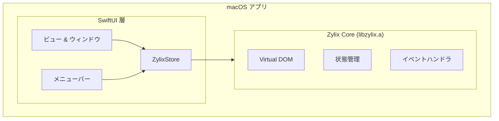


**ステータス: 🚧 開発中** — このプラットフォームは現在SwiftUIデモアプリのみです。C FFI経由のZigコア統合は計画中ですが、まだ実装されていません。以下のコードは目標アーキテクチャを示しています。


SwiftUI を使用して Zylix でネイティブ macOS アプリケーションを構築します。このガイドでは、Xcode プロジェクトのセットアップ、C ABI 統合、Mac App Store デプロイについて説明します。

## 前提条件

始める前に、以下がインストールされていることを確認してください：

- **macOS** 13.0 (Ventura) 以降
- **Xcode** 15.0 以降
- **Zig** 0.11.0 以降
- Apple Developer アカウント（配布用）
- Swift と SwiftUI の基本知識

```bash
# インストールの確認
zig version
xcodebuild -version
swift --version
```

## アーキテクチャ概要



## プロジェクトセットアップ

### ステップ 1: Xcode プロジェクトの作成

1. Xcode を開く → ファイル → 新規 → プロジェクト
2. **macOS** → **App** を選択
3. 設定：
   - Product Name: `ZylixMacApp`
   - Interface: **SwiftUI**
   - Language: **Swift**

### ステップ 2: ユニバーサルバイナリのビルド

Apple Silicon と Intel の両方用に `libzylix.a` をビルド：

```bash
cd core

# Apple Silicon (arm64) 用にビルド
zig build -Dtarget=aarch64-macos -Doptimize=ReleaseFast

# Intel (x86_64) 用にビルド
zig build -Dtarget=x86_64-macos -Doptimize=ReleaseFast

# ユニバーサルバイナリを作成
lipo -create \
    zig-out/lib/libzylix-arm64.a \
    zig-out/lib/libzylix-x64.a \
    -output libzylix.a

# アーキテクチャを確認
lipo -info libzylix.a
# 出力: Architectures in the fat file: libzylix.a are: x86_64 arm64
```

## Swift 統合

### ZylixStore

`ZylixStore.swift` を作成：

```swift
import Foundation
import SwiftUI

@MainActor
class ZylixStore: ObservableObject {
    @Published private(set) var state: ZylixState

    static let shared = ZylixStore()

    private init() {
        let result = zylix_init()
        guard result == 0 else {
            fatalError("Zylix の初期化に失敗: \(result)")
        }

        guard let statePtr = zylix_get_state() else {
            fatalError("初期状態の取得に失敗")
        }
        self.state = statePtr.pointee
    }

    func dispatch(_ eventType: UInt32) {
        zylix_dispatch(eventType, nil, 0)
        refreshState()
    }

    private func refreshState() {
        guard let statePtr = zylix_get_state() else { return }
        self.state = statePtr.pointee
    }

    // 便利メソッド
    func increment() { dispatch(UInt32(EVENT_INCREMENT)) }
    func decrement() { dispatch(UInt32(EVENT_DECREMENT)) }
    func reset() { dispatch(UInt32(EVENT_RESET)) }
}
```

### メインアプリ

`ZylixMacApp.swift` を作成：

```swift
import SwiftUI

@main
struct ZylixMacApp: App {
    @StateObject private var store = ZylixStore.shared

    var body: some Scene {
        WindowGroup {
            ContentView()
                .environmentObject(store)
        }
        .commands {
            // カスタムメニューコマンドを追加
            CommandGroup(after: .newItem) {
                Button("カウンターをリセット") {
                    store.reset()
                }
                .keyboardShortcut("R", modifiers: [.command, .shift])
            }
        }

        // 設定ウィンドウ
        Settings {
            SettingsView()
        }

        // メニューバーエクストラ（オプション）
        MenuBarExtra("Zylix", systemImage: "star.fill") {
            MenuBarView()
                .environmentObject(store)
        }
    }
}
```

### コンテンツビュー

`ContentView.swift` を作成：

```swift
import SwiftUI

struct ContentView: View {
    @EnvironmentObject var store: ZylixStore
    @State private var selectedTab = 0

    var body: some View {
        NavigationSplitView {
            // サイドバー
            List(selection: $selectedTab) {
                Label("カウンター", systemImage: "number")
                    .tag(0)
                Label("Todo", systemImage: "checklist")
                    .tag(1)
            }
            .listStyle(.sidebar)
            .frame(minWidth: 150)
        } detail: {
            // メインコンテンツ
            switch selectedTab {
            case 0:
                CounterView()
            case 1:
                TodoView()
            default:
                Text("項目を選択")
            }
        }
        .frame(minWidth: 600, minHeight: 400)
    }
}

struct CounterView: View {
    @EnvironmentObject var store: ZylixStore

    var body: some View {
        VStack(spacing: 24) {
            Text("カウンター")
                .font(.largeTitle)
                .fontWeight(.bold)

            Text("\(store.state.counter)")
                .font(.system(size: 72, weight: .bold, design: .rounded))
                .foregroundColor(.accentColor)

            HStack(spacing: 16) {
                Button(action: store.decrement) {
                    Image(systemName: "minus.circle.fill")
                        .font(.title)
                }
                .buttonStyle(.bordered)
                .controlSize(.large)

                Button(action: store.reset) {
                    Image(systemName: "arrow.counterclockwise")
                        .font(.title)
                }
                .buttonStyle(.bordered)
                .controlSize(.large)

                Button(action: store.increment) {
                    Image(systemName: "plus.circle.fill")
                        .font(.title)
                }
                .buttonStyle(.borderedProminent)
                .controlSize(.large)
            }
        }
        .padding(40)
        .frame(maxWidth: .infinity, maxHeight: .infinity)
    }
}
```

## デバッグ

### よくある問題

| 問題 | 解決策 |
|------|--------|
| リンカエラー | `libzylix.a` が Link Binary With Libraries にあるか確認 |
| init でクラッシュ | Zylix 初期化の戻りコードを確認 |
| 状態が更新されない | `refreshState()` が dispatch 後に呼ばれているか確認 |

## 配布

### Mac App Store

1. **署名と機能**：
   - App Sandbox 機能を追加
   - Hardened Runtime を設定

2. **アーカイブとアップロード**：
   - Product → Archive
   - Distribute App → App Store Connect

### 直接配布

1. **公証**:
```bash
# 公証用 ZIP を作成
ditto -c -k --keepParent "ZylixMacApp.app" "ZylixMacApp.zip"

# 公証に提出
xcrun notarytool submit "ZylixMacApp.zip" \
    --apple-id "your@email.com" \
    --team-id "YOUR_TEAM_ID" \
    --password "@keychain:AC_PASSWORD" \
    --wait

# 公証をステープル
xcrun stapler staple "ZylixMacApp.app"
```

## 次のステップ

- **[Linux](../linux)**: GTK4 でネイティブ Linux アプリを構築
  - **[Windows](../windows)**: WinUI 3 でネイティブ Windows アプリを構築
