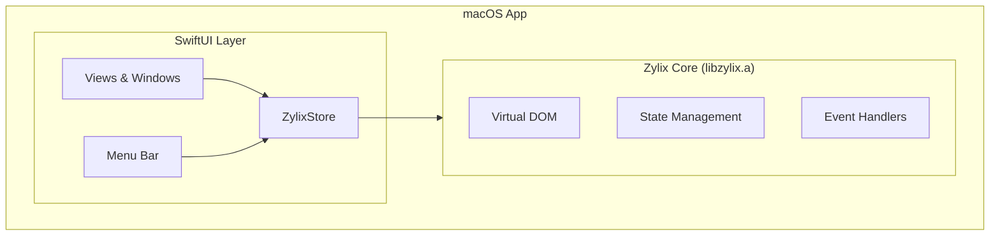

Build native macOS applications with Zylix using SwiftUI. This guide covers Xcode project setup, C ABI integration, and Mac App Store deployment.

## Prerequisites

Before you begin, ensure you have:

- **macOS** 13.0 (Ventura) or later
- **Xcode** 15.0 or later
- **Zig** 0.15.0 or later
- Apple Developer account (for distribution)
- Basic knowledge of Swift and SwiftUI

```bash
# Verify installations
zig version
xcodebuild -version
swift --version
```

## Architecture Overview



## Project Setup

### Step 1: Create Xcode Project

1. Open Xcode → File → New → Project
2. Select **macOS** → **App**
3. Configure:
   - Product Name: `ZylixMacApp`
   - Interface: **SwiftUI**
   - Language: **Swift**
   - Uncheck "Include Tests" (add later if needed)

### Step 2: Build Universal Binary

Build `libzylix.a` for both Apple Silicon and Intel:

```bash
cd core

# Build for Apple Silicon (arm64)
zig build -Dtarget=aarch64-macos -Doptimize=ReleaseFast

# Build for Intel (x86_64)
zig build -Dtarget=x86_64-macos -Doptimize=ReleaseFast

# Create universal binary
lipo -create \
    zig-out/lib/libzylix-arm64.a \
    zig-out/lib/libzylix-x64.a \
    -output libzylix.a

# Verify architectures
lipo -info libzylix.a
# Output: Architectures in the fat file: libzylix.a are: x86_64 arm64
```

### Step 3: Add Library to Xcode

1. Drag `libzylix.a` into Xcode project navigator
2. Target → **Build Settings**:
   - **Library Search Paths**: `$(PROJECT_DIR)/libs`
   - **Header Search Paths**: `$(PROJECT_DIR)/include`
3. Target → **Build Phases** → **Link Binary With Libraries**:
   - Add `libzylix.a`

### Step 4: Create Bridging Header

Create `ZylixMacApp-Bridging-Header.h`:

```c
#ifndef ZylixMacApp_Bridging_Header_h
#define ZylixMacApp_Bridging_Header_h

#include <stdint.h>
#include <stddef.h>

// State structure
typedef struct {
    int32_t counter;
    uint32_t todo_count;
    uint32_t version;
} ZylixState;

// Lifecycle
int32_t zylix_init(void);
int32_t zylix_deinit(void);

// Event dispatch
int32_t zylix_dispatch(uint32_t event_type, const void* payload, size_t len);

// State access
const ZylixState* zylix_get_state(void);

// Events
#define EVENT_INCREMENT 1
#define EVENT_DECREMENT 2
#define EVENT_RESET 3
#define EVENT_TODO_ADD 10
#define EVENT_TODO_TOGGLE 11
#define EVENT_TODO_REMOVE 12

#endif
```

## Swift Integration

### ZylixStore

Create `ZylixStore.swift`:

```swift
import Foundation
import SwiftUI

@MainActor
class ZylixStore: ObservableObject {
    @Published private(set) var state: ZylixState

    static let shared = ZylixStore()

    private init() {
        let result = zylix_init()
        guard result == 0 else {
            fatalError("Failed to initialize Zylix: \(result)")
        }

        guard let statePtr = zylix_get_state() else {
            fatalError("Failed to get initial state")
        }
        self.state = statePtr.pointee
    }

    deinit {
        zylix_deinit()
    }

    func dispatch(_ eventType: UInt32) {
        zylix_dispatch(eventType, nil, 0)
        refreshState()
    }

    func dispatch(_ eventType: UInt32, payload: String) {
        payload.withCString { ptr in
            zylix_dispatch(eventType, ptr, payload.utf8.count)
        }
        refreshState()
    }

    func dispatch(_ eventType: UInt32, payload: UInt32) {
        withUnsafePointer(to: payload) { ptr in
            zylix_dispatch(eventType, ptr, MemoryLayout<UInt32>.size)
        }
        refreshState()
    }

    private func refreshState() {
        guard let statePtr = zylix_get_state() else { return }
        self.state = statePtr.pointee
    }

    // Convenience methods
    func increment() { dispatch(UInt32(EVENT_INCREMENT)) }
    func decrement() { dispatch(UInt32(EVENT_DECREMENT)) }
    func reset() { dispatch(UInt32(EVENT_RESET)) }

    func addTodo(_ text: String) {
        dispatch(UInt32(EVENT_TODO_ADD), payload: text)
    }

    func toggleTodo(id: UInt32) {
        dispatch(UInt32(EVENT_TODO_TOGGLE), payload: id)
    }

    func removeTodo(id: UInt32) {
        dispatch(UInt32(EVENT_TODO_REMOVE), payload: id)
    }
}
```

### Main App

Create `ZylixMacApp.swift`:

```swift
import SwiftUI

@main
struct ZylixMacApp: App {
    @StateObject private var store = ZylixStore.shared

    var body: some Scene {
        WindowGroup {
            ContentView()
                .environmentObject(store)
        }
        .commands {
            // Add custom menu commands
            CommandGroup(after: .newItem) {
                Button("Reset Counter") {
                    store.reset()
                }
                .keyboardShortcut("R", modifiers: [.command, .shift])
            }
        }

        // Settings window
        Settings {
            SettingsView()
        }

        // Menu bar extra (optional)
        MenuBarExtra("Zylix", systemImage: "star.fill") {
            MenuBarView()
                .environmentObject(store)
        }
    }
}
```

### Content View

Create `ContentView.swift`:

```swift
import SwiftUI

struct ContentView: View {
    @EnvironmentObject var store: ZylixStore
    @State private var selectedTab = 0

    var body: some View {
        NavigationSplitView {
            // Sidebar
            List(selection: $selectedTab) {
                Label("Counter", systemImage: "number")
                    .tag(0)
                Label("Todos", systemImage: "checklist")
                    .tag(1)
            }
            .listStyle(.sidebar)
            .frame(minWidth: 150)
        } detail: {
            // Main content
            switch selectedTab {
            case 0:
                CounterView()
            case 1:
                TodoView()
            default:
                Text("Select an item")
            }
        }
        .frame(minWidth: 600, minHeight: 400)
    }
}

struct CounterView: View {
    @EnvironmentObject var store: ZylixStore

    var body: some View {
        VStack(spacing: 24) {
            Text("Counter")
                .font(.largeTitle)
                .fontWeight(.bold)

            Text("\(store.state.counter)")
                .font(.system(size: 72, weight: .bold, design: .rounded))
                .foregroundColor(.accentColor)

            HStack(spacing: 16) {
                Button(action: store.decrement) {
                    Image(systemName: "minus.circle.fill")
                        .font(.title)
                }
                .buttonStyle(.bordered)
                .controlSize(.large)

                Button(action: store.reset) {
                    Image(systemName: "arrow.counterclockwise")
                        .font(.title)
                }
                .buttonStyle(.bordered)
                .controlSize(.large)

                Button(action: store.increment) {
                    Image(systemName: "plus.circle.fill")
                        .font(.title)
                }
                .buttonStyle(.borderedProminent)
                .controlSize(.large)
            }

            Text("State version: \(store.state.version)")
                .font(.caption)
                .foregroundColor(.secondary)
        }
        .padding(40)
        .frame(maxWidth: .infinity, maxHeight: .infinity)
    }
}

struct TodoView: View {
    @EnvironmentObject var store: ZylixStore
    @State private var newTodoText = ""

    var body: some View {
        VStack(spacing: 16) {
            Text("Todos (\(store.state.todo_count))")
                .font(.largeTitle)
                .fontWeight(.bold)

            HStack {
                TextField("New todo...", text: $newTodoText)
                    .textFieldStyle(.roundedBorder)
                    .onSubmit {
                        addTodo()
                    }

                Button("Add", action: addTodo)
                    .buttonStyle(.borderedProminent)
                    .disabled(newTodoText.isEmpty)
            }
            .padding(.horizontal)

            // Todo list placeholder
            List {
                Text("Todo items would appear here")
                    .foregroundColor(.secondary)
            }
        }
        .padding()
        .frame(maxWidth: .infinity, maxHeight: .infinity)
    }

    private func addTodo() {
        guard !newTodoText.isEmpty else { return }
        store.addTodo(newTodoText)
        newTodoText = ""
    }
}
```

### Menu Bar View

```swift
struct MenuBarView: View {
    @EnvironmentObject var store: ZylixStore

    var body: some View {
        VStack(alignment: .leading, spacing: 8) {
            Text("Counter: \(store.state.counter)")
                .font(.headline)

            Divider()

            Button("Increment") { store.increment() }
            Button("Decrement") { store.decrement() }
            Button("Reset") { store.reset() }

            Divider()

            Button("Quit") {
                NSApplication.shared.terminate(nil)
            }
            .keyboardShortcut("Q")
        }
        .padding()
        .frame(width: 200)
    }
}
```

### Settings View

```swift
struct SettingsView: View {
    @AppStorage("autoSave") private var autoSave = true
    @AppStorage("showMenuBar") private var showMenuBar = true

    var body: some View {
        Form {
            Toggle("Auto-save state", isOn: $autoSave)
            Toggle("Show in menu bar", isOn: $showMenuBar)
        }
        .padding()
        .frame(width: 300)
    }
}
```

## macOS-Specific Features

### Keyboard Shortcuts

```swift
struct ContentView: View {
    var body: some View {
        // ...
    }
    .onAppear {
        NSEvent.addLocalMonitorForEvents(matching: .keyDown) { event in
            if event.modifierFlags.contains(.command) {
                switch event.charactersIgnoringModifiers {
                case "=", "+":
                    store.increment()
                    return nil
                case "-":
                    store.decrement()
                    return nil
                default:
                    break
                }
            }
            return event
        }
    }
}
```

### Drag and Drop

```swift
struct TodoView: View {
    var body: some View {
        List {
            // ...
        }
        .onDrop(of: [.plainText], isTargeted: nil) { providers in
            providers.first?.loadItem(forTypeIdentifier: "public.plain-text") { data, _ in
                if let data = data as? Data,
                   let text = String(data: data, encoding: .utf8) {
                    Task { @MainActor in
                        store.addTodo(text)
                    }
                }
            }
            return true
        }
    }
}
```

### Touch Bar Support

```swift
struct ContentView: View {
    var body: some View {
        // ...
    }
    .touchBar {
        Button(action: store.decrement) {
            Image(systemName: "minus")
        }
        Button(action: store.reset) {
            Image(systemName: "arrow.counterclockwise")
        }
        Button(action: store.increment) {
            Image(systemName: "plus")
        }
    }
}
```

## Testing

### Unit Tests

```swift
import XCTest
@testable import ZylixMacApp

final class ZylixStoreTests: XCTestCase {
    func testIncrement() async {
        let store = await ZylixStore.shared
        let initial = await store.state.counter

        await store.increment()

        let newValue = await store.state.counter
        XCTAssertEqual(newValue, initial + 1)
    }
}
```

### UI Tests

```swift
import XCTest

final class ZylixMacAppUITests: XCTestCase {
    func testCounterIncrement() throws {
        let app = XCUIApplication()
        app.launch()

        let incrementButton = app.buttons["plus.circle.fill"]
        incrementButton.click()

        // Verify counter updated
        XCTAssertTrue(app.staticTexts["1"].exists)
    }
}
```

## Debugging

### Instruments

Use Xcode Instruments for:
- Memory leaks: **Leaks** instrument
- Performance: **Time Profiler**
- Allocations: **Allocations** instrument

### Console Logging

```swift
import os

private let logger = Logger(subsystem: "com.example.zylixmacapp", category: "ZylixStore")

func dispatch(_ eventType: UInt32) {
    logger.debug("Dispatching event: \(eventType)")
    zylix_dispatch(eventType, nil, 0)
    refreshState()
    logger.debug("New state version: \(self.state.version)")
}
```

## Distribution

### Mac App Store

1. **Signing & Capabilities**:
   - Add App Sandbox capability
   - Configure Hardened Runtime

2. **Archive and Upload**:
   - Product → Archive
   - Distribute App → App Store Connect

### Direct Distribution

1. **Notarization**:
```bash
# Create ZIP for notarization
ditto -c -k --keepParent "ZylixMacApp.app" "ZylixMacApp.zip"

# Submit for notarization
xcrun notarytool submit "ZylixMacApp.zip" \
    --apple-id "your@email.com" \
    --team-id "YOUR_TEAM_ID" \
    --password "@keychain:AC_PASSWORD" \
    --wait

# Staple the notarization
xcrun stapler staple "ZylixMacApp.app"
```

2. **Create DMG**:
```bash
create-dmg \
    --volname "Zylix" \
    --window-pos 200 120 \
    --window-size 600 400 \
    --icon-size 100 \
    --icon "ZylixMacApp.app" 150 190 \
    --app-drop-link 450 185 \
    "ZylixMacApp.dmg" \
    "ZylixMacApp.app"
```

## Next Steps

- **[Linux](../linux)**: Build native Linux apps with GTK4
  - **[Windows](../windows)**: Build native Windows apps with WinUI 3
