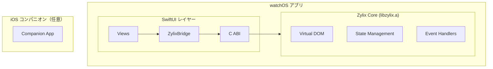

Zylix を使用して SwiftUI で watchOS アプリを構築します。現行のカウンター PoC 実装に合わせた手順をまとめています。

対応状況の定義は [互換性リファレンス](https://github.com/kotsutsumi/zylix/blob/main/docs/COMPATIBILITY.md) を参照してください。

## ステータス

**In Development** — C ABI ブリッジによる最小カウンター実装。

## 前提条件

- **macOS** 13.0 以降
- **Xcode** 15.0 以降（watchOS SDK）
- **Zig** 0.15.0 以降

```bash
# インストールの確認
zig version
xcodebuild -version
xcrun simctl list devices | grep -i watch
```

## アーキテクチャ概要



## プロジェクトセットアップ

### ステップ 1: watchOS 向けにコアをビルド

```bash
cd core

# watchOS シミュレータ用（開発推奨）
zig build watchos-sim

# watchOS デバイス用
zig build watchos
```

出力先:
- シミュレータ: `core/zig-out/watchos-simulator/libzylix.a`
- デバイス: `core/zig-out/watchos/libzylix.a`

### ステップ 2: ライブラリをコピー

```bash
cp core/zig-out/watchos-simulator/libzylix.a platforms/watchos/ZylixWatch/Libraries/
```

### ステップ 3: Xcode プロジェクトを開く

```bash
cd platforms/watchos
open ZylixWatch.xcodeproj
```

### ステップ 4: 実行

watchOS シミュレータを選び、`ZylixWatch` ターゲットを実行します。

## 主なファイル

- `platforms/watchos/ZylixWatch/Sources/ZylixWatchApp.swift`
- `platforms/watchos/ZylixWatch/Sources/ContentView.swift`
- `platforms/watchos/ZylixWatch/Sources/ZylixBridge.swift`
- `platforms/watchos/ZylixWatch/Sources/Zylix-Bridging-Header.h`

## 使用する C ABI

| 関数 | 目的 |
|------|------|
| `zylix_init()` | 初期化 |
| `zylix_deinit()` | 終了処理 |
| `zylix_dispatch()` | イベント送信 |
| `zylix_get_state()` | 状態取得 |
| `zylix_get_abi_version()` | ABI バージョン取得 |
| `zylix_get_last_error()` | エラー取得 |

## トラブルシューティング

- **undefined symbol**: `libzylix.a` がターゲットにリンクされているか確認。
- **bridging header not found**: Build Settings のヘッダーパスを確認。

## チュートリアル

詳細手順は [watchOS チュートリアル](/tutorials/watchos/) を参照してください。
