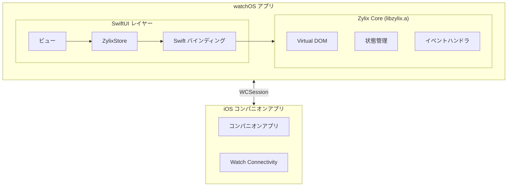

Zylix を使用して SwiftUI でネイティブ watchOS アプリケーションを構築します。このガイドでは、コンパニオンアプリのセットアップ、WatchKit 統合、Zylix Test Framework でのテストについて説明します。

## 前提条件

開始する前に、以下を確認してください：

- **macOS** 13.0 以降
- **Xcode** 15.0 以降（watchOS SDK 付き）
- **Zig** 0.15.0 以降
- Apple Developer アカウント（デバイステストとデプロイ用）
- iOS コンパニオンアプリ（推奨）

```bash
# インストールの確認
zig version
xcodebuild -version
xcrun simctl list devices | grep -i watch
```

## アーキテクチャ概要



## プロジェクトセットアップ

### ステップ 1: watchOS ターゲットの作成

既存の iOS アプリがある場合：

1. Xcode を開く → File → New → Target
2. **watchOS** → **App** を選択
3. 設定：
   - Product Name: `ZylixWatch`
   - Interface: **SwiftUI**
   - Include Watch Connectivity: **Yes**

### ステップ 2: watchOS 用の Zylix 静的ライブラリをビルド

watchOS 用の `libzylix.a` をビルド：

```bash
cd core

# watchOS デバイス用 (arm64)
zig build -Dtarget=aarch64-watchos -Doptimize=ReleaseFast

# watchOS シミュレータ用 (arm64)
zig build -Dtarget=aarch64-watchos-simulator -Doptimize=ReleaseFast
```

## watchOS 固有の考慮事項

### 画面サイズ

| デバイス | 画面サイズ | 解像度 |
|--------|-------------|------------|
| Series 9 (41mm) | 352x430 | @2x |
| Series 9 (45mm) | 396x484 | @2x |
| Series 10 (42mm) | 374x446 | @2x |
| Series 10 (46mm) | 416x496 | @2x |
| Ultra 2 | 502x410 | @2x |
| SE (40mm) | 324x394 | @2x |
| SE (44mm) | 368x448 | @2x |

### メモリ制約

watchOS はメモリが限られています。Zylix の状態を最適化してください：

```zig
// コンパクトなデータ構造を使用
pub const WatchState = struct {
    counter: i16,  // 小さい型を使用
    active_workout: bool,
    heart_rate: u8,
};
```

### Digital Crown 統合

```swift
// ContentView.swift
import SwiftUI

struct ContentView: View {
    @StateObject private var store = ZylixStore.shared
    @State private var crownValue = 0.0

    var body: some View {
        VStack {
            Text("\(store.state.counter)")
                .font(.system(size: 48, weight: .bold))
        }
        .focusable()
        .digitalCrownRotation($crownValue, from: -100, through: 100, sensitivity: .low)
        .onChange(of: crownValue) { _, newValue in
            store.setCounter(Int32(newValue))
        }
    }
}
```

## watchOS アプリのテスト

### シミュレータテスト

```bash
# 利用可能な Watch シミュレータを一覧表示
xcrun simctl list devices | grep -i watch

# Watch シミュレータを起動
xcrun simctl boot "Apple Watch Series 9 (45mm)"

# Watch と iPhone シミュレータをペアリング
xcrun simctl pair <watch-udid> <phone-udid>
```

### Zylix Test Framework での E2E テスト

Zylix Test Framework は watchOS 固有のテストをサポートしています：

```zig
// tests/e2e/watchos_test.zig
const zylix_test = @import("zylix_test");

test "watchOS Digital Crown 操作" {
    var app = try zylix_test.App.launch(.{
        .app_id = "com.example.watchapp",
        .platform = .watchos,
        .device = "Apple Watch Series 9 (45mm)",
    });
    defer app.terminate() catch {};

    // Digital Crown を回転
    try app.rotateDigitalCrown(.up, 0.5);

    // カウンターの変更を確認
    const counter = try app.find(.byTestId("counter-display"));
    try zylix_test.expect(counter.getText()).toContain("5");
}

test "watchOS サイドボタン押下" {
    var app = try zylix_test.App.launch(.{
        .app_id = "com.example.watchapp",
        .platform = .watchos,
    });
    defer app.terminate() catch {};

    // サイドボタンを押す
    try app.pressSideButton();

    // アプリスイッチャーが表示されたことを確認
    try app.waitFor(.byAccessibilityId("AppSwitcher"), 3000);
}
```

### 統合テスト設定

Zylix テストインフラストラクチャには watchOS モックハンドラが含まれています：

```zig
// watchOS のテストポート
pub const TestPorts = struct {
    pub const watchos: u16 = 18101; // iOS (18100) とは異なる
};

// watchOS 固有の WDA エンドポイント
// POST /session/{id}/wda/digitalCrown/rotate
// POST /session/{id}/wda/sideButton/press
// POST /session/{id}/wda/sideButton/doublePress
// GET  /session/{id}/wda/companion/info
```

## パフォーマンス最適化

### 更新頻度の削減

```swift
// 状態更新をスロットル
class ZylixStore: ObservableObject {
    private var updateTimer: Timer?
    private var pendingUpdate = false

    private func scheduleUpdate() {
        guard !pendingUpdate else { return }
        pendingUpdate = true

        updateTimer = Timer.scheduledTimer(withTimeInterval: 0.1, repeats: false) { [weak self] _ in
            self?.refreshState()
            self?.pendingUpdate = false
        }
    }
}
```

## デバッグ

### よくある問題

| 問題 | 解決策 |
|-------|----------|
| シミュレータのペアリングに失敗 | 両方のシミュレータを削除して再ペアリング |
| Watch アプリがインストールされない | バンドル ID が iPhone アプリと一致しているか確認 |
| 状態同期が遅延 | WCSession メッセージの優先度を上げる |
| メモリ警告 | 状態サイズを削減、遅延読み込みを使用 |

### デバッグコマンド

```bash
# Watch シミュレータログ
xcrun simctl spawn <watch-udid> log stream --predicate 'process == "ZylixWatch"'

# ペアリング状態を確認
xcrun simctl list pairs

# Watch シミュレータをリセット
xcrun simctl erase <watch-udid>
```

## 次のステップ

- **[iOS](../ios)**: コンパニオン iOS アプリを構築
- **[macOS](../macos)**: 同様の SwiftUI パターンで macOS アプリを構築
