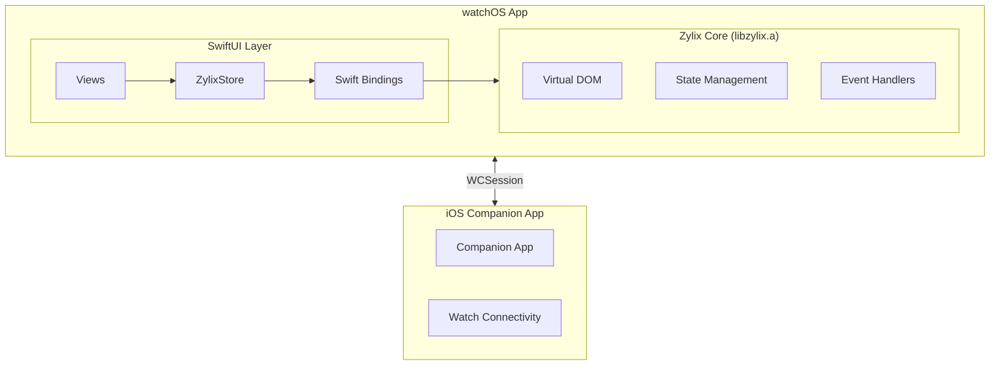

Build native watchOS applications with Zylix using SwiftUI. This guide covers companion app setup, WatchKit integration, and testing with Zylix Test Framework.

## Prerequisites

Before you begin, ensure you have:

- **macOS** 13.0 or later
- **Xcode** 15.0 or later with watchOS SDK
- **Zig** 0.15.0 or later
- Apple Developer account (for device testing and deployment)
- An iOS companion app (recommended)

```bash
# Verify installations
zig version
xcodebuild -version
xcrun simctl list devices | grep -i watch
```

## Architecture Overview



## Project Setup

### Step 1: Create watchOS Target

If you have an existing iOS app:

1. Open Xcode → File → New → Target
2. Select **watchOS** → **App**
3. Configure:
   - Product Name: `ZylixWatch`
   - Interface: **SwiftUI**
   - Include Watch Connectivity: **Yes**

### Step 2: Build Zylix Static Library for watchOS

Build `libzylix.a` for watchOS:

```bash
cd core

# Build for watchOS device (arm64)
zig build -Dtarget=aarch64-watchos -Doptimize=ReleaseFast

# Build for watchOS Simulator (arm64)
zig build -Dtarget=aarch64-watchos-simulator -Doptimize=ReleaseFast
```

### Step 3: Configure Xcode Project

1. Add `libzylix.a` to your watch target
2. Set up bridging header (same as iOS)
3. Configure **Build Settings**:
   - Library Search Paths: `$(PROJECT_DIR)/libs`
   - Header Search Paths: `$(PROJECT_DIR)/include`

## watchOS-Specific Considerations

### Screen Sizes

| Device | Screen Size | Resolution |
|--------|-------------|------------|
| Series 9 (41mm) | 352x430 | @2x |
| Series 9 (45mm) | 396x484 | @2x |
| Series 10 (42mm) | 374x446 | @2x |
| Series 10 (46mm) | 416x496 | @2x |
| Ultra 2 | 502x410 | @2x |
| SE (40mm) | 324x394 | @2x |
| SE (44mm) | 368x448 | @2x |

### Memory Constraints

watchOS has limited memory. Optimize your Zylix state:

```zig
// Use compact data structures
pub const WatchState = struct {
    counter: i16,  // Use smaller types
    active_workout: bool,
    heart_rate: u8,
};
```

### Digital Crown Integration

```swift
// ContentView.swift
import SwiftUI

struct ContentView: View {
    @StateObject private var store = ZylixStore.shared
    @State private var crownValue = 0.0

    var body: some View {
        VStack {
            Text("\(store.state.counter)")
                .font(.system(size: 48, weight: .bold))
        }
        .focusable()
        .digitalCrownRotation($crownValue, from: -100, through: 100, sensitivity: .low)
        .onChange(of: crownValue) { _, newValue in
            store.setCounter(Int32(newValue))
        }
    }
}
```

## Watch Connectivity

### Sync State with iPhone

```swift
// WatchConnectivityManager.swift
import WatchConnectivity

class WatchConnectivityManager: NSObject, ObservableObject {
    static let shared = WatchConnectivityManager()
    private var session: WCSession?

    override init() {
        super.init()
        if WCSession.isSupported() {
            session = WCSession.default
            session?.delegate = self
            session?.activate()
        }
    }

    func sendStateToPhone() {
        guard let session = session, session.isReachable else { return }
        let state = ZylixStore.shared.state
        let data: [String: Any] = [
            "counter": state.counter,
            "timestamp": Date().timeIntervalSince1970
        ]
        session.sendMessage(data, replyHandler: nil)
    }
}

extension WatchConnectivityManager: WCSessionDelegate {
    func session(_ session: WCSession, activationDidCompleteWith state: WCSessionActivationState, error: Error?) {}

    func session(_ session: WCSession, didReceiveMessage message: [String: Any]) {
        if let counter = message["counter"] as? Int32 {
            Task { @MainActor in
                ZylixStore.shared.setCounter(counter)
            }
        }
    }
}
```

## Testing watchOS Apps

### Simulator Testing

```bash
# List available Watch simulators
xcrun simctl list devices | grep -i watch

# Boot a Watch simulator
xcrun simctl boot "Apple Watch Series 9 (45mm)"

# Pair Watch with iPhone simulator
xcrun simctl pair <watch-udid> <phone-udid>
```

### E2E Testing with Zylix Test Framework

The Zylix Test Framework supports watchOS-specific testing:

```zig
// tests/e2e/watchos_test.zig
const zylix_test = @import("zylix_test");

test "watchOS Digital Crown interaction" {
    var app = try zylix_test.App.launch(.{
        .app_id = "com.example.watchapp",
        .platform = .watchos,
        .device = "Apple Watch Series 9 (45mm)",
    });
    defer app.terminate() catch {};

    // Rotate Digital Crown
    try app.rotateDigitalCrown(.up, 0.5);

    // Verify counter changed
    const counter = try app.find(.byTestId("counter-display"));
    try zylix_test.expect(counter.getText()).toContain("5");
}

test "watchOS Side Button press" {
    var app = try zylix_test.App.launch(.{
        .app_id = "com.example.watchapp",
        .platform = .watchos,
    });
    defer app.terminate() catch {};

    // Press Side Button
    try app.pressSideButton();

    // Verify app switcher appeared
    try app.waitFor(.byAccessibilityId("AppSwitcher"), 3000);
}
```

### Integration Test Configuration

The Zylix test infrastructure includes watchOS mock handlers:

```zig
// Test ports for watchOS
pub const TestPorts = struct {
    pub const watchos: u16 = 18101; // Different from iOS (18100)
};

// watchOS-specific WDA endpoints
// POST /session/{id}/wda/digitalCrown/rotate
// POST /session/{id}/wda/sideButton/press
// POST /session/{id}/wda/sideButton/doublePress
// GET  /session/{id}/wda/companion/info
```

## Complications

### Create a Zylix-Powered Complication

```swift
// ComplicationController.swift
import ClockKit

class ComplicationController: NSObject, CLKComplicationDataSource {
    func currentTimelineEntry(
        for complication: CLKComplication,
        withHandler handler: @escaping (CLKComplicationTimelineEntry?) -> Void
    ) {
        let state = ZylixStore.shared.state

        let template = CLKComplicationTemplateCircularSmallSimpleText(
            textProvider: CLKSimpleTextProvider(text: "\(state.counter)")
        )

        let entry = CLKComplicationTimelineEntry(
            date: Date(),
            complicationTemplate: template
        )

        handler(entry)
    }
}
```

## Performance Optimization

### Reduce Update Frequency

```swift
// Throttle state updates
class ZylixStore: ObservableObject {
    private var updateTimer: Timer?
    private var pendingUpdate = false

    private func scheduleUpdate() {
        guard !pendingUpdate else { return }
        pendingUpdate = true

        updateTimer = Timer.scheduledTimer(withTimeInterval: 0.1, repeats: false) { [weak self] _ in
            self?.refreshState()
            self?.pendingUpdate = false
        }
    }
}
```

### Background App Refresh

```swift
// Schedule background updates
import WatchKit

extension ExtensionDelegate {
    func scheduleBackgroundRefresh() {
        let date = Date().addingTimeInterval(15 * 60) // 15 minutes
        WKApplication.shared().scheduleBackgroundRefresh(
            withPreferredDate: date,
            userInfo: nil
        ) { error in
            if let error = error {
                print("Background refresh error: \(error)")
            }
        }
    }
}
```

## Debugging

### Common Issues

| Issue | Solution |
|-------|----------|
| Simulator pairing failed | Delete both simulators and re-pair |
| Watch app not installing | Check bundle ID matches iPhone app |
| State sync delayed | Increase WCSession message priority |
| Memory warnings | Reduce state size, use lazy loading |

### Debug Commands

```bash
# Watch simulator logs
xcrun simctl spawn <watch-udid> log stream --predicate 'process == "ZylixWatch"'

# Check pairing status
xcrun simctl list pairs

# Reset Watch simulator
xcrun simctl erase <watch-udid>
```

## Next Steps

- **[iOS](../ios)**: Build the companion iOS app
- **[macOS](../macos)**: Build macOS apps with similar SwiftUI patterns
