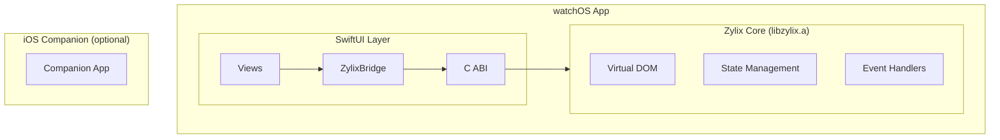

Build watchOS apps with Zylix using SwiftUI. This guide matches the current counter PoC implementation.

Platform status definitions follow the [Compatibility Reference](https://github.com/kotsutsumi/zylix/blob/main/docs/COMPATIBILITY.md).

## Status

**In Development** — minimal counter implementation with C ABI bridge.

## Prerequisites

- **macOS** 13.0 or later
- **Xcode** 15.0 or later with watchOS SDK
- **Zig** 0.15.0 or later

```bash
# Verify installations
zig version
xcodebuild -version
xcrun simctl list devices | grep -i watch
```

## Architecture Overview



## Project Setup

### Step 1: Build Zylix Core for watchOS

```bash
cd core

# For watchOS Simulator (recommended for development)
zig build watchos-sim

# For watchOS Device
zig build watchos
```

Outputs:
- Simulator: `core/zig-out/watchos-simulator/libzylix.a`
- Device: `core/zig-out/watchos/libzylix.a`

### Step 2: Copy the Library

```bash
cp core/zig-out/watchos-simulator/libzylix.a platforms/watchos/ZylixWatch/Libraries/
```

### Step 3: Open the Xcode Project

```bash
cd platforms/watchos
open ZylixWatch.xcodeproj
```

### Step 4: Run

Select a watchOS Simulator and run the `ZylixWatch` target.

## Key Files

- `platforms/watchos/ZylixWatch/Sources/ZylixWatchApp.swift`
- `platforms/watchos/ZylixWatch/Sources/ContentView.swift`
- `platforms/watchos/ZylixWatch/Sources/ZylixBridge.swift`
- `platforms/watchos/ZylixWatch/Sources/Zylix-Bridging-Header.h`

## C ABI Functions Used

| Function | Purpose |
|----------|---------|
| `zylix_init()` | Initialize Zylix Core |
| `zylix_deinit()` | Shutdown Zylix Core |
| `zylix_dispatch()` | Dispatch counter events |
| `zylix_get_state()` | Read current state |
| `zylix_get_abi_version()` | Get ABI version |
| `zylix_get_last_error()` | Get last error |

## Troubleshooting

- **undefined symbol**: ensure `libzylix.a` is linked in the Xcode target.
- **bridging header not found**: verify the header path in Build Settings.

## Tutorial

For a full walkthrough, see the [watchOS tutorial](/tutorials/watchos/).
