
**ステータス: 🚧 開発中** — このプラットフォームは現在ビルドインフラのみです。WinUI 3とのZigコア統合は計画中ですが、まだ実装されていません。以下のコードは目標アーキテクチャを示しています。


WinUI 3 を使用して Zylix でネイティブ Windows アプリケーションを構築します。このガイドでは、Visual Studio のセットアップ、P/Invoke 統合、Microsoft Store デプロイについて説明します。

## 前提条件

始める前に、以下がインストールされていることを確認してください：

- **Windows 10** バージョン 1809 (build 17763) 以降
- **Visual Studio 2022** with:
  - .NET デスクトップ開発ワークロード
  - Windows App SDK
- **Zig** 0.11.0 以降
- **.NET 8** SDK 以降
- C# と XAML の基本知識

```powershell
# Zig インストールの確認
zig version

# .NET インストールの確認
dotnet --version
```

## アーキテクチャ概要

```mermaid
flowchart TB
    subgraph Windows["Windows アプリ"]
        subgraph CSharp["C# / WinUI 層"]
            XAML["XAML ビュー"]
            ViewModel["ViewModel"]
            PInvoke["P/Invoke"]
        end

        subgraph Native["ネイティブ層 (zylix.dll)"]
            VDOM["Virtual DOM"]
            State["状態管理"]
            Events["イベントハンドラ"]
        end

        XAML --> ViewModel
        ViewModel --> PInvoke
        PInvoke --> Native
    end
```



## プロジェクトセットアップ

### ステップ 1: WinUI 3 プロジェクトの作成

1. Visual Studio 2022 を開く
2. 新しいプロジェクトを作成 → **Blank App, Packaged (WinUI 3 in Desktop)**
3. 設定：
   - プロジェクト名: `ZylixWindowsApp`
   - Target Framework: **.NET 8.0**

### ステップ 2: Zylix DLL のビルド

Windows 用に `zylix.dll` をビルド：

```powershell
cd core

# Windows x64 用にビルド
zig build -Dtarget=x86_64-windows -Doptimize=ReleaseFast

# 出力: zig-out/lib/zylix.dll
# プロジェクトにコピー
Copy-Item zig-out/lib/zylix.dll ..\ZylixWindowsApp\
```

## P/Invoke 統合

### ネイティブ相互運用

`ZylixInterop.cs` を作成：

```csharp
using System.Runtime.InteropServices;

namespace ZylixWindowsApp;

// Zig 定義と一致する状態構造体
[StructLayout(LayoutKind.Sequential)]
public struct ZylixState
{
    public int Counter;
    public uint TodoCount;
    public uint Version;
}

// ソースジェネレーターを使用した P/Invoke 宣言
public static partial class ZylixInterop
{
    private const string DllName = "zylix";

    [LibraryImport(DllName, EntryPoint = "zylix_init")]
    public static partial int Init();

    [LibraryImport(DllName, EntryPoint = "zylix_deinit")]
    public static partial int Deinit();

    [LibraryImport(DllName, EntryPoint = "zylix_dispatch")]
    public static partial int Dispatch(uint eventType, nint payload, nuint len);

    [LibraryImport(DllName, EntryPoint = "zylix_get_state")]
    public static partial nint GetState();

    // ペイロードなしでディスパッチするヘルパー
    public static int Dispatch(uint eventType) => Dispatch(eventType, nint.Zero, 0);

    // 型付き状態を取得するヘルパー
    public static ZylixState? GetTypedState()
    {
        var ptr = GetState();
        if (ptr == nint.Zero) return null;
        return Marshal.PtrToStructure<ZylixState>(ptr);
    }
}

// イベントタイプ定数
public static class ZylixEvents
{
    public const uint Increment = 1;
    public const uint Decrement = 2;
    public const uint Reset = 3;
    public const uint TodoAdd = 10;
}
```

### ViewModel

`MainViewModel.cs` を作成：

```csharp
using CommunityToolkit.Mvvm.ComponentModel;
using CommunityToolkit.Mvvm.Input;

namespace ZylixWindowsApp;

public partial class MainViewModel : ObservableObject
{
    [ObservableProperty]
    private int _counter;

    [ObservableProperty]
    private uint _todoCount;

    [ObservableProperty]
    private uint _version;

    public MainViewModel()
    {
        var result = ZylixInterop.Init();
        if (result != 0)
        {
            throw new InvalidOperationException($"Zylix の初期化に失敗: {result}");
        }

        RefreshState();
    }

    private void RefreshState()
    {
        var state = ZylixInterop.GetTypedState();
        if (state.HasValue)
        {
            Counter = state.Value.Counter;
            TodoCount = state.Value.TodoCount;
            Version = state.Value.Version;
        }
    }

    [RelayCommand]
    private void Increment()
    {
        ZylixInterop.Dispatch(ZylixEvents.Increment);
        RefreshState();
    }

    [RelayCommand]
    private void Decrement()
    {
        ZylixInterop.Dispatch(ZylixEvents.Decrement);
        RefreshState();
    }

    [RelayCommand]
    private void Reset()
    {
        ZylixInterop.Dispatch(ZylixEvents.Reset);
        RefreshState();
    }
}
```

## WinUI 3 ビュー

### カウンターページ

`CounterPage.xaml` を作成：

```xml
<?xml version="1.0" encoding="utf-8"?>
<Page
    x:Class="ZylixWindowsApp.CounterPage"
    xmlns="http://schemas.microsoft.com/winfx/2006/xaml/presentation"
    xmlns:x="http://schemas.microsoft.com/winfx/2006/xaml">

    <Grid HorizontalAlignment="Center" VerticalAlignment="Center">
        <StackPanel Spacing="24">
            <!-- タイトル -->
            <TextBlock Text="カウンター"
                       Style="{StaticResource TitleTextBlockStyle}"
                       HorizontalAlignment="Center"/>

            <!-- カウンター値 -->
            <TextBlock Text="{x:Bind ViewModel.Counter, Mode=OneWay}"
                       FontSize="96"
                       FontWeight="Bold"
                       HorizontalAlignment="Center"
                       Foreground="{ThemeResource SystemAccentColor}"/>

            <!-- ボタン -->
            <StackPanel Orientation="Horizontal"
                        Spacing="16"
                        HorizontalAlignment="Center">

                <Button Content="-"
                        Command="{x:Bind ViewModel.DecrementCommand}"
                        Width="64" Height="64"
                        FontSize="24"/>

                <Button Content="リセット"
                        Command="{x:Bind ViewModel.ResetCommand}"
                        Height="64"/>

                <Button Content="+"
                        Command="{x:Bind ViewModel.IncrementCommand}"
                        Style="{StaticResource AccentButtonStyle}"
                        Width="64" Height="64"
                        FontSize="24"/>
            </StackPanel>

            <!-- バージョン情報 -->
            <TextBlock HorizontalAlignment="Center"
                       Foreground="{ThemeResource SystemBaseMediumColor}">
                <Run Text="状態バージョン: "/>
                <Run Text="{x:Bind ViewModel.Version, Mode=OneWay}"/>
            </TextBlock>
        </StackPanel>
    </Grid>
</Page>
```

## デバッグ

### よくある問題

| 問題 | 解決策 |
|------|--------|
| DLL が見つからない | zylix.dll が出力ディレクトリにコピーされているか確認 |
| BadImageFormatException | DLL アーキテクチャが一致しているか確認 (x64/ARM64) |
| AccessViolationException | P/Invoke でのポインタ処理を確認 |
| UI が更新されない | INotifyPropertyChanged が実装されているか確認 |

## 配布

### MSIX パッケージ

1. プロジェクトを右クリック → **発行** → **アプリパッケージの作成**
2. **サイドローディング** または **Microsoft Store** を選択
3. 証明書とバージョンを設定
4. パッケージをビルド

### 自己完結型デプロイ

`.csproj` を編集：

```xml
<PropertyGroup>
  <SelfContained>true</SelfContained>
  <RuntimeIdentifier>win-x64</RuntimeIdentifier>
  <PublishSingleFile>true</PublishSingleFile>
</PropertyGroup>
```

発行：
```powershell
dotnet publish -c Release
```

### Microsoft Store

1. パートナーセンターでアプリを作成
2. アプリをストアに関連付け: プロジェクト → 発行 → アプリをストアに関連付け
3. 提出パッケージを作成
4. アップロードして認定に提出

## 次のステップ

- **[Web/WASM](../web)**: WebAssembly で Web アプリを構築
  - **[iOS](../ios)**: SwiftUI でネイティブ iOS アプリを構築
