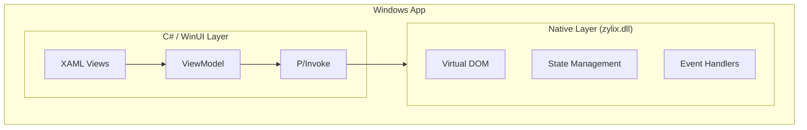


**Status: 🚧 In Development** — This platform has build infrastructure but no working demo application yet. Zig core integration via P/Invoke is planned. The code below shows the target architecture.


Build native Windows applications with Zylix using WinUI 3. This guide covers Visual Studio setup, P/Invoke integration, and Microsoft Store deployment.

## Prerequisites

Before you begin, ensure you have:

- **Windows 10** version 1809 (build 17763) or later
- **Visual Studio 2022** with:
  - .NET Desktop Development workload
  - Windows App SDK
- **Zig** 0.11.0 or later
- **.NET 8** SDK or later
- Basic knowledge of C# and XAML

```powershell
# Verify Zig installation
zig version

# Verify .NET installation
dotnet --version
```

## Architecture Overview



## Project Setup

### Step 1: Create WinUI 3 Project

1. Open Visual Studio 2022
2. Create new project → **Blank App, Packaged (WinUI 3 in Desktop)**
3. Configure:
   - Project name: `ZylixWindowsApp`
   - Target Framework: **.NET 8.0**

### Step 2: Build Zylix DLL

Build `zylix.dll` for Windows:

```powershell
cd core

# Build for Windows x64
zig build -Dtarget=x86_64-windows -Doptimize=ReleaseFast

# Output: zig-out/lib/zylix.dll
# Copy to project
Copy-Item zig-out/lib/zylix.dll ..\ZylixWindowsApp\
```

### Step 3: Configure Project

Edit `ZylixWindowsApp.csproj`:

```xml
<Project Sdk="Microsoft.NET.Sdk">
  <PropertyGroup>
    <OutputType>WinExe</OutputType>
    <TargetFramework>net8.0-windows10.0.19041.0</TargetFramework>
    <TargetPlatformMinVersion>10.0.17763.0</TargetPlatformMinVersion>
    <WindowsSdkPackageVersion>10.0.19041.38</WindowsSdkPackageVersion>
    <UseWinUI>true</UseWinUI>
    <Nullable>enable</Nullable>
    <AllowUnsafeBlocks>true</AllowUnsafeBlocks>
  </PropertyGroup>

  <ItemGroup>
    <Content Include="zylix.dll">
      <CopyToOutputDirectory>PreserveNewest</CopyToOutputDirectory>
    </Content>
  </ItemGroup>

  <ItemGroup>
    <PackageReference Include="Microsoft.WindowsAppSDK" Version="1.5.*" />
    <PackageReference Include="CommunityToolkit.Mvvm" Version="8.*" />
  </ItemGroup>
</Project>
```

## P/Invoke Integration

### Native Interop

Create `ZylixInterop.cs`:

```csharp
using System.Runtime.InteropServices;

namespace ZylixWindowsApp;

// State structure matching Zig definition
[StructLayout(LayoutKind.Sequential)]
public struct ZylixState
{
    public int Counter;
    public uint TodoCount;
    public uint Version;
}

// P/Invoke declarations using source generators
public static partial class ZylixInterop
{
    private const string DllName = "zylix";

    [LibraryImport(DllName, EntryPoint = "zylix_init")]
    public static partial int Init();

    [LibraryImport(DllName, EntryPoint = "zylix_deinit")]
    public static partial int Deinit();

    [LibraryImport(DllName, EntryPoint = "zylix_dispatch")]
    public static partial int Dispatch(uint eventType, nint payload, nuint len);

    [LibraryImport(DllName, EntryPoint = "zylix_get_state")]
    public static partial nint GetState();

    // Helper to dispatch without payload
    public static int Dispatch(uint eventType) => Dispatch(eventType, nint.Zero, 0);

    // Helper to dispatch with string payload
    public static unsafe int Dispatch(uint eventType, string payload)
    {
        var bytes = System.Text.Encoding.UTF8.GetBytes(payload);
        fixed (byte* ptr = bytes)
        {
            return Dispatch(eventType, (nint)ptr, (nuint)bytes.Length);
        }
    }

    // Helper to dispatch with int payload
    public static unsafe int Dispatch(uint eventType, int payload)
    {
        return Dispatch(eventType, (nint)(&payload), sizeof(int));
    }

    // Helper to get typed state
    public static ZylixState? GetTypedState()
    {
        var ptr = GetState();
        if (ptr == nint.Zero) return null;
        return Marshal.PtrToStructure<ZylixState>(ptr);
    }
}

// Event type constants
public static class ZylixEvents
{
    public const uint Increment = 1;
    public const uint Decrement = 2;
    public const uint Reset = 3;
    public const uint TodoAdd = 10;
    public const uint TodoToggle = 11;
    public const uint TodoRemove = 12;
}
```

### ViewModel

Create `MainViewModel.cs`:

```csharp
using CommunityToolkit.Mvvm.ComponentModel;
using CommunityToolkit.Mvvm.Input;

namespace ZylixWindowsApp;

public partial class MainViewModel : ObservableObject
{
    [ObservableProperty]
    private int _counter;

    [ObservableProperty]
    private uint _todoCount;

    [ObservableProperty]
    private uint _version;

    [ObservableProperty]
    private string _newTodoText = string.Empty;

    public MainViewModel()
    {
        var result = ZylixInterop.Init();
        if (result != 0)
        {
            throw new InvalidOperationException($"Failed to initialize Zylix: {result}");
        }

        RefreshState();
    }

    ~MainViewModel()
    {
        ZylixInterop.Deinit();
    }

    private void RefreshState()
    {
        var state = ZylixInterop.GetTypedState();
        if (state.HasValue)
        {
            Counter = state.Value.Counter;
            TodoCount = state.Value.TodoCount;
            Version = state.Value.Version;
        }
    }

    [RelayCommand]
    private void Increment()
    {
        ZylixInterop.Dispatch(ZylixEvents.Increment);
        RefreshState();
    }

    [RelayCommand]
    private void Decrement()
    {
        ZylixInterop.Dispatch(ZylixEvents.Decrement);
        RefreshState();
    }

    [RelayCommand]
    private void Reset()
    {
        ZylixInterop.Dispatch(ZylixEvents.Reset);
        RefreshState();
    }

    [RelayCommand]
    private void AddTodo()
    {
        if (string.IsNullOrWhiteSpace(NewTodoText)) return;

        ZylixInterop.Dispatch(ZylixEvents.TodoAdd, NewTodoText);
        NewTodoText = string.Empty;
        RefreshState();
    }

    [RelayCommand]
    private void ToggleTodo(int id)
    {
        ZylixInterop.Dispatch(ZylixEvents.TodoToggle, id);
        RefreshState();
    }

    [RelayCommand]
    private void RemoveTodo(int id)
    {
        ZylixInterop.Dispatch(ZylixEvents.TodoRemove, id);
        RefreshState();
    }
}
```

## WinUI 3 Views

### Main Window

Edit `MainWindow.xaml`:

```xml
<?xml version="1.0" encoding="utf-8"?>
<Window
    x:Class="ZylixWindowsApp.MainWindow"
    xmlns="http://schemas.microsoft.com/winfx/2006/xaml/presentation"
    xmlns:x="http://schemas.microsoft.com/winfx/2006/xaml"
    xmlns:local="using:ZylixWindowsApp"
    Title="Zylix Windows Demo">

    <Grid Background="{ThemeResource ApplicationPageBackgroundThemeBrush}">
        <Grid.RowDefinitions>
            <RowDefinition Height="Auto"/>
            <RowDefinition Height="*"/>
        </Grid.RowDefinitions>

        <!-- Title Bar -->
        <Grid Grid.Row="0" Height="48" Background="{ThemeResource SystemAccentColor}">
            <TextBlock Text="Zylix Windows Demo"
                       VerticalAlignment="Center"
                       Margin="16,0"
                       Style="{StaticResource SubtitleTextBlockStyle}"
                       Foreground="White"/>
        </Grid>

        <!-- Content -->
        <NavigationView Grid.Row="1"
                        PaneDisplayMode="Left"
                        IsBackButtonVisible="Collapsed"
                        IsSettingsVisible="False">
            <NavigationView.MenuItems>
                <NavigationViewItem Icon="Calculator" Content="Counter" Tag="counter"/>
                <NavigationViewItem Icon="AllApps" Content="Todos" Tag="todos"/>
            </NavigationView.MenuItems>

            <Frame x:Name="ContentFrame"/>
        </NavigationView>
    </Grid>
</Window>
```

Edit `MainWindow.xaml.cs`:

```csharp
using Microsoft.UI.Xaml;
using Microsoft.UI.Xaml.Controls;

namespace ZylixWindowsApp;

public sealed partial class MainWindow : Window
{
    public MainViewModel ViewModel { get; } = new();

    public MainWindow()
    {
        InitializeComponent();

        // Navigate to counter page by default
        ContentFrame.Navigate(typeof(CounterPage), ViewModel);
    }
}
```

### Counter Page

Create `CounterPage.xaml`:

```xml
<?xml version="1.0" encoding="utf-8"?>
<Page
    x:Class="ZylixWindowsApp.CounterPage"
    xmlns="http://schemas.microsoft.com/winfx/2006/xaml/presentation"
    xmlns:x="http://schemas.microsoft.com/winfx/2006/xaml"
    xmlns:local="using:ZylixWindowsApp">

    <Grid HorizontalAlignment="Center" VerticalAlignment="Center">
        <StackPanel Spacing="24">
            <!-- Title -->
            <TextBlock Text="Counter"
                       Style="{StaticResource TitleTextBlockStyle}"
                       HorizontalAlignment="Center"/>

            <!-- Counter Value -->
            <TextBlock Text="{x:Bind ViewModel.Counter, Mode=OneWay}"
                       FontSize="96"
                       FontWeight="Bold"
                       HorizontalAlignment="Center"
                       Foreground="{ThemeResource SystemAccentColor}"/>

            <!-- Buttons -->
            <StackPanel Orientation="Horizontal"
                        Spacing="16"
                        HorizontalAlignment="Center">

                <Button Content="-"
                        Command="{x:Bind ViewModel.DecrementCommand}"
                        Width="64" Height="64"
                        FontSize="24"/>

                <Button Content="Reset"
                        Command="{x:Bind ViewModel.ResetCommand}"
                        Height="64"/>

                <Button Content="+"
                        Command="{x:Bind ViewModel.IncrementCommand}"
                        Style="{StaticResource AccentButtonStyle}"
                        Width="64" Height="64"
                        FontSize="24"/>
            </StackPanel>

            <!-- Version Info -->
            <TextBlock HorizontalAlignment="Center"
                       Foreground="{ThemeResource SystemBaseMediumColor}">
                <Run Text="State version: "/>
                <Run Text="{x:Bind ViewModel.Version, Mode=OneWay}"/>
            </TextBlock>
        </StackPanel>
    </Grid>
</Page>
```

Create `CounterPage.xaml.cs`:

```csharp
using Microsoft.UI.Xaml.Controls;
using Microsoft.UI.Xaml.Navigation;

namespace ZylixWindowsApp;

public sealed partial class CounterPage : Page
{
    public MainViewModel? ViewModel { get; private set; }

    public CounterPage()
    {
        InitializeComponent();
    }

    protected override void OnNavigatedTo(NavigationEventArgs e)
    {
        base.OnNavigatedTo(e);
        ViewModel = e.Parameter as MainViewModel;
    }
}
```

### Todo Page

Create `TodoPage.xaml`:

```xml
<?xml version="1.0" encoding="utf-8"?>
<Page
    x:Class="ZylixWindowsApp.TodoPage"
    xmlns="http://schemas.microsoft.com/winfx/2006/xaml/presentation"
    xmlns:x="http://schemas.microsoft.com/winfx/2006/xaml"
    xmlns:local="using:ZylixWindowsApp">

    <Grid Padding="24">
        <Grid.RowDefinitions>
            <RowDefinition Height="Auto"/>
            <RowDefinition Height="Auto"/>
            <RowDefinition Height="*"/>
        </Grid.RowDefinitions>

        <!-- Title -->
        <StackPanel Grid.Row="0" Orientation="Horizontal" Spacing="8">
            <TextBlock Text="Todos"
                       Style="{StaticResource TitleTextBlockStyle}"/>
            <TextBlock VerticalAlignment="Center"
                       Foreground="{ThemeResource SystemBaseMediumColor}">
                <Run Text="("/>
                <Run Text="{x:Bind ViewModel.TodoCount, Mode=OneWay}"/>
                <Run Text=")"/>
            </TextBlock>
        </StackPanel>

        <!-- Add Todo -->
        <Grid Grid.Row="1" Margin="0,16,0,16">
            <Grid.ColumnDefinitions>
                <ColumnDefinition Width="*"/>
                <ColumnDefinition Width="Auto"/>
            </Grid.ColumnDefinitions>

            <TextBox Grid.Column="0"
                     PlaceholderText="New todo..."
                     Text="{x:Bind ViewModel.NewTodoText, Mode=TwoWay, UpdateSourceTrigger=PropertyChanged}"/>

            <Button Grid.Column="1"
                    Content="Add"
                    Command="{x:Bind ViewModel.AddTodoCommand}"
                    Style="{StaticResource AccentButtonStyle}"
                    Margin="8,0,0,0"/>
        </Grid>

        <!-- Todo List Placeholder -->
        <ListView Grid.Row="2">
            <ListViewItem Content="Todo items would appear here"/>
        </ListView>
    </Grid>
</Page>
```

## Advanced Features

### System Tray

```csharp
using H.NotifyIcon;

public partial class App : Application
{
    private TaskbarIcon? _trayIcon;

    protected override void OnLaunched(LaunchActivatedEventArgs args)
    {
        // Create tray icon
        _trayIcon = new TaskbarIcon
        {
            IconSource = new BitmapImage(new Uri("ms-appx:///Assets/icon.ico")),
            ToolTipText = "Zylix Windows App"
        };

        _trayIcon.LeftClickCommand = new RelayCommand(ShowMainWindow);
    }

    private void ShowMainWindow()
    {
        // Activate main window
    }
}
```

### Toast Notifications

```csharp
using Microsoft.Windows.AppNotifications;
using Microsoft.Windows.AppNotifications.Builder;

public static class NotificationService
{
    public static void ShowNotification(string title, string message)
    {
        var builder = new AppNotificationBuilder()
            .AddText(title)
            .AddText(message);

        var notification = builder.BuildNotification();
        AppNotificationManager.Default.Show(notification);
    }
}
```

### Window Customization

```csharp
using Microsoft.UI;
using Microsoft.UI.Windowing;
using WinRT.Interop;

public partial class MainWindow : Window
{
    private AppWindow GetAppWindow()
    {
        var hWnd = WindowNative.GetWindowHandle(this);
        var windowId = Win32Interop.GetWindowIdFromWindow(hWnd);
        return AppWindow.GetFromWindowId(windowId);
    }

    private void CustomizeTitleBar()
    {
        var appWindow = GetAppWindow();

        if (AppWindowTitleBar.IsCustomizationSupported())
        {
            var titleBar = appWindow.TitleBar;
            titleBar.ExtendsContentIntoTitleBar = true;
            titleBar.ButtonBackgroundColor = Colors.Transparent;
            titleBar.ButtonInactiveBackgroundColor = Colors.Transparent;
        }
    }
}
```

## Testing

### Unit Tests

Create test project and add `ZylixTests.cs`:

```csharp
using Xunit;

namespace ZylixWindowsApp.Tests;

public class ZylixInteropTests
{
    [Fact]
    public void Init_ShouldReturnZero()
    {
        var result = ZylixInterop.Init();
        Assert.Equal(0, result);
        ZylixInterop.Deinit();
    }

    [Fact]
    public void Increment_ShouldIncreaseCounter()
    {
        ZylixInterop.Init();
        var initial = ZylixInterop.GetTypedState()?.Counter ?? 0;

        ZylixInterop.Dispatch(ZylixEvents.Increment);

        var newState = ZylixInterop.GetTypedState();
        Assert.NotNull(newState);
        Assert.Equal(initial + 1, newState.Value.Counter);

        ZylixInterop.Deinit();
    }
}
```

### UI Tests

```csharp
using Microsoft.VisualStudio.TestTools.UnitTesting;
using Microsoft.VisualStudio.TestTools.UnitTesting.AppContainer;

namespace ZylixWindowsApp.Tests;

[TestClass]
public class UITests
{
    [UITestMethod]
    public void IncrementButton_ShouldUpdateCounter()
    {
        var viewModel = new MainViewModel();
        Assert.AreEqual(0, viewModel.Counter);

        viewModel.IncrementCommand.Execute(null);

        Assert.AreEqual(1, viewModel.Counter);
    }
}
```

## Debugging

### Visual Studio Debugger

1. Set breakpoints in C# code
2. Use **Debug → Windows → Modules** to verify DLL loaded
3. Enable native debugging: Project Properties → Debug → Enable native code debugging

### Native Debugging

```powershell
# Enable loader snaps for DLL loading issues
reg add "HKLM\SOFTWARE\Microsoft\Windows NT\CurrentVersion\Image File Execution Options\ZylixWindowsApp.exe" /v GlobalFlag /t REG_DWORD /d 0x00000002
```

### Common Issues

| Issue | Solution |
|-------|----------|
| DLL not found | Ensure zylix.dll copied to output directory |
| BadImageFormatException | Verify DLL architecture matches (x64/ARM64) |
| AccessViolationException | Check pointer handling in P/Invoke |
| UI not updating | Verify INotifyPropertyChanged implemented |

## Distribution

### MSIX Package

1. Right-click project → **Publish** → **Create App Packages**
2. Select **Sideloading** or **Microsoft Store**
3. Configure certificate and versioning
4. Build package

### Self-Contained Deployment

Edit `.csproj`:

```xml
<PropertyGroup>
  <SelfContained>true</SelfContained>
  <RuntimeIdentifier>win-x64</RuntimeIdentifier>
  <PublishSingleFile>true</PublishSingleFile>
</PropertyGroup>
```

Publish:
```powershell
dotnet publish -c Release
```

### Microsoft Store

1. Create app in Partner Center
2. Associate app with store: Project → Publish → Associate App with the Store
3. Create submission package
4. Upload and submit for certification

## Next Steps

- **[Web/WASM](../web)**: Build web apps with WebAssembly
  - **[iOS](../ios)**: Build native iOS apps with SwiftUI
