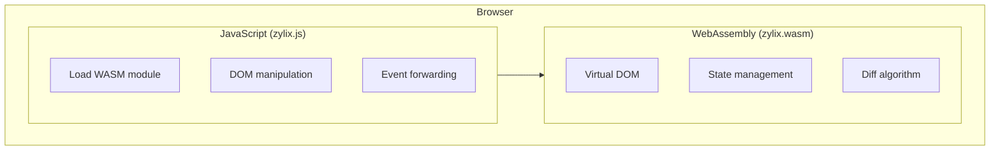
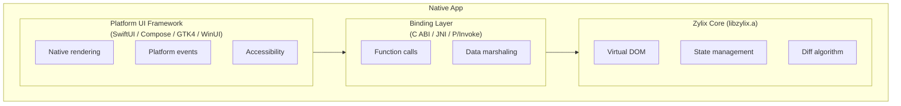

Zylix runs on six platforms, each using native UI frameworks for authentic user experiences. This section provides platform-specific setup, integration patterns, and best practices.

## Supported Platforms

| Platform | UI Framework | Binding | Build Command |
|----------|-------------|---------|---------------|
| **Web/WASM** | HTML/JavaScript | WebAssembly | `zig build wasm` |
| **iOS** | SwiftUI | C ABI | `zig build ios` |
| **Android** | Jetpack Compose | JNI | `zig build android` |
| **macOS** | SwiftUI | C ABI | `zig build` |
| **Linux** | GTK4 | C ABI | `zig build linux` |
| **Windows** | WinUI 3 | P/Invoke | `zig build windows-x64` |

## Platform Comparison

| Feature | Web | iOS | Android | macOS | Linux | Windows |
|---------|-----|-----|---------|-------|-------|---------|
| **UI Framework** | HTML/JS | SwiftUI | Compose | SwiftUI | GTK4 | WinUI 3 |
| **Language** | JavaScript | Swift | Kotlin | Swift | C | C# |
| **Binding** | WASM | C ABI | JNI | C ABI | C ABI | P/Invoke |
| **Min Version** | Modern browsers | iOS 15+ | API 26+ | macOS 12+ | GTK 4.0+ | Win 10+ |
| **Bundle Size** | ~50 KB | ~100 KB | ~150 KB | ~100 KB | ~80 KB | ~120 KB |
| **Hot Reload** | ✅ | ✅ | ✅ | ✅ | ❌ | ❌ |

## Architecture Per Platform

### Web/WASM Architecture



### Native Platforms Architecture



## Binding Strategies

### WebAssembly (Web)

Direct compilation to WASM with JavaScript glue code:

```javascript
// Load WASM module
const wasmModule = await WebAssembly.instantiate(wasmBuffer, {
    env: {
        js_log: (ptr, len) => console.log(readString(ptr, len)),
        js_create_element: (tag, parent) => createElement(tag, parent),
        js_set_text: (el, ptr, len) => setTextContent(el, ptr, len),
    }
});

// Initialize
wasmModule.exports.zylix_init();

// Dispatch events
function onClick(callbackId) {
    wasmModule.exports.zylix_dispatch(callbackId, 0, 0);
    render();
}
```

### C ABI (iOS, macOS, Linux)

Static library linking with direct function calls:

```swift
// Swift binding
@_silgen_name("zylix_init")
func zylix_init() -> Int32

@_silgen_name("zylix_dispatch")
func zylix_dispatch(_ eventType: UInt32, _ payload: UnsafeRawPointer?, _ len: Int) -> Int32

@_silgen_name("zylix_get_state")
func zylix_get_state() -> UnsafePointer<ZylixState>?

// Usage
zylix_init()
zylix_dispatch(EVENT_INCREMENT, nil, 0)
let state = zylix_get_state()?.pointee
```

### JNI (Android)

Java Native Interface for Kotlin/Java interop:

```kotlin
// Kotlin binding
object ZylixLib {
    init {
        System.loadLibrary("zylix")
    }

    external fun init(): Int
    external fun deinit(): Int
    external fun dispatch(eventType: Int, payload: ByteArray?, len: Int): Int
    external fun getState(): ZylixState
}

// Usage
ZylixLib.init()
ZylixLib.dispatch(EVENT_INCREMENT, null, 0)
val state = ZylixLib.getState()
```

### P/Invoke (Windows)

.NET source-generated interop:

```csharp
// C# binding
public static partial class ZylixInterop
{
    [LibraryImport("zylix", EntryPoint = "zylix_init")]
    public static partial int Init();

    [LibraryImport("zylix", EntryPoint = "zylix_dispatch")]
    public static partial int Dispatch(uint eventType, IntPtr payload, nuint len);

    [LibraryImport("zylix", EntryPoint = "zylix_get_state")]
    public static partial IntPtr GetState();
}

// Usage
ZylixInterop.Init();
ZylixInterop.Dispatch(EVENT_INCREMENT, IntPtr.Zero, 0);
var statePtr = ZylixInterop.GetState();
```

## Common Patterns

### State Observation

Each platform implements state observation differently:




```swift
// SwiftUI with ObservableObject
class ZylixStore: ObservableObject {
    @Published var state: ZylixState

    init() {
        zylix_init()
        state = zylix_get_state()!.pointee
    }

    func dispatch(_ event: UInt32) {
        zylix_dispatch(event, nil, 0)
        state = zylix_get_state()!.pointee
    }
}
```



```kotlin
// Compose with MutableState
class ZylixStore {
    var state by mutableStateOf(ZylixLib.getState())
        private set

    fun dispatch(event: Int) {
        ZylixLib.dispatch(event, null, 0)
        state = ZylixLib.getState()
    }
}
```



```javascript
// Reactive state wrapper
class ZylixStore {
    constructor() {
        this.listeners = [];
        this.state = zylix.getState();
    }

    dispatch(event) {
        zylix.dispatch(event, null, 0);
        this.state = zylix.getState();
        this.listeners.forEach(fn => fn(this.state));
    }

    subscribe(listener) {
        this.listeners.push(listener);
        return () => this.listeners = this.listeners.filter(l => l !== listener);
    }
}
```



```csharp
// MVVM with INotifyPropertyChanged
public class ZylixStore : INotifyPropertyChanged
{
    private ZylixState _state;

    public ZylixState State
    {
        get => _state;
        private set { _state = value; OnPropertyChanged(); }
    }

    public void Dispatch(uint eventType)
    {
        ZylixInterop.Dispatch(eventType, IntPtr.Zero, 0);
        State = Marshal.PtrToStructure<ZylixState>(ZylixInterop.GetState());
    }
}
```




### Event Handling

Converting native events to Zylix events:




```swift
Button("Increment") {
    store.dispatch(EVENT_INCREMENT)
}
.buttonStyle(.borderedProminent)

TextField("Enter text", text: $inputText)
    .onChange(of: inputText) { newValue in
        newValue.withCString { ptr in
            zylix_dispatch(EVENT_TEXT_INPUT, ptr, newValue.count)
        }
    }
```



```kotlin
Button(onClick = { store.dispatch(EVENT_INCREMENT) }) {
    Text("Increment")
}

TextField(
    value = inputText,
    onValueChange = { text ->
        ZylixLib.dispatch(EVENT_TEXT_INPUT, text.toByteArray(), text.length)
        inputText = text
    }
)
```



```javascript
button.addEventListener('click', () => {
    store.dispatch(EVENT_INCREMENT);
});

input.addEventListener('input', (e) => {
    const text = e.target.value;
    const bytes = new TextEncoder().encode(text);
    const ptr = zylix.alloc(bytes.length);
    zylix.memory.set(bytes, ptr);
    zylix.dispatch(EVENT_TEXT_INPUT, ptr, bytes.length);
    zylix.free(ptr, bytes.length);
});
```



```csharp
private void OnIncrementClick(object sender, RoutedEventArgs e)
{
    Store.Dispatch(EVENT_INCREMENT);
}

private void OnTextChanged(object sender, TextChangedEventArgs e)
{
    var text = ((TextBox)sender).Text;
    var bytes = Encoding.UTF8.GetBytes(text);
    fixed (byte* ptr = bytes)
    {
        ZylixInterop.Dispatch(EVENT_TEXT_INPUT, (IntPtr)ptr, (nuint)bytes.Length);
    }
}
```




## Build Configuration

### Cross-Platform Build Script

```bash
#!/bin/bash
# build-all.sh

# Build core for all platforms
cd core

# Web/WASM
zig build wasm -Doptimize=ReleaseSmall
cp zig-out/lib/zylix.wasm ../platforms/web/

# iOS (arm64)
zig build -Dtarget=aarch64-ios -Doptimize=ReleaseFast
cp zig-out/lib/libzylix.a ../platforms/ios/

# Android (multiple ABIs)
for abi in aarch64-linux-android armv7a-linux-androideabi x86_64-linux-android; do
    zig build -Dtarget=$abi -Doptimize=ReleaseFast
    cp zig-out/lib/libzylix.a ../platforms/android/app/src/main/jniLibs/${abi}/
done

# macOS (universal binary)
zig build -Dtarget=aarch64-macos -Doptimize=ReleaseFast
zig build -Dtarget=x86_64-macos -Doptimize=ReleaseFast
lipo -create zig-out/lib/libzylix-arm64.a zig-out/lib/libzylix-x64.a -output ../platforms/macos/libzylix.a

# Linux (x64)
zig build -Dtarget=x86_64-linux-gnu -Doptimize=ReleaseFast
cp zig-out/lib/libzylix.a ../platforms/linux/

# Windows (x64)
zig build -Dtarget=x86_64-windows -Doptimize=ReleaseFast
cp zig-out/lib/zylix.dll ../platforms/windows/
```

## Performance Tips

### All Platforms

1. **Minimize state changes**: Batch related updates
2. **Use keys for lists**: Enable efficient reconciliation
3. **Lazy loading**: Load data on demand
4. **Memoization**: Cache expensive computations

### Platform-Specific

| Platform | Tip |
|----------|-----|
| **Web** | Enable WASM streaming compilation |
| **iOS** | Use `@State` over `@ObservedObject` for local state |
| **Android** | Use `remember` for expensive calculations |
| **macOS** | Prefer native controls over custom drawing |
| **Linux** | Use CSS classes over inline styles |
| **Windows** | Enable compiled bindings for performance |

## Debugging

### All Platforms

```zig
// Enable debug logging in Zig
pub const log_level: std.log.Level = .debug;

// Log state changes
pub fn logStateChange(event: Event) void {
    std.log.debug("Event: {s}, Version: {d}", .{
        @tagName(event),
        state.getVersion()
    });
}
```

### Platform-Specific Tools

| Platform | Tools |
|----------|-------|
| **Web** | Browser DevTools, WASM debugging |
| **iOS** | Xcode Instruments, View Debugger |
| **Android** | Android Studio Profiler, Layout Inspector |
| **macOS** | Xcode Instruments |
| **Linux** | GTK Inspector, Valgrind |
| **Windows** | Visual Studio Profiler, WinDbg |

## Next Steps

- [Getting Started](../getting-started) - Installation and first app tutorial
- [Architecture](../architecture) - Deep dive into Zylix internals
- [Core Concepts](../core-concepts) - Virtual DOM, State, Components, and Events
