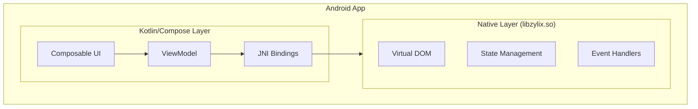


**Status: 🚧 In Development** — This platform currently has a Jetpack Compose demo app only. Zig core integration via JNI is planned but not yet implemented. The code below shows the target architecture.


Build native Android applications with Zylix using Jetpack Compose. This guide covers Android Studio setup, JNI integration, and Google Play deployment.

## Prerequisites

Before you begin, ensure you have:

- **Android Studio** Hedgehog (2023.1.1) or later
- **Android NDK** r25 or later
- **Zig** 0.11.0 or later
- **JDK** 17 or later
- Basic knowledge of Kotlin and Jetpack Compose

```bash
# Verify Zig installation
zig version

# Verify Java installation
java -version
```

## Architecture Overview



## Project Setup

### Step 1: Create Android Project

1. Open Android Studio → New Project
2. Select **Empty Activity** (Compose)
3. Configure:
   - Name: `ZylixApp`
   - Package: `com.example.zylixapp`
   - Minimum SDK: **API 26** (Android 8.0)
   - Build configuration language: **Kotlin DSL**

### Step 2: Configure NDK

Add to `local.properties`:
```properties
ndk.dir=/path/to/android-ndk
```

Update `app/build.gradle.kts`:

```kotlin
android {
    namespace = "com.example.zylixapp"
    compileSdk = 34

    defaultConfig {
        applicationId = "com.example.zylixapp"
        minSdk = 26
        targetSdk = 34
        versionCode = 1
        versionName = "1.0"

        ndk {
            abiFilters += listOf("arm64-v8a", "armeabi-v7a", "x86_64")
        }
    }

    buildFeatures {
        compose = true
    }

    externalNativeBuild {
        cmake {
            path = file("src/main/cpp/CMakeLists.txt")
            version = "3.22.1"
        }
    }
}
```

### Step 3: Build Zylix Shared Library

Build `libzylix.so` for Android:

```bash
cd core

# Build for arm64-v8a (most common)
zig build -Dtarget=aarch64-linux-android -Doptimize=ReleaseFast

# Build for armeabi-v7a (older devices)
zig build -Dtarget=arm-linux-androideabi -Doptimize=ReleaseFast

# Build for x86_64 (emulators)
zig build -Dtarget=x86_64-linux-android -Doptimize=ReleaseFast
```

Copy libraries to Android project:
```bash
mkdir -p app/src/main/jniLibs/{arm64-v8a,armeabi-v7a,x86_64}
cp zig-out/lib/libzylix-arm64.so app/src/main/jniLibs/arm64-v8a/libzylix.so
cp zig-out/lib/libzylix-arm.so app/src/main/jniLibs/armeabi-v7a/libzylix.so
cp zig-out/lib/libzylix-x64.so app/src/main/jniLibs/x86_64/libzylix.so
```

### Step 4: Create JNI Bridge

Create `app/src/main/cpp/CMakeLists.txt`:

```cmake
cmake_minimum_required(VERSION 3.22.1)
project("zylixjni")

add_library(${CMAKE_PROJECT_NAME} SHARED
    zylix_jni.cpp
)

# Link pre-built Zylix library
add_library(zylix SHARED IMPORTED)
set_target_properties(zylix PROPERTIES
    IMPORTED_LOCATION ${CMAKE_SOURCE_DIR}/../jniLibs/${ANDROID_ABI}/libzylix.so
)

target_link_libraries(${CMAKE_PROJECT_NAME}
    android
    log
    zylix
)
```

Create `app/src/main/cpp/zylix_jni.cpp`:

```cpp
#include <jni.h>
#include <android/log.h>

#define LOG_TAG "ZylixJNI"
#define LOGI(...) __android_log_print(ANDROID_LOG_INFO, LOG_TAG, __VA_ARGS__)
#define LOGE(...) __android_log_print(ANDROID_LOG_ERROR, LOG_TAG, __VA_ARGS__)

// External Zylix functions
extern "C" {
    int32_t zylix_init(void);
    int32_t zylix_deinit(void);
    int32_t zylix_dispatch(uint32_t event_type, const void* payload, size_t len);

    typedef struct {
        int32_t counter;
        uint32_t todo_count;
        uint32_t version;
    } ZylixState;

    const ZylixState* zylix_get_state(void);
}

extern "C" JNIEXPORT jint JNICALL
Java_com_example_zylixapp_ZylixLib_init(JNIEnv* env, jobject /* this */) {
    LOGI("Initializing Zylix");
    return zylix_init();
}

extern "C" JNIEXPORT jint JNICALL
Java_com_example_zylixapp_ZylixLib_deinit(JNIEnv* env, jobject /* this */) {
    LOGI("Deinitializing Zylix");
    return zylix_deinit();
}

extern "C" JNIEXPORT jint JNICALL
Java_com_example_zylixapp_ZylixLib_dispatch(
    JNIEnv* env,
    jobject /* this */,
    jint eventType,
    jbyteArray payload,
    jint len
) {
    if (payload == nullptr || len == 0) {
        return zylix_dispatch(eventType, nullptr, 0);
    }

    jbyte* bytes = env->GetByteArrayElements(payload, nullptr);
    int32_t result = zylix_dispatch(eventType, bytes, len);
    env->ReleaseByteArrayElements(payload, bytes, JNI_ABORT);

    return result;
}

extern "C" JNIEXPORT jobject JNICALL
Java_com_example_zylixapp_ZylixLib_getState(JNIEnv* env, jobject /* this */) {
    const ZylixState* state = zylix_get_state();
    if (state == nullptr) {
        return nullptr;
    }

    // Find ZylixState class
    jclass stateClass = env->FindClass("com/example/zylixapp/ZylixState");
    if (stateClass == nullptr) {
        LOGE("Failed to find ZylixState class");
        return nullptr;
    }

    // Get constructor
    jmethodID constructor = env->GetMethodID(stateClass, "<init>", "(III)V");
    if (constructor == nullptr) {
        LOGE("Failed to find ZylixState constructor");
        return nullptr;
    }

    // Create and return Java object
    return env->NewObject(
        stateClass,
        constructor,
        state->counter,
        state->todo_count,
        state->version
    );
}
```

## Kotlin Integration

### Data Classes

Create `ZylixState.kt`:

```kotlin
package com.example.zylixapp

data class ZylixState(
    val counter: Int,
    val todoCount: Int,
    val version: Int
)

// Event type constants
object ZylixEvents {
    const val INCREMENT = 1
    const val DECREMENT = 2
    const val RESET = 3
    const val TODO_ADD = 10
    const val TODO_TOGGLE = 11
    const val TODO_REMOVE = 12
}
```

### JNI Library Class

Create `ZylixLib.kt`:

```kotlin
package com.example.zylixapp

object ZylixLib {
    init {
        System.loadLibrary("zylixjni")
    }

    external fun init(): Int
    external fun deinit(): Int
    external fun dispatch(eventType: Int, payload: ByteArray?, len: Int): Int
    external fun getState(): ZylixState?

    // Convenience methods
    fun dispatch(eventType: Int) = dispatch(eventType, null, 0)

    fun dispatch(eventType: Int, payload: String) {
        val bytes = payload.toByteArray(Charsets.UTF_8)
        dispatch(eventType, bytes, bytes.size)
    }

    fun dispatch(eventType: Int, payload: Int) {
        val bytes = ByteArray(4)
        bytes[0] = (payload and 0xFF).toByte()
        bytes[1] = ((payload shr 8) and 0xFF).toByte()
        bytes[2] = ((payload shr 16) and 0xFF).toByte()
        bytes[3] = ((payload shr 24) and 0xFF).toByte()
        dispatch(eventType, bytes, 4)
    }
}
```

### ViewModel

Create `ZylixViewModel.kt`:

```kotlin
package com.example.zylixapp

import androidx.lifecycle.ViewModel
import androidx.lifecycle.viewModelScope
import kotlinx.coroutines.flow.MutableStateFlow
import kotlinx.coroutines.flow.StateFlow
import kotlinx.coroutines.flow.asStateFlow
import kotlinx.coroutines.launch

class ZylixViewModel : ViewModel() {
    private val _state = MutableStateFlow(ZylixState(0, 0, 0))
    val state: StateFlow<ZylixState> = _state.asStateFlow()

    init {
        val result = ZylixLib.init()
        if (result != 0) {
            throw RuntimeException("Failed to initialize Zylix: $result")
        }
        refreshState()
    }

    override fun onCleared() {
        super.onCleared()
        ZylixLib.deinit()
    }

    private fun refreshState() {
        ZylixLib.getState()?.let { newState ->
            _state.value = newState
        }
    }

    fun increment() {
        ZylixLib.dispatch(ZylixEvents.INCREMENT)
        refreshState()
    }

    fun decrement() {
        ZylixLib.dispatch(ZylixEvents.DECREMENT)
        refreshState()
    }

    fun reset() {
        ZylixLib.dispatch(ZylixEvents.RESET)
        refreshState()
    }

    fun addTodo(text: String) {
        if (text.isNotBlank()) {
            ZylixLib.dispatch(ZylixEvents.TODO_ADD, text)
            refreshState()
        }
    }

    fun toggleTodo(id: Int) {
        ZylixLib.dispatch(ZylixEvents.TODO_TOGGLE, id)
        refreshState()
    }

    fun removeTodo(id: Int) {
        ZylixLib.dispatch(ZylixEvents.TODO_REMOVE, id)
        refreshState()
    }
}
```

### Composable UI

Create `MainActivity.kt`:

```kotlin
package com.example.zylixapp

import android.os.Bundle
import androidx.activity.ComponentActivity
import androidx.activity.compose.setContent
import androidx.activity.viewModels
import androidx.compose.foundation.layout.*
import androidx.compose.material3.*
import androidx.compose.runtime.*
import androidx.compose.ui.Alignment
import androidx.compose.ui.Modifier
import androidx.compose.ui.unit.dp
import androidx.compose.ui.unit.sp

class MainActivity : ComponentActivity() {
    private val viewModel: ZylixViewModel by viewModels()

    override fun onCreate(savedInstanceState: Bundle?) {
        super.onCreate(savedInstanceState)
        setContent {
            ZylixAppTheme {
                Surface(
                    modifier = Modifier.fillMaxSize(),
                    color = MaterialTheme.colorScheme.background
                ) {
                    ZylixApp(viewModel)
                }
            }
        }
    }
}

@Composable
fun ZylixApp(viewModel: ZylixViewModel) {
    val state by viewModel.state.collectAsState()

    Column(
        modifier = Modifier
            .fillMaxSize()
            .padding(16.dp),
        horizontalAlignment = Alignment.CenterHorizontally
    ) {
        // Counter section
        CounterSection(
            count = state.counter,
            onIncrement = viewModel::increment,
            onDecrement = viewModel::decrement,
            onReset = viewModel::reset
        )

        Spacer(modifier = Modifier.height(32.dp))

        HorizontalDivider()

        Spacer(modifier = Modifier.height(32.dp))

        // Todo section
        TodoSection(
            todoCount = state.todoCount,
            onAddTodo = viewModel::addTodo
        )
    }
}

@Composable
fun CounterSection(
    count: Int,
    onIncrement: () -> Unit,
    onDecrement: () -> Unit,
    onReset: () -> Unit
) {
    Column(horizontalAlignment = Alignment.CenterHorizontally) {
        Text(
            text = "Counter",
            style = MaterialTheme.typography.headlineMedium
        )

        Spacer(modifier = Modifier.height(16.dp))

        Text(
            text = "$count",
            fontSize = 64.sp,
            style = MaterialTheme.typography.displayLarge
        )

        Spacer(modifier = Modifier.height(16.dp))

        Row(horizontalArrangement = Arrangement.spacedBy(16.dp)) {
            Button(onClick = onDecrement) {
                Text("-")
            }

            OutlinedButton(onClick = onReset) {
                Text("Reset")
            }

            Button(onClick = onIncrement) {
                Text("+")
            }
        }
    }
}

@Composable
fun TodoSection(
    todoCount: Int,
    onAddTodo: (String) -> Unit
) {
    var newTodoText by remember { mutableStateOf("") }

    Column(
        modifier = Modifier.fillMaxWidth(),
        horizontalAlignment = Alignment.CenterHorizontally
    ) {
        Text(
            text = "Todos ($todoCount)",
            style = MaterialTheme.typography.headlineMedium
        )

        Spacer(modifier = Modifier.height(16.dp))

        Row(
            modifier = Modifier.fillMaxWidth(),
            horizontalArrangement = Arrangement.spacedBy(8.dp)
        ) {
            OutlinedTextField(
                value = newTodoText,
                onValueChange = { newTodoText = it },
                label = { Text("New todo") },
                modifier = Modifier.weight(1f),
                singleLine = true
            )

            Button(
                onClick = {
                    onAddTodo(newTodoText)
                    newTodoText = ""
                },
                enabled = newTodoText.isNotBlank()
            ) {
                Text("Add")
            }
        }
    }
}
```

### Theme

Create `Theme.kt`:

```kotlin
package com.example.zylixapp

import androidx.compose.material3.MaterialTheme
import androidx.compose.material3.darkColorScheme
import androidx.compose.material3.lightColorScheme
import androidx.compose.runtime.Composable
import androidx.compose.foundation.isSystemInDarkTheme

private val DarkColorScheme = darkColorScheme()
private val LightColorScheme = lightColorScheme()

@Composable
fun ZylixAppTheme(
    darkTheme: Boolean = isSystemInDarkTheme(),
    content: @Composable () -> Unit
) {
    val colorScheme = if (darkTheme) DarkColorScheme else LightColorScheme

    MaterialTheme(
        colorScheme = colorScheme,
        content = content
    )
}
```

## Testing

### Unit Tests

```kotlin
// ZylixViewModelTest.kt
package com.example.zylixapp

import org.junit.Test
import org.junit.Assert.*

class ZylixViewModelTest {
    @Test
    fun testIncrement() {
        val viewModel = ZylixViewModel()
        val initial = viewModel.state.value.counter

        viewModel.increment()

        assertEquals(initial + 1, viewModel.state.value.counter)
    }
}
```

### Instrumented Tests

```kotlin
// MainActivityTest.kt
package com.example.zylixapp

import androidx.compose.ui.test.*
import androidx.compose.ui.test.junit4.createAndroidComposeRule
import org.junit.Rule
import org.junit.Test

class MainActivityTest {
    @get:Rule
    val composeTestRule = createAndroidComposeRule<MainActivity>()

    @Test
    fun testCounterIncrement() {
        composeTestRule
            .onNodeWithText("+")
            .performClick()

        composeTestRule
            .onNodeWithText("1")
            .assertIsDisplayed()
    }
}
```

## Debugging

### Logcat

View native logs:
```bash
adb logcat -s ZylixJNI
```

### Native Debugging

1. Set breakpoints in C++ code
2. Run with **Debug Native** configuration
3. Use LLDB commands in Android Studio

### Common Issues

| Issue | Solution |
|-------|----------|
| UnsatisfiedLinkError | Ensure library is in correct jniLibs folder |
| Crash on init | Check Logcat for native error messages |
| State not updating | Verify JNI method signatures match |
| Memory leak | Use LeakCanary and native memory profiler |

## Play Store Deployment

### Generate Signed APK/Bundle

1. Build → Generate Signed Bundle/APK
2. Select **Android App Bundle**
3. Create or use existing keystore
4. Build release version

### ProGuard Rules

Add to `proguard-rules.pro`:

```proguard
# Keep JNI methods
-keepclasseswithmembernames class * {
    native <methods>;
}

# Keep Zylix classes
-keep class com.example.zylixapp.ZylixLib { *; }
-keep class com.example.zylixapp.ZylixState { *; }
```

## Next Steps


  
  

