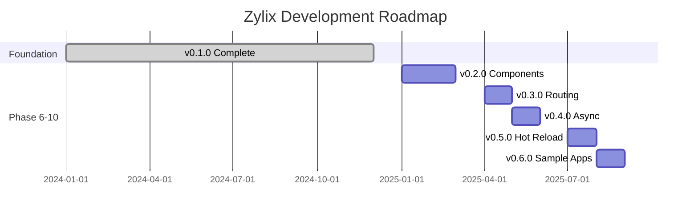
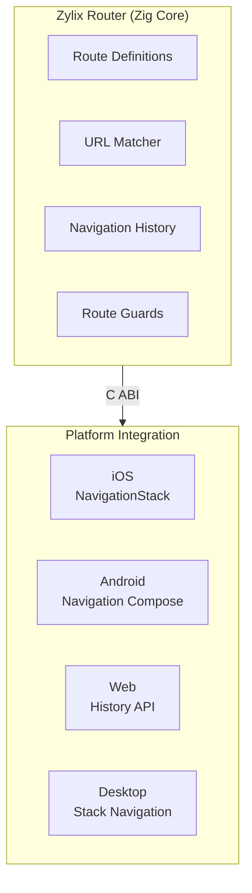

This page outlines the development roadmap for Zylix beyond v0.1.0. Each phase introduces new capabilities while maintaining the framework's core principles of performance, simplicity, and native platform integration.

## Current Status

**Version 0.1.0** is complete with:

- ✅ Virtual DOM engine with efficient diffing
- ✅ Type-safe state management
- ✅ Component system with 9 basic components
- ✅ CSS utility system (TailwindCSS-like)
- ✅ Flexbox layout engine
- ✅ 6-platform support (Web, iOS, Android, macOS, Linux, Windows)
- ✅ C ABI and WASM bindings

## Roadmap Overview



## Phase 6: Component Library (v0.2.0)

Expand from 9 basic components to 30+ comprehensive UI components.

### Planned Components




| Component | Description | Priority |
|-----------|-------------|----------|
| `select` | Dropdown/picker | P0 |
| `checkbox` | Boolean toggle | P0 |
| `radio` | Single selection | P0 |
| `textarea` | Multi-line input | P0 |
| `switch` | Toggle switch | P1 |
| `slider` | Range input | P1 |
| `date_picker` | Date selection | P1 |
| `time_picker` | Time selection | P1 |
| `form` | Form container | P0 |



| Component | Description | Priority |
|-----------|-------------|----------|
| `stack` | V/H stack | P0 |
| `grid` | CSS Grid layout | P0 |
| `scroll_view` | Scrollable container | P0 |
| `spacer` | Flexible space | P0 |
| `divider` | Visual separator | P1 |
| `card` | Card container | P1 |
| `safe_area` | Safe area insets | P1 |



| Component | Description | Priority |
|-----------|-------------|----------|
| `nav_bar` | Navigation bar | P0 |
| `tab_bar` | Tab navigation | P0 |
| `drawer` | Side drawer | P1 |
| `breadcrumb` | Breadcrumb nav | P2 |
| `pagination` | Page navigation | P2 |



| Component | Description | Priority |
|-----------|-------------|----------|
| `alert` | Alert dialog | P0 |
| `toast` | Toast notification | P0 |
| `modal` | Modal dialog | P0 |
| `progress` | Progress indicator | P1 |
| `spinner` | Loading spinner | P1 |
| `badge` | Notification badge | P1 |



| Component | Description | Priority |
|-----------|-------------|----------|
| `table` | Data table | P1 |
| `avatar` | User avatar | P1 |
| `icon` | Icon component | P0 |
| `tag` | Label/tag | P1 |
| `accordion` | Expandable sections | P1 |




### Implementation

```zig
pub const ComponentType = enum(u8) {
    // Existing (0-9)
    container = 0, text = 1, button = 2, ...

    // Form (10-19)
    select = 10, checkbox = 11, radio = 12, ...

    // Layout (20-29)
    stack = 20, grid = 21, scroll_view = 22, ...

    // Navigation (30-39)
    nav_bar = 30, tab_bar = 31, drawer = 32, ...

    // Feedback (40-49)
    alert = 40, toast = 41, modal = 42, ...
};
```

## Phase 7: Routing System (v0.3.0)

Cross-platform navigation with deep linking support.

### Architecture



### Features

- **Path patterns**: `/users/:id/posts`
- **Query parameters**: `?page=1&sort=date`
- **Route guards**: Authentication, permissions
- **Deep linking**: Universal Links, App Links
- **History management**: Back, forward, replace

### API Preview

```zig
const routes = [_]Route{
    .{ .path = "/", .component = home_component },
    .{ .path = "/users/:id", .component = user_component },
    .{ .path = "/settings", .component = settings_component, .guards = &[_]Guard{auth_guard} },
};

// Navigation
router.push("/users/123");
router.back();

// Access params
const user_id = router.getParams().get("id");
```

## Phase 8: Async Processing (v0.4.0)

Async/await patterns for HTTP, file I/O, and background tasks.

### Features

- **Future/Promise**: Chainable async operations
- **HTTP Client**: GET, POST, PUT, DELETE with JSON support
- **Background Tasks**: Scheduled and repeating tasks
- **Cancellation**: Timeout and manual cancellation

### API Preview

```zig
// HTTP request
const response = try HttpClient.get("https://api.example.com/users")
    .then(fn(resp) { return resp.json(User); })
    .await();

// Background task
const handle = TaskRunner.schedule(
    .{ .work_fn = sync_data },
    Duration.minutes(5),
);
```

### Platform Integration

| Platform | Runtime | HTTP | Background |
|----------|---------|------|------------|
| iOS | Swift Concurrency | URLSession | Background Tasks |
| Android | Coroutines | OkHttp | WorkManager |
| Web | Promise | Fetch API | Web Workers |
| Desktop | Thread Pool | libcurl/WinHTTP | Native threads |

## Phase 9: Hot Reload (v0.5.0)

Development-time code reloading with state preservation.

### Features

- **File watching**: < 100ms detection
- **Incremental builds**: < 1s for small changes
- **State preservation**: Maintain app state across reloads
- **Error overlay**: Source-mapped error display

### CLI Commands

```bash
# Start dev server with hot reload
zylix dev --platform web --port 3000

# iOS Simulator with hot reload
zylix dev --platform ios-sim --hot

# All platforms
zylix dev --all
```

## Phase 10: Sample Applications (v0.6.0)

Comprehensive examples demonstrating real-world patterns.

### Planned Apps

| App | Level | Demonstrates |
|-----|-------|--------------|
| **Todo Pro** | Beginner | State, forms, storage |
| **E-Commerce** | Intermediate | Routing, HTTP, auth |
| **Dashboard** | Intermediate | Charts, tables, real-time |
| **Chat** | Advanced | WebSocket, push notifications |
| **Notes** | Advanced | Rich text, search, sync |

Each app will include:
- Full source code for all 6 platforms
- Step-by-step tutorials
- Architecture documentation
- Performance benchmarks

## Contributing

We welcome contributions! See our [Contributing Guide](https://github.com/kotsutsumi/zylix/blob/main/CONTRIBUTING.md) for details.

### Priority Areas

1. Component implementations (v0.2.0)
2. Platform shell updates
3. Documentation improvements
4. Sample applications

## Detailed Roadmap

For complete implementation details, see the full roadmap documents:

- [ROADMAP.md](https://github.com/kotsutsumi/zylix/blob/main/docs/ROADMAP.md) (English)
- [ROADMAP.ja.md](https://github.com/kotsutsumi/zylix/blob/main/docs/ROADMAP.ja.md) (Japanese)
