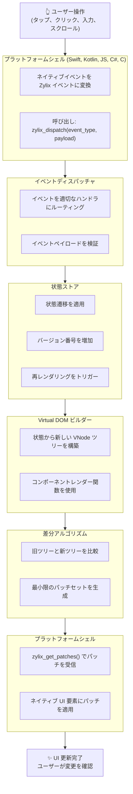
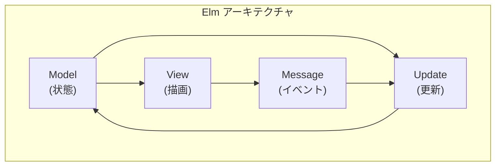

Zylix の技術的な基盤を理解するためのコア概念を解説します。

## 概要

Zylix は 4 つの主要コンポーネントで構成されています：



## コア概念


  
  
  
  


## 設計原則

### 1. 不変性 (Immutability)

状態と Virtual DOM ノードは不変です。変更は新しいバージョンの作成を意味します。

```zig
// 状態は直接変更されず、新しいバージョンが作成される
const old_version = state.getVersion();
handleIncrement();
const new_version = state.getVersion();
// new_version == old_version + 1
```

### 2. 型安全 (Type Safety)

Zig のコンパイル時型チェックにより、ランタイムエラーを防ぎます。

```zig
// 判別共用体による型安全なイベント
pub const Event = union(enum) {
    todo_add: []const u8,   // 文字列ペイロード
    todo_toggle: u32,        // ID ペイロード
    todo_clear_completed,    // ペイロードなし
};
```

### 3. ゼロアロケーション (Zero Allocation)

ホットパスではヒープアロケーションを行いません。

```zig
// アリーナアロケーションで予測可能なパフォーマンス
var arena = Arena(4096).init();
defer arena.reset();

// すべてのアロケーションはアリーナから
const nodes = arena.alloc(VNode, 100);
```

### 4. 単一責任 (Single Responsibility)

各モジュールは明確な責任を持ちます。

| モジュール | 責任 |
|-----------|------|
| `vdom.zig` | Virtual DOM ツリーの構築と管理 |
| `diff.zig` | 旧新ツリーの比較とパッチ生成 |
| `state.zig` | アプリケーション状態の管理 |
| `events.zig` | イベント定義と処理 |
| `abi.zig` | C ABI エクスポート |

## アーキテクチャパターン

### Elm アーキテクチャ

Zylix は Elm アーキテクチャ（Model-View-Update）に基づいています：



- **Model**: 不変のアプリケーション状態
- **View**: 状態から UI を構築
- **Update**: イベントに基づいて状態を更新
- **Message**: ユーザーアクションや外部イベント

## パフォーマンス特性

| 操作 | 計算量 | 説明 |
|------|--------|------|
| ノード作成 | O(1) | バンプアロケーション |
| ツリー差分 | O(n) | 線形時間比較 |
| キー付きリスト | O(n) | ハッシュマップによる最適化 |
| 状態更新 | O(1) | 直接代入 |
| イベント処理 | O(1) | switch 文による分岐 |

## メモリ使用量

| コンポーネント | サイズ |
|---------------|-------|
| VNode | 64 bytes |
| VTree (1000 ノード) | ~64 KB |
| AppState | ~4 KB |
| Arena (デフォルト) | 4 KB |

## 次のステップ

各コア概念の詳細については、以下のページを参照してください：


  
  
  
  

