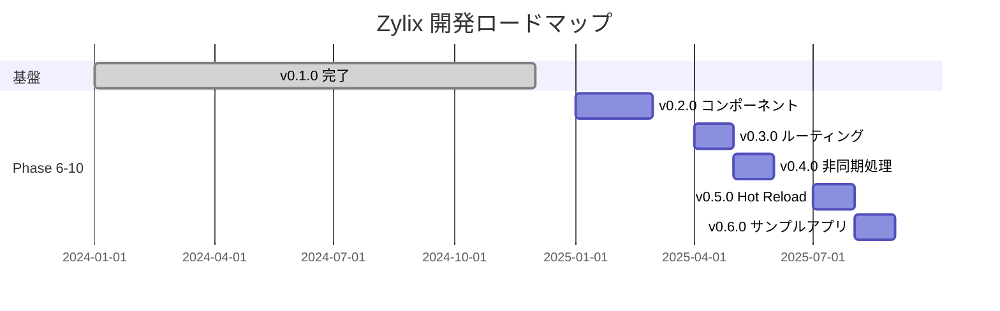
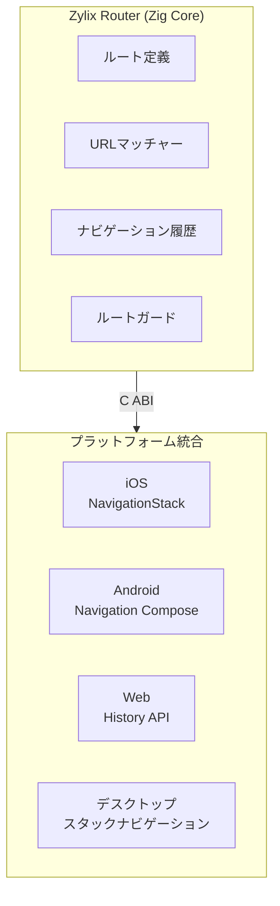

このページでは、v0.1.0以降のZylix開発ロードマップを説明します。各フェーズでは、パフォーマンス、シンプルさ、ネイティブプラットフォーム統合というフレームワークの核心原則を維持しながら、新しい機能を導入します。

## 現在の状況

**バージョン 0.1.0** は以下を完了しています：

- ✅ 効率的な差分計算を持つVirtual DOMエンジン
- ✅ 型安全な状態管理
- ✅ 9種類の基本コンポーネントを持つコンポーネントシステム
- ✅ CSSユーティリティシステム（TailwindCSS風）
- ✅ Flexboxレイアウトエンジン
- ✅ 6プラットフォーム対応（Web、iOS、Android、macOS、Linux、Windows）
- ✅ C ABIとWASMバインディング

## ロードマップ概要



## Phase 6: コンポーネントライブラリ (v0.2.0)

9種類の基本コンポーネントから30種類以上の包括的なUIコンポーネントに拡張します。

### 追加予定コンポーネント




| コンポーネント | 説明 | 優先度 |
|--------------|------|-------|
| `select` | ドロップダウン/ピッカー | P0 |
| `checkbox` | ブール値トグル | P0 |
| `radio` | 単一選択 | P0 |
| `textarea` | 複数行入力 | P0 |
| `switch` | トグルスイッチ | P1 |
| `slider` | レンジ入力 | P1 |
| `date_picker` | 日付選択 | P1 |
| `time_picker` | 時刻選択 | P1 |
| `form` | フォームコンテナ | P0 |



| コンポーネント | 説明 | 優先度 |
|--------------|------|-------|
| `stack` | 縦/横スタック | P0 |
| `grid` | CSSグリッドレイアウト | P0 |
| `scroll_view` | スクロール可能コンテナ | P0 |
| `spacer` | 柔軟なスペース | P0 |
| `divider` | 視覚的区切り | P1 |
| `card` | カードコンテナ | P1 |
| `safe_area` | セーフエリアインセット | P1 |



| コンポーネント | 説明 | 優先度 |
|--------------|------|-------|
| `nav_bar` | ナビゲーションバー | P0 |
| `tab_bar` | タブナビゲーション | P0 |
| `drawer` | サイドドロワー | P1 |
| `breadcrumb` | パンくずナビ | P2 |
| `pagination` | ページナビゲーション | P2 |



| コンポーネント | 説明 | 優先度 |
|--------------|------|-------|
| `alert` | アラートダイアログ | P0 |
| `toast` | トースト通知 | P0 |
| `modal` | モーダルダイアログ | P0 |
| `progress` | プログレスインジケーター | P1 |
| `spinner` | ローディングスピナー | P1 |
| `badge` | 通知バッジ | P1 |



| コンポーネント | 説明 | 優先度 |
|--------------|------|-------|
| `table` | データテーブル | P1 |
| `avatar` | ユーザーアバター | P1 |
| `icon` | アイコンコンポーネント | P0 |
| `tag` | ラベル/タグ | P1 |
| `accordion` | 展開可能セクション | P1 |




### 実装

```zig
pub const ComponentType = enum(u8) {
    // 既存 (0-9)
    container = 0, text = 1, button = 2, ...

    // フォーム (10-19)
    select = 10, checkbox = 11, radio = 12, ...

    // レイアウト (20-29)
    stack = 20, grid = 21, scroll_view = 22, ...

    // ナビゲーション (30-39)
    nav_bar = 30, tab_bar = 31, drawer = 32, ...

    // フィードバック (40-49)
    alert = 40, toast = 41, modal = 42, ...
};
```

## Phase 7: ルーティングシステム (v0.3.0)

ディープリンクサポート付きのクロスプラットフォームナビゲーション。

### アーキテクチャ



### 機能

- **パスパターン**: `/users/:id/posts`
- **クエリパラメータ**: `?page=1&sort=date`
- **ルートガード**: 認証、権限
- **ディープリンク**: Universal Links、App Links
- **履歴管理**: 戻る、進む、置換

### APIプレビュー

```zig
const routes = [_]Route{
    .{ .path = "/", .component = home_component },
    .{ .path = "/users/:id", .component = user_component },
    .{ .path = "/settings", .component = settings_component, .guards = &[_]Guard{auth_guard} },
};

// ナビゲーション
router.push("/users/123");
router.back();

// パラメータアクセス
const user_id = router.getParams().get("id");
```

## Phase 8: 非同期処理 (v0.4.0)

HTTP、ファイルI/O、バックグラウンドタスク用のasync/awaitパターン。

### 機能

- **Future/Promise**: チェーン可能な非同期操作
- **HTTPクライアント**: JSONサポート付きGET、POST、PUT、DELETE
- **バックグラウンドタスク**: スケジュールおよび繰り返しタスク
- **キャンセル**: タイムアウトと手動キャンセル

### APIプレビュー

```zig
// HTTPリクエスト
const response = try HttpClient.get("https://api.example.com/users")
    .then(fn(resp) { return resp.json(User); })
    .await();

// バックグラウンドタスク
const handle = TaskRunner.schedule(
    .{ .work_fn = sync_data },
    Duration.minutes(5),
);
```

### プラットフォーム統合

| プラットフォーム | ランタイム | HTTP | バックグラウンド |
|--------------|---------|------|------------|
| iOS | Swift Concurrency | URLSession | Background Tasks |
| Android | Coroutines | OkHttp | WorkManager |
| Web | Promise | Fetch API | Web Workers |
| デスクトップ | Thread Pool | libcurl/WinHTTP | ネイティブスレッド |

## Phase 9: Hot Reload (v0.5.0)

状態保持付きの開発時コードリロード。

### 機能

- **ファイル監視**: < 100ms検出
- **インクリメンタルビルド**: 小さな変更で < 1秒
- **状態保持**: リロード間でアプリ状態を維持
- **エラーオーバーレイ**: ソースマップ付きエラー表示

### CLIコマンド

```bash
# ホットリロード付き開発サーバー起動
zylix dev --platform web --port 3000

# ホットリロード付きiOSシミュレーター
zylix dev --platform ios-sim --hot

# 全プラットフォーム
zylix dev --all
```

## Phase 10: サンプルアプリケーション (v0.6.0)

実世界のパターンを示す包括的な例。

### 計画中のアプリ

| アプリ | レベル | 実証内容 |
|-------|-------|---------|
| **Todo Pro** | 初級 | 状態、フォーム、ストレージ |
| **ECサイト** | 中級 | ルーティング、HTTP、認証 |
| **ダッシュボード** | 中級 | チャート、テーブル、リアルタイム |
| **チャット** | 上級 | WebSocket、プッシュ通知 |
| **メモ** | 上級 | リッチテキスト、検索、同期 |

各アプリには以下が含まれます：
- 全6プラットフォーム用の完全なソースコード
- ステップバイステップのチュートリアル
- アーキテクチャドキュメント
- パフォーマンスベンチマーク

## コントリビュート

コントリビュートを歓迎します！詳細は[コントリビュートガイド](https://github.com/kotsutsumi/zylix/blob/main/CONTRIBUTING.md)をご覧ください。

### 優先領域

1. コンポーネント実装（v0.2.0）
2. プラットフォームシェル更新
3. ドキュメント改善
4. サンプルアプリケーション

## 詳細なロードマップ

完全な実装詳細については、以下のロードマップドキュメントをご覧ください：

- [ROADMAP.md](https://github.com/kotsutsumi/zylix/blob/main/docs/ROADMAP.md)（英語）
- [ROADMAP.ja.md](https://github.com/kotsutsumi/zylix/blob/main/docs/ROADMAP.ja.md)（日本語）
